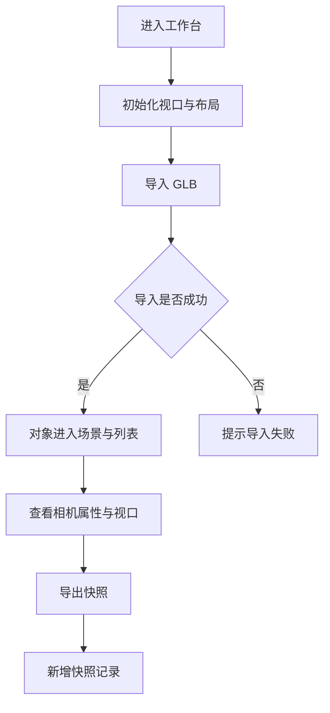

# 第一阶段开发前确认方案：工作台骨架与基础导入闭环

## 1. 文档控制

- 产品/功能名称：3D 影视分镜工作台第一阶段：工作台骨架与基础导入闭环
- 文档版本：v1.0
- 文档状态：已完成
- 创建日期：2026-06-22
- 更新日期：2026-06-23
- 负责人：待定
- 评审参与方：用户、产品、设计、工程
- 相关文档：
  - `docs/prd/3d-workbench-prd.md`
  - `docs/prd/change-log.md`
  - `docs/prd/prd-writing-guide.md`
  - `docs/assets/reference/ui-reference-3d-director.png`
- 相关变更记录：
  - `docs/prd/change-log.md` 2026-06-22 “确认第一阶段开发范围”
  - `docs/prd/change-log.md` 2026-06-22 “完成第一阶段初版开发”

## 2. 一页摘要

### 一句话结论

第一阶段的目标是先搭出一个可扩展的 3D 分镜工作台骨架，打通“打开页面 -> 进入工作台 -> 导入 `.glb` -> 在视口中查看 -> 在列表与相机面板中看到对象 -> 导出快照”的最小闭环。

### 本次解决的问题

当前产品还处于从概念走向可操作原型的早期阶段。用户需要先拥有一个稳定、专业、可扩展的工作台底座，而不是一开始就堆叠时间线、材质编辑或动画能力。

### 本次交付内容

- 参考图风格的三栏式工作台布局。
- 中央视口基础渲染能力：网格、坐标轴、基础灯光、OrbitControls。
- 本地 `.glb` 文件导入。
- 左侧对象/机位列表基础展示。
- 右侧相机属性面板基础展示与 FOV 调整。
- 底部浮动工具条视觉骨架和模式状态。
- 当前视口或当前相机画面的 PNG 快照导出。
- 项目、对象、相机、快照的内存数据结构。

### 本次不交付内容

- 不做关键帧时间线。
- 不做材质颜色和材质参数编辑。
- 不做模型变换编辑闭环。
- 不做本地项目保存和读取。
- 不做 AI 视频接口接入。

### 关键风险或未决问题

- 大体积 `.glb` 可能带来加载慢、卡顿或失败，需要至少有基础加载和错误反馈。
- 视口快照导出依赖 WebGL 画布读取策略，需要明确渲染器配置和导出时机。
- 第一阶段只做内存状态，刷新页面后资产、快照和当前工作内容都会丢失。

## 3. 背景、问题与依据

### 背景

用户已经明确本产品的目标不是完整 DCC 软件，而是面向影视分镜预演和 AI 视频前置准备的轻量虚拟摄影工作台。第一阶段最重要的不是做全，而是先验证 UI 架构、渲染架构、基础数据结构和导入导出链路。

### 用户问题

- 用户没有一个可直接操作的 3D 工作台来承载后续机位、对象和快照能力。
- 如果没有真实 `.glb` 导入，就无法验证空间比例、视口交互和对象管理方案是否成立。
- 如果没有快照导出，第一阶段就无法形成可交付的参考帧结果。

### 现有方案不足

- 仅有主 PRD 的总体功能描述，还不能替代阶段实现方案。
- 若直接开始做材质、时间线或对象编辑，会让渲染层、状态层和 UI 层同时膨胀，增加返工风险。
- 如果第一阶段不先建立稳定的相机与快照能力，后续镜头和时间线设计缺少基础支点。

### 证据与依据

| 类型 | 内容 | 来源 | 可信度 |
| --- | --- | --- | --- |
| 已确认需求 | 第一阶段需要实现 `.glb` 导入和快照 PNG 导出 | 项目沟通与变更记录 | 高 |
| 视觉参考 | 参考图体现了三栏工作台、中央大视口、右侧属性区和底部浮动工具条 | `docs/assets/reference/ui-reference-3d-director.png` | 高 |
| 产品基线 | 主 PRD 明确产品第一版是轻量虚拟摄影台而非完整建模软件 | `docs/prd/3d-workbench-prd.md` | 高 |
| 技术依据 | Three.js 可提供场景渲染、相机、控制器、GLTFLoader 和截图能力 | three.js 官方文档与当前技术选型 | 高 |

## 4. 目标用户、场景与用户旅程

### 用户角色

| 用户类型 | 目标 | 痛点 | 使用频率 |
| --- | --- | --- | --- |
| 导演 / 分镜师 | 快速确认空间、机位和构图 | 传统 3D 软件过重，静态截图不够稳定 | 高频 |
| AI 视频创作者 | 为生成前准备稳定空间参考和机位快照 | 仅靠提示词难控制镜头和对象位置 | 高频 |
| 3D 协作者 | 导入已有模型并给团队输出参考画面 | 缺少轻量、可复用的展示与快照工具 | 中频 |

### 使用场景

- 用户打开工作台，希望看到专业但克制的 3D 创作界面。
- 用户导入一个角色或场景 `.glb`，检查它在视口中的摆放和比例是否合理。
- 用户需要查看相机参数并导出一张当前画面的参考帧。

### 触发条件

- 用户首次进入产品。
- 用户选择本地 `.glb` 文件。
- 用户需要留存当前视口或当前相机画面。

### 用户旅程

| 步骤 | 用户行为 | 用户目标 | 系统响应 |
| --- | --- | --- | --- |
| 1 | 打开工作台 | 进入可操作的 3D 创作环境 | 页面展示三栏工作台和视口 |
| 2 | 观察视口和面板 | 理解工作区布局 | 系统展示网格、坐标轴、列表、属性区和底部工具条 |
| 3 | 导入 `.glb` 文件 | 把真实模型放入场景 | 系统解析文件、创建对象记录并在视口显示 |
| 4 | 查看左侧对象与机位列表 | 确认导入结果和基础资产结构 | 列表显示对象项和机位项 |
| 5 | 查看右侧相机属性并调整 FOV | 检查当前观察参数 | 面板显示相机名称、位置、目标点和 FOV |
| 6 | 导出快照 | 形成可留存的参考帧 | 系统生成 PNG 并新增快照记录 |

## 5. 目标、非目标与成功指标

### 产品目标

- 建立一个结构稳定、视觉明确的 3D 工作台骨架。
- 验证 `.glb` 导入、对象记录、视口显示和快照导出的基础闭环。
- 为后续对象编辑、摄影机编辑、时间线和导出 JSON 打下数据结构基础。

### 体验目标

- 用户进入页面后能快速理解工作台各区域职责。
- 用户导入模型后能立即在视口中看到结果，不需要额外配置。
- 快照导出结果与用户眼前看到的画面保持一致。

### 非目标

- 不在第一阶段追求完整资产管理、复杂编辑器或多镜头能力。
- 不在第一阶段引入持久化、本地缓存管理 UI 或协作能力。
- 不把右侧面板扩展成完整对象属性编辑器。

### 成功指标

| 指标 | 类型 | 目标值或观察方式 | 是否验收项 |
| --- | --- | --- | --- |
| 工作台骨架可用 | 定性 | 页面打开后能稳定呈现三栏布局和中央视口 | 是 |
| `.glb` 导入成功 | 定性 | 合法模型导入后出现在视口和对象列表中 | 是 |
| 相机信息可见 | 定性 | 右侧面板能展示当前相机核心字段并调节 FOV | 是 |
| 快照导出闭环 | 定性 | 用户可导出 PNG，且快照记录可在界面中看到 | 是 |

## 6. 范围、优先级与版本边界

### 本次范围

- 工作台整体布局和视觉骨架。
- 视口渲染基础设施。
- `.glb` 导入服务。
- 左侧对象/机位列表基础展示。
- 右侧相机属性展示和 FOV 调节。
- 快照导出与快照记录。
- 项目内存状态和核心数据结构。

### 本次不做

- 模型平移、旋转、缩放编辑。
- 材质编辑。
- 时间线与关键帧。
- 本地项目保存。
- AI 视频输出。

### 后续版本

- 第二阶段：模型编辑闭环与材质编辑。
- 第三阶段：摄影机可编辑闭环。
- 后续阶段：时间线、骨骼控制、导出结构化镜头参数。

### 优先级

| 优先级 | 功能/能力 | 用户价值 | 说明 |
| --- | --- | --- | --- |
| P0 | 工作台布局与 3D 视口 | 没有底座就无法进入创作 | 第一阶段必须完成 |
| P0 | `.glb` 导入 | 验证真实模型链路 | 第一阶段必须完成 |
| P0 | 快照导出 | 形成最小交付结果 | 第一阶段必须完成 |
| P1 | 相机属性展示与 FOV 调整 | 支撑构图观察 | 第一阶段应完成 |
| P1 | 左侧对象/机位列表 | 提供资产可见性 | 第一阶段应完成 |
| P2 | 底部工具条模式切换 | 为后续编辑工具预留位置 | 第一阶段做基础状态即可 |

## 7. 产品方案与用户流程

### 产品方案

第一阶段产品方案是“专业工作台骨架 + 基础导入闭环”，强调稳定结构和清晰分区，而不是高密度编辑功能。页面由顶部栏、左侧列表、中央视口、右侧属性区和底部浮动工具条组成。核心任务是让用户能够把模型放进场景、观察它、查看相机参数、导出快照。

### 页面/区域结构

- 顶部栏：产品名称、帮助、退出等全局入口。
- 左侧栏：资产/对象/机位列表，第一阶段以展示为主。
- 中央视口：Three.js 渲染画布、网格、坐标轴、相机辅助器。
- 右侧栏：快照管理、相机预览占位、相机属性。
- 底部工具条：选择、对象、相机、适配视图、快照等模式或入口。

### 主流程

1. 用户进入工作台，系统完成视口和基础 UI 初始化。
2. 用户导入 `.glb` 文件，系统解析文件并在视口中放置模型。
3. 用户查看对象列表、相机面板和当前场景，必要时调整 FOV。
4. 用户导出快照，系统生成 PNG 并新增快照记录。

### 分支流程

- 若用户未导入任何模型，仍可浏览工作台并导出空场景快照。
- 若用户已有活跃相机，则快照优先使用当前相机或当前视口的规则导出。

### 异常流程

- `.glb` 解析失败时，不污染当前场景，UI 提示导入失败。
- 当快照导出失败时，保留当前工作区状态，并提示失败原因。
- 当模型尺寸异常时，系统仍尝试自动缩放和落地，避免完全丢失可见性。

### 状态说明

- 空状态：未导入模型时，左侧对象列表为空，视口仅显示基础场景。
- 加载状态：导入 `.glb` 过程中显示加载反馈，防止用户误以为无响应。
- 错误状态：导入失败或快照导出失败时显示明确提示。
- 禁用状态：无可用操作目标时，部分面板入口只展示占位或禁用态。
- 成功状态：导入成功后对象可见，快照导出成功后列表新增记录。

### 流程图



## 8. 功能需求与规则

### 8.1 工作台布局与导航骨架

用户问题：用户需要一个稳定、专业、可理解的 3D 创作界面来承载后续功能。

用户故事：

- 作为创作者，我希望打开页面就进入一个分区清晰的 3D 工作台，以便快速找到视口、列表、属性区和工具入口。

入口：页面首次打开。

主流程：

1. 用户打开页面。
2. 系统初始化整体布局与视口区域。
3. 用户看到顶部栏、左侧列表、中央视口、右侧属性区和底部工具条。

规则：

- 工作台采用三栏结构，中央视口优先占据主要面积。
- 左右面板保持固定职责，不在第一阶段承载复杂编辑逻辑。
- 底部工具条先提供视觉和模式状态，不强求所有按钮完成真实编辑行为。

规格明细：

| 维度 | 说明 |
| --- | --- |
| 展示内容 | 顶部栏、左侧列表、中央视口、右侧属性区、底部工具条 |
| 数据来源 | 本地默认状态、项目状态、当前视口运行时状态 |
| 数据规则 | 首次打开时加载默认项目数据和默认相机 |
| 交互规则 | 允许切换模式和浏览布局，不要求第一阶段完成所有编辑 |
| 状态规则 | 页面首屏即展示完整骨架；无模型时显示空工作台 |
| 权限规则 | 第一阶段默认单用户本地使用，不做角色权限区分 |
| 联动规则 | 左右面板都围绕当前项目状态和活跃相机展示 |
| 持久化规则 | 页面刷新后恢复默认初始状态 |
| 性能约束 | 首屏应在本地开发环境中稳定渲染，不因布局逻辑重复挂载 Three.js 渲染器 |

边界与异常：

- 小屏或低分辨率下允许布局压缩，但不得遮挡主要功能区域。
- 若视口初始化失败，至少保留其余工作台结构，便于定位问题。

验收标准：

- 给定用户首次打开页面，当初始化完成，则应看到三栏工作台和底部工具条。
- 给定未导入任何模型，当用户进入页面，则视口仍应显示基础场景而非空白错误页。

### 8.2 3D 视口基础能力

用户问题：用户需要在空间中观察模型和相机，而不是只看平面属性。

用户故事：

- 作为创作者，我希望在视口中自由环绕、平移和缩放，以便检查模型、场景和机位关系。

入口：中间 3D 视口。

主流程：

1. 系统初始化 Three.js 场景、相机、渲染器和控制器。
2. 用户在视口中使用鼠标进行环绕、平移和缩放。
3. 视口实时更新画面。

规则：

- 使用编辑视角作为默认观察相机。
- 视口默认显示网格、坐标轴和基础灯光。
- OrbitControls 负责基础观察，不在第一阶段引入变换控制器。

规格明细：

| 维度 | 说明 |
| --- | --- |
| 展示内容 | WebGL 画布、地面网格、坐标轴、基础灯光、相机辅助器 |
| 数据来源 | Three.js 运行时场景、活跃相机状态、对象状态 |
| 数据规则 | 默认场景中至少存在一个编辑相机和基础辅助器 |
| 交互规则 | 支持环绕、平移、缩放；拖动过程中画面实时更新 |
| 状态规则 | 无模型时仍显示基础场景；导入模型后自动重新构图 |
| 权限规则 | 第一阶段不区分对象编辑权限，仅开放观察操作 |
| 联动规则 | FOV 变化会同步影响相机预览和快照导出画面 |
| 持久化规则 | 视口观察状态仅保存在内存 |
| 性能约束 | 避免重复创建 renderer、scene、camera 和 controls |

边界与异常：

- 极大或极小模型导入后可能导致视觉比例异常，系统需要尝试自动归一化。
- 视口尺寸变化时应重新计算相机宽高比和渲染尺寸。

验收标准：

- 给定页面初始化完成，当用户拖拽或滚轮操作，则视口应支持环绕、平移和缩放。
- 给定未导入模型，当用户观察场景，则仍应看到地面网格和坐标轴。

### 8.3 `.glb` 导入

用户问题：没有真实模型导入，工作台无法验证实际创作链路。

用户故事：

- 作为创作者，我希望导入本地 `.glb` 文件，以便把真实角色或场景放进工作台中查看。

入口：左侧资产区域或导入按钮。

主流程：

1. 用户选择本地 `.glb` 文件。
2. 系统创建临时 object URL 并交给 GLTFLoader 解析。
3. 系统从解析结果生成资产记录和场景对象记录。
4. 系统计算包围盒，对模型执行居中、缩放和落地处理。
5. 模型显示在视口，对象列表新增记录。

规则：

- 第一阶段仅支持 `.glb` 格式。
- 合法模型导入后必须同时进入运行时场景和项目状态。
- 导入成功后对象默认可见、未锁定。

规格明细：

| 维度 | 说明 |
| --- | --- |
| 展示内容 | 导入入口、加载反馈、对象列表新增项、视口中的模型 |
| 数据来源 | 本地文件选择器、GLTFLoader 解析结果 |
| 数据规则 | 创建 `AssetRecord` 和 `SceneObject`，记录文件名、大小、创建时间、对象关系 |
| 交互规则 | 用户选择文件后立即开始解析；解析成功后自动出现在场景中 |
| 状态规则 | 空状态无对象；加载中显示反馈；解析失败显示错误提示 |
| 权限规则 | 第一阶段默认允许导入本地文件 |
| 联动规则 | 导入成功后左侧列表、视口和后续快照导出都可见该对象 |
| 持久化规则 | 资产只保存在内存中，刷新页面后丢失 |
| 性能约束 | 大文件允许加载变慢，但不能导致整个页面失去响应且无提示 |

组件专项清单：

#### 上传 / 导入 / 文件解析

- 支持格式：`.glb`
- 文件大小限制：第一阶段不强拦截，但需对异常大文件保留失败提示
- 数量限制：可逐次导入多个文件，但每次按单次选择处理
- 选择入口：文件选择器
- 拖拽上传：第一阶段不做
- 解析流程：`File` -> `objectURL` -> `GLTFLoader` -> 资产记录 + 场景对象 -> 自动摆放
- 进度展示：提供基础加载状态
- 成功后的数据写入：写入 `assets`、`objects`，并创建运行时场景节点
- 失败原因与提示：格式错误、解析失败、文件损坏、运行时异常
- 重试、取消与清理策略：失败后允许重新导入；页面关闭或对象删除时释放临时资源
- 临时资源释放策略：释放 `objectURL` 和相关 Three.js 资源

边界与异常：

- 非 `.glb` 文件应被拒绝或提示不支持。
- 文件损坏或解析失败时，不应污染已有对象和场景状态。

验收标准：

- 给定合法 `.glb` 文件，当导入完成，则模型应出现在 3D 视口和左侧对象列表中。
- 给定异常或损坏文件，当用户导入，则系统应提示失败且保持现有场景不变。

### 8.4 左侧对象 / 机位列表

用户问题：用户需要知道场景里有哪些对象和机位，不能只依赖视口观察。

用户故事：

- 作为创作者，我希望在左侧看到对象和机位列表，以便确认导入结果和后续可管理资产。

入口：左侧面板。

主流程：

1. 系统根据项目状态读取对象和机位。
2. 左侧按区域展示对象列表和机位列表。
3. 用户查看列表项与当前场景对应关系。

规则：

- 第一阶段列表以展示为主，不要求完成复杂筛选和批量操作。
- 默认至少存在一台相机记录，防止出现完全无机位状态。
- 对象按导入顺序展示，机位按创建顺序展示。

规格明细：

| 维度 | 说明 |
| --- | --- |
| 展示内容 | 对象分组、机位分组、列表项名称、基础图标或类型标签 |
| 数据来源 | `objects`、`cameras` 项目状态 |
| 数据规则 | 对象名称优先取导入名称；相机名称使用默认命名或当前名称 |
| 交互规则 | 第一阶段以查看为主，可支持基础选中高亮 |
| 状态规则 | 无对象时显示空状态；机位区域至少显示默认相机 |
| 权限规则 | 第一阶段不区分可见与只读角色 |
| 联动规则 | 活跃对象和活跃相机会影响右侧面板展示 |
| 持久化规则 | 列表内容随项目内存状态变化 |
| 性能约束 | 列表规模在第一阶段预计较小，不做虚拟滚动 |

组件专项清单：

#### 数据列表 / 表格 / 卡片流

- 列表目的：展示当前项目中的对象和机位
- 数据来源：项目内存状态 `objects`、`cameras`
- 首次加载时机：页面初始化后立即加载
- 字段与展示规则：展示名称、类型；无复杂多列
- 默认排序：按创建或导入顺序
- 可切换排序：第一阶段不做
- 分页方式：无分页
- 每页数量：不限制
- 搜索与筛选：第一阶段不做
- 空状态：对象为空时显示“暂无对象”；机位至少保留默认项
- 行操作：第一阶段不做复杂行内操作
- 批量操作：第一阶段不做
- 刷新策略：状态变化后即时刷新
- 新增、编辑、删除后的回写策略：新增对象或机位后即时插入列表

边界与异常：

- 未导入对象时，对象列表为空但布局不塌陷。
- 若对象名称缺失，则使用可理解默认命名。

验收标准：

- 给定导入成功的模型，当左侧面板渲染完成，则对象列表应出现对应对象项。
- 给定页面初始状态，当用户未导入任何模型，则对象列表应展示空状态而不是错误提示。

### 8.5 右侧相机属性面板

用户问题：用户需要知道当前观察参数，并对最基础的构图参数做调整。

用户故事：

- 作为创作者，我希望在右侧看到当前相机名称、位置、目标点和 FOV，以便检查视角并调整画面宽窄。

入口：右侧相机属性面板。

主流程：

1. 系统读取活跃相机状态。
2. 右侧面板展示名称、位置、目标点和 FOV。
3. 用户调整 FOV，系统同步更新 Three.js 相机。

规则：

- 第一阶段位置和目标点以展示为主，不要求手动编辑。
- FOV 是第一阶段唯一允许真实修改并立即生效的相机字段。
- 没有活跃对象时，右侧默认展示相机信息而不是对象属性。

规格明细：

| 维度 | 说明 |
| --- | --- |
| 展示内容 | 相机名称、位置、目标点、FOV、快照区 |
| 数据来源 | `activeCameraId`、`cameras` 状态和运行时相机 |
| 数据规则 | 数值以项目状态为准，显示时可格式化到易读精度 |
| 交互规则 | 用户拖动 FOV 控件后立即更新状态和画面 |
| 状态规则 | 有相机时展示属性；无活跃对象时默认回到相机面板 |
| 权限规则 | 第一阶段不做锁定和只读差异 |
| 联动规则 | FOV 调整同步影响视口画面和快照导出结果 |
| 持久化规则 | 修改仅保存在内存中 |
| 性能约束 | 滑杆拖动时需要保持视口更新流畅 |

组件专项清单：

#### 详情页 / 详情面板

- 入口：默认右侧栏
- 数据来源：当前活跃相机状态
- 字段分组：基础信息、观察参数、快照相关
- 字段展示规则：名称文本、位置/目标点数值、FOV 控件
- 编辑入口：FOV 直接在面板中编辑
- 只读与锁定状态：第一阶段默认可查看、FOV 可编辑
- 缺失数据展示：无有效相机时显示占位
- 与列表或视口的联动：活跃相机变化时面板同步刷新
- 关闭、返回或切换对象后的状态保留：切回无对象状态时返回相机面板

#### 表单 / 属性编辑器

- 表单目的：展示并微调基础相机参数
- 字段列表：`name`、`position`、`target`、`fov`
- 字段类型：文本、数值展示、滑杆
- 默认值：来自默认相机
- 必填规则：相机数据必须存在
- 校验规则：FOV 在允许范围内
- 输入限制：FOV 限定在合理区间
- 提交时机：实时生效
- 保存成功反馈：视口实时变化即可视为反馈
- 保存失败处理：恢复上一个合法 FOV
- 重置、取消与撤销：第一阶段不做显式撤销
- 脏数据提醒：第一阶段不做

边界与异常：

- 若相机数据不完整，则使用默认值补齐。
- FOV 输入越界时应回退到最近合法值或限制在范围内。

验收标准：

- 给定存在活跃相机，当右侧面板展示时，则应看到名称、位置、目标点和 FOV。
- 给定用户调整 FOV，当调整完成，则视口中的画面宽窄应实时变化。

### 8.6 快照导出与快照记录

用户问题：用户需要把当前场景画面保存为可交付参考图。

用户故事：

- 作为创作者，我希望一键导出当前视口或当前相机画面，以便留存和分享参考帧。

入口：右侧快照区、底部工具条快照入口。

主流程：

1. 用户触发快照导出。
2. 系统读取当前渲染画布。
3. 系统生成 PNG 并触发下载。
4. 系统在快照列表中新增一条记录。

规则：

- 默认文件名格式为 `snapshot-YYYYMMDD-HHmmss.png`。
- 快照记录至少保存名称、创建时间、来源相机和图片数据。
- 第一阶段快照只保存在内存中，不做持久化。

规格明细：

| 维度 | 说明 |
| --- | --- |
| 展示内容 | 快照导出按钮、快照列表、缩略图或记录项 |
| 数据来源 | WebGL 画布数据、活跃相机状态、系统时间 |
| 数据规则 | 生成 `SnapshotRecord`，记录 `imageDataUrl` 和元数据 |
| 交互规则 | 点击导出即开始生成，不要求额外复杂配置 |
| 状态规则 | 无快照时显示空状态；导出成功后立即新增记录；失败时提示 |
| 权限规则 | 第一阶段默认允许本地导出 |
| 联动规则 | 快照内容与当前视口/FOV/活跃相机一致 |
| 持久化规则 | 仅保存在内存，刷新页面后丢失 |
| 性能约束 | 导出过程不能明显阻塞主界面长时间无反馈 |

组件专项清单：

#### 导出 / 下载 / 生成结果

- 导出入口：右侧面板和底部工具条
- 导出对象：当前视口或当前相机画面
- 文件格式：PNG
- 文件命名：`snapshot-YYYYMMDD-HHmmss.png`
- 字段内容：图片二进制结果与快照元信息
- 数据来源：当前 WebGL 画布、相机状态
- 导出前校验：画布已完成渲染
- 生成中状态：显示基础处理中反馈
- 成功反馈：触发下载且列表新增记录
- 失败处理：提示失败原因，不影响当前场景
- 导出内容与当前视图、选中项或筛选条件的关系：以当前可见画面为准

#### 数据列表 / 表格 / 卡片流

- 列表目的：展示已生成快照记录
- 数据来源：`snapshots` 项目状态
- 首次加载时机：页面初始化后展示已有内存快照
- 字段与展示规则：名称、时间、关联相机、缩略图或记录项
- 默认排序：按创建时间倒序
- 可切换排序：第一阶段不做
- 分页方式：无分页
- 每页数量：不限制
- 搜索与筛选：第一阶段不做
- 空状态：无快照时显示占位
- 行操作：第一阶段可仅展示，不做复杂管理
- 批量操作：第一阶段不做
- 刷新策略：导出成功后即时插入最新记录
- 新增、编辑、删除后的回写策略：导出后追加；删除第一阶段不做

边界与异常：

- 画布未准备好时禁止导出或提示稍后重试。
- 若导出失败，不应新增空快照记录。

验收标准：

- 给定当前视口渲染正常，当用户点击导出，则应下载 PNG 文件并新增快照记录。
- 给定导出成功后，当用户查看快照区，则应看到新快照出现在列表中。

## 9. 数据、技术与非功能要求

### 数据模型

```json
{
  "schemaVersion": "0.1",
  "projectName": "string",
  "activeShotId": "string",
  "activeObjectId": "string | undefined",
  "activeCameraId": "string | undefined",
  "assets": [],
  "objects": [],
  "cameras": [],
  "snapshots": []
}
```

### 字段说明

| 字段 | 类型 | 说明 | 是否必填 | 默认值 | 备注 |
| --- | --- | --- | --- | --- | --- |
| schemaVersion | string | 项目结构版本 | 是 | `"0.1"` | 为后续迁移预留 |
| projectName | string | 项目名称 | 是 | 默认项目名 | 第一阶段可固定 |
| activeShotId | string | 当前镜头标识 | 是 | 默认镜头 id | 先保留占位 |
| activeObjectId | string \| undefined | 当前选中对象 | 否 | `undefined` | 第一阶段对象编辑弱化 |
| activeCameraId | string \| undefined | 当前活跃摄影机 | 否 | 默认相机 id | 右侧相机面板依赖 |
| assets | AssetRecord[] | 导入资产记录 | 是 | `[]` | 仅内存保存 |
| objects | SceneObject[] | 场景对象记录 | 是 | `[]` | 对应导入模型 |
| cameras | SceneCamera[] | 摄影机记录 | 是 | 默认相机数组 | 至少保留一台 |
| snapshots | SnapshotRecord[] | 快照记录 | 是 | `[]` | 按创建顺序新增 |

### 存储、导入导出与兼容策略

- 第一阶段只做前端内存状态，不做本地项目保存。
- `.glb` 导入基于浏览器本地文件与临时 object URL。
- 快照导出格式固定为 PNG。
- 后续若增加项目 JSON 导出，需要兼容第一阶段的 `schemaVersion` 和基础字段。

### 技术架构

- `React` 负责工作台 UI 结构与交互入口。
- `Zustand` 负责项目状态。
- `Three.js` 负责视口场景、相机、辅助器和模型渲染。
- `GLTFLoader` 负责 `.glb` 文件解析。
- `snapshotExport` 负责快照导出。

### 模块边界

- `components`：布局与面板展示，不直接管理 Three.js 运行时细节。
- `store`：统一维护项目状态与操作入口。
- `three`：场景创建、对象挂载、相机同步、资源释放。
- `domain`：数据结构定义和默认项目数据。
- `export`：快照导出及后续 JSON 导出逻辑。

### 关键依赖

- Three.js 基础场景能力。
- 浏览器 `File`、`Blob`、下载能力。
- WebGL 画布可读能力。

### 实现策略

- 先保证视口稳定创建和销毁，再接入导入与快照逻辑。
- 运行时对象与项目状态分层管理，避免把 Three.js 对象直接塞进业务状态。
- 对导入资源和导出结果都保留基础生命周期管理能力，避免明显资源泄漏。

### 非功能需求

- 性能要求：首屏稳定加载；中小体积 `.glb` 导入后视口可正常响应。
- 兼容性要求：优先支持现代桌面浏览器。
- 可用性要求：导入和导出都必须有明确成功或失败反馈。
- 可维护性要求：UI、状态、渲染、导入导出分层清晰。
- 安全与隐私要求：第一阶段只处理本地文件，不上传外部服务。

## 10. 验收、风险、开放问题与评审记录

### 验收标准

| 编号 | 验收项 | 前置条件 | 操作 | 预期结果 | 验证方式 |
| --- | --- | --- | --- | --- | --- |
| AC-001 | 工作台布局渲染 | 页面可访问 | 打开应用 | 展示三栏工作台、中央视口和底部工具条 | 手动 |
| AC-002 | 视口基础交互 | 页面初始化完成 | 在视口中环绕、平移、缩放 | 视口正常响应并持续渲染 | 手动 |
| AC-003 | `.glb` 导入成功 | 准备合法 `.glb` 文件 | 执行导入 | 模型进入场景并出现在对象列表中 | 手动 |
| AC-004 | `.glb` 导入失败处理 | 准备损坏或异常文件 | 执行导入 | 系统提示失败，场景保持稳定 | 手动 |
| AC-005 | 相机属性展示 | 页面初始化完成 | 查看右侧面板 | 显示相机名称、位置、目标点和 FOV | 手动 |
| AC-006 | FOV 联动 | 右侧相机面板可见 | 调整 FOV | 视口画面宽窄实时变化 | 手动 |
| AC-007 | 快照导出 | 视口已有可见画面 | 点击导出 | 下载 PNG 并新增快照记录 | 手动 |

### 排期与里程碑

| 阶段 | 目标 | 交付物 | 验收方式 | 状态 |
| --- | --- | --- | --- | --- |
| M1-1 | 工作台骨架 | 顶部、左右面板、中央视口、底部工具条 | 页面手动检查 | 已完成 |
| M1-2 | 视口基础设施 | 网格、坐标轴、OrbitControls、相机辅助器 | 视口手动检查 | 已完成 |
| M1-3 | `.glb` 导入 | 导入服务、对象记录、视口挂载 | 导入手动验证 | 已完成 |
| M1-4 | 相机面板与快照 | FOV 联动、PNG 导出、快照记录 | 导出手动验证 | 已完成 |

### 假设、约束与依赖

- 假设：第一阶段用户更需要可操作原型，而不是复杂编辑能力。
- 约束：只处理本地内存状态，不做项目持久化。
- 依赖：浏览器本地文件能力、Three.js 渲染能力、`.glb` 文件质量。

### 风险

| 风险 | 影响范围 | 概率 | 影响 | 应对策略 |
| --- | --- | --- | --- | --- |
| 大模型导入卡顿 | 导入体验、视口响应 | 中 | 中 | 提供加载反馈，后续补充性能边界 |
| 画布导出兼容性问题 | 快照导出 | 中 | 高 | 明确导出策略并在主流浏览器验证 |
| Three.js 生命周期混乱 | 视口稳定性 | 中 | 高 | 将运行时对象与 React 生命周期解耦 |
| 第一阶段范围膨胀 | 进度与质量 | 中 | 高 | 严格控制不提前做时间线和材质编辑 |

### 开放问题

| 问题 | 影响范围 | 负责人 | 期望确认时间 | 状态 |
| --- | --- | --- | --- | --- |
| 第一阶段是否需要支持多个同时导入的 `.glb` 选择体验优化 | 导入交互 | 待定 | 后续阶段前 | 待后续评估 |
| 快照列表是否需要缩略图预览还是仅记录项即可 | 右侧快照区 | 待定 | 第二阶段前 | 待后续明确 |

### 评审记录

| 日期 | 参与方 | 结论 | 待办 |
| --- | --- | --- | --- |
| 2026-06-22 | 用户、产品、工程 | 确认第一阶段纳入 `.glb` 导入与快照导出 | 更新阶段文档并进入开发 |
| 2026-06-22 | 用户、产品、工程 | 第一阶段初版开发完成 | 后续补真实模型兼容性验证 |

### 变更记录

| 日期 | 变更内容 | 变更原因 | 影响范围 |
| --- | --- | --- | --- |
| 2026-06-22 | 第一阶段纳入 `.glb` 导入与快照导出 | 用户确认第一阶段需要真实导入和输出结果 | 第一阶段范围、技术方案、验收标准 |
| 2026-06-23 | 按新版 PRD 标准重写第一阶段文档 | 统一文档结构并补齐组件规格与验收细节 | `docs/prd/m1-development-confirmation.md` 全文 |
