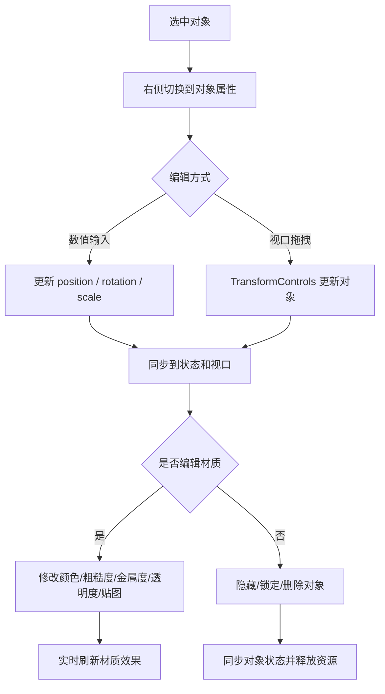

# 第二阶段开发前确认方案：模型可编辑闭环

## 1. 文档控制

- 产品/功能名称：3D 影视分镜工作台第二阶段：模型可编辑闭环
- 文档版本：v1.0
- 文档状态：已完成
- 创建日期：2026-06-22
- 更新日期：2026-06-23
- 负责人：待定
- 评审参与方：用户、产品、设计、工程
- 相关文档：
  - `docs/prd/3d-workbench-prd.md`
  - `docs/prd/change-log.md`
  - `docs/prd/m1-development-confirmation.md`
  - `docs/assets/reference/ui-reference-3d-director.png`
- 相关变更记录：
  - `docs/prd/change-log.md` 2026-06-22 “调整第二阶段开发范围”
  - `docs/prd/change-log.md` 2026-06-22 “确认第二阶段数据存储与资源清理策略”
  - `docs/prd/change-log.md` 2026-06-22 “完成第二阶段初版开发”

## 2. 一页摘要

### 一句话结论

第二阶段的目标是把第一阶段的“可看”工作台推进为“可摆、可调、可删、可改材质”的模型编辑闭环，打通“选中对象 -> 改变换 -> 视口拖拽 -> 改材质 -> 隐藏/锁定/删除 -> 资源释放”的完整链路。

### 本次解决的问题

第一阶段已经能导入模型并导出快照，但模型仍然是“可见不可改”的。用户无法精确摆位、无法快速拖拽、无法锁定或隐藏对象，也不能做基础材质探索，这会直接卡住分镜预演的核心使用场景。

### 本次交付内容

- 左侧对象列表增强：选中、高亮、可见、锁定、删除操作。
- 右侧模型属性面板。
- 模型位置、旋转、缩放数值编辑。
- 视口 `TransformControls` 拖拽编辑。
- 模型隐藏/显示、锁定/解锁、删除。
- 材质列表读取。
- 材质颜色、粗糙度、金属度、透明度、贴图替换。
- `sceneRegistry` 级别的运行时对象映射。
- 对象删除、页面关闭、组件卸载时的资源释放。

### 本次不交付内容

- 不做关键帧时间线。
- 不做材质关键帧动画。
- 不做项目文件持久化。
- 不做多镜头管理。
- 不做高级材质节点编辑或复杂材质兼容层。

### 关键风险或未决问题

- 不同 `.glb` 模型的材质类型差异很大，第二阶段只能优先覆盖常见材质。
- `TransformControls` 与 `OrbitControls` 容易产生交互冲突，需要清楚定义拖拽期间的控制权。
- 贴图替换会带来新的 object URL 生命周期问题，若释放不当容易泄漏资源。

## 3. 背景、问题与依据

### 背景

第一阶段已经完成工作台骨架、基础视口、`.glb` 导入和快照导出，证明这个产品方向是可落地的。第二阶段的重点不再是“能否进入工作台”，而是“用户能否真正摆场景、改对象、做造型探索”。

### 用户问题

- 用户导入模型后，不能通过数值方式精确调整位置、旋转、缩放。
- 用户不能在视口中直接拖拽模型做快速摆位。
- 用户不能隐藏、锁定或删除对象，导致场景管理效率低。
- 用户不能修改颜色、粗糙度、金属度、透明度和贴图，无法完成基础视觉探索。
- 运行时 Three.js 对象和产品状态之间缺少稳定映射，不利于后续时间线接入。

### 现有方案不足

- 第一阶段右侧只覆盖相机属性，模型缺少专属属性面板。
- 视口只有观察能力，没有对象编辑控制器。
- 材质数据没有从运行时对象提取为稳定的业务可编辑结构。
- 删除对象和页面关闭前如果不释放 URL 与材质资源，长期使用会积累内存问题。

### 证据与依据

| 类型 | 内容 | 来源 | 可信度 |
| --- | --- | --- | --- |
| 产品基线 | 主 PRD 已将模型变换编辑和材质颜色调整列为 MVP 核心能力 | `docs/prd/3d-workbench-prd.md` | 高 |
| 已确认需求 | 第二阶段需支持视口拖拽、模型隐藏锁定删除和扩展材质参数编辑 | 项目沟通与变更记录 | 高 |
| 技术依据 | Three.js `TransformControls` 可用于平移、旋转、缩放控制 | three.js 官方文档与当前选型 | 高 |
| 技术依据 | 贴图替换和材质参数编辑依赖运行时材质遍历、提取和回写 | 当前架构与材质处理需求 | 高 |

## 4. 目标用户、场景与用户旅程

### 用户角色

| 用户类型 | 目标 | 痛点 | 使用频率 |
| --- | --- | --- | --- |
| 导演 / 分镜师 | 快速调整角色和道具位置构图 | 只能看不能摆，无法形成有效分镜 | 高频 |
| AI 视频创作者 | 稳定控制场景和对象关系 | 靠文本描述无法精确复现空间布局 | 高频 |
| 3D 协作者 | 对导入模型做轻量修改并输出参考图 | 不想进入复杂 DCC 软件做简单调整 | 中频 |

### 使用场景

- 用户导入一个角色模型，希望把它向前移动一点并调整朝向。
- 用户在视口里快速拖拽道具位置，然后用数值输入做精修。
- 用户想把一个模型隐藏掉，避免它出现在当前参考帧里。
- 用户需要把角色服装颜色改成另一版，并替换一张贴图做快速方案对比。

### 触发条件

- 用户已经导入至少一个对象。
- 用户希望从“看场景”进入“摆场景”。
- 用户需要为快照或后续镜头准备更稳定的对象状态。

### 用户旅程

| 步骤 | 用户行为 | 用户目标 | 系统响应 |
| --- | --- | --- | --- |
| 1 | 在左侧对象列表选中一个模型 | 进入对象编辑状态 | 右侧切换到对象属性面板，视口高亮对象 |
| 2 | 修改位置、旋转、缩放数值 | 精确摆位 | 视口实时更新对象变换 |
| 3 | 切换到拖拽模式并操作控制器 | 快速摆位 | `TransformControls` 同步更新对象和状态 |
| 4 | 隐藏或锁定对象 | 管理场景干扰项 | 对象在视口和属性编辑层同步更新 |
| 5 | 打开材质区域并调整参数 | 做基础造型或光感探索 | 材质效果在视口实时反馈 |
| 6 | 替换贴图或删除对象 | 调整方案或清理场景 | 系统同步更新状态并释放资源 |

## 5. 目标、非目标与成功指标

### 产品目标

- 让模型成为真正可编辑的资产，而不是只可见的参考对象。
- 建立对象状态、运行时对象和材质数据之间的稳定映射。
- 为后续时间线和摄影机编辑提供可靠的对象层数据基础。

### 体验目标

- 用户可以在“数值精调”和“视口拖拽”之间自然切换。
- 对象编辑结果必须实时反馈到 3D 视口。
- 材质编辑不求专业 DCC 深度，但要覆盖常见的基础探索需求。

### 非目标

- 不把第二阶段扩展成完整建模或复杂材质工作流。
- 不追求对所有 Three.js 材质类型的完美兼容。
- 不在第二阶段引入持久化和撤销重做系统。

### 成功指标

| 指标 | 类型 | 目标值或观察方式 | 是否验收项 |
| --- | --- | --- | --- |
| 对象选中闭环 | 定性 | 选中对象后左侧、右侧、视口联动正确 | 是 |
| 变换编辑闭环 | 定性 | 数值编辑和视口拖拽都能实时更新对象 | 是 |
| 对象状态控制 | 定性 | 隐藏、锁定、删除都能稳定生效 | 是 |
| 材质编辑闭环 | 定性 | 修改颜色、粗糙度、金属度、透明度和贴图后视口实时反馈 | 是 |
| 资源释放 | 定性 | 删除对象或页面关闭时释放相关 URL 和运行时资源 | 是 |

## 6. 范围、优先级与版本边界

### 本次范围

- 模型选中与对象属性面板。
- 变换数值输入。
- `TransformControls` 拖拽。
- 对象隐藏、锁定、删除。
- 材质列表读取与材质参数编辑。
- 贴图替换。
- 运行时对象映射与资源释放。

### 本次不做

- 关键帧时间线。
- 对象复制。
- 项目持久化。
- 材质动画与高级 shader 编辑。
- 删除确认弹窗或撤销系统。

### 后续版本

- 第三阶段：摄影机可编辑闭环。
- 后续：时间线、骨骼控制、结构化导出。

### 优先级

| 优先级 | 功能/能力 | 用户价值 | 说明 |
| --- | --- | --- | --- |
| P0 | 对象选中与属性面板切换 | 没有选中态就无法进入编辑 | 第二阶段必须完成 |
| P0 | 位置/旋转/缩放编辑 | 核心摆位能力 | 第二阶段必须完成 |
| P0 | `TransformControls` 视口拖拽 | 提升摆位效率 | 第二阶段必须完成 |
| P0 | 对象隐藏/锁定/删除 | 保证场景管理可用 | 第二阶段必须完成 |
| P0 | 材质基础编辑 | 满足第一版视觉探索需求 | 第二阶段必须完成 |
| P1 | 贴图替换 | 扩展材质探索边界 | 第二阶段应完成 |
| P1 | 资源释放 | 控制本地运行稳定性 | 第二阶段应完成 |

## 7. 产品方案与用户流程

### 产品方案

第二阶段的产品方案是“对象成为资产，材质成为可调参数”。用户从左侧对象列表或视口进入对象选中态，右侧从相机面板切换成模型属性面板；一方面通过数值输入和拖拽完成变换编辑，另一方面通过材质区域完成基础视觉调节。所有结果都直接反馈到视口，并进入项目状态。

### 页面/区域结构

- 左侧栏：对象列表从纯展示升级为可选中和可执行快速状态操作。
- 中央视口：增加对象选中态和 `TransformControls`。
- 右侧栏：根据当前选中对象类型切换相机面板或模型属性面板。
- 底部工具条：可承接移动、旋转、缩放等模式切换。

### 主流程

1. 用户在左侧对象列表或视口中选中对象。
2. 右侧切换到对象属性面板并展示变换和材质信息。
3. 用户通过数值或拖拽修改对象变换。
4. 用户根据需要隐藏、锁定、删除对象，或修改材质参数。
5. 系统将变化同步到 Three.js 运行时对象、项目状态和快照结果。

### 分支流程

- 若对象被锁定，则仍可查看属性，但禁止编辑变换和材质。
- 若对象没有可编辑材质，则材质区展示只读或不支持状态。
- 若多个 Mesh 共享材质，则材质区按材质维度去重展示。

### 异常流程

- 删除对象时如果资源释放失败，不应阻塞状态移除，但需要确保场景中节点已清除。
- 不支持的材质类型应显示为不可编辑，而不是假装支持。
- 贴图替换失败时，保留旧贴图并提示失败。

### 状态说明

- 空状态：未选中对象时，右侧保留相机属性或对象空状态。
- 加载状态：贴图替换或重解析过程中显示处理中反馈。
- 错误状态：材质读取失败、贴图替换失败、删除失败时给出明确提示。
- 禁用状态：对象锁定、材质不支持、无选中对象时相关操作不可用。
- 成功状态：变换和材质修改后视口实时更新，对象状态立即可见。

### 流程图



## 8. 功能需求与规则

### 8.1 对象选中与右侧面板切换

用户问题：用户需要明确进入“编辑哪个对象”，否则后续数值和材质修改没有目标。

用户故事：

- 作为创作者，我希望选中模型后右侧自动切换到对象属性面板，以便直接进入编辑。

入口：左侧对象列表、3D 视口中的对象。

主流程：

1. 用户在左侧列表或视口中选中对象。
2. 系统记录 `activeObjectId`。
3. 左侧高亮当前对象，右侧切换到对象属性面板。
4. 视口为当前对象显示选中态和控制器。

规则：

- 当前存在选中对象时，右侧优先展示对象属性而不是相机属性。
- 切换选中对象时，右侧内容必须同步刷新。
- 删除当前对象后，清空选中态并回退到相机面板或空状态。

规格明细：

| 维度 | 说明 |
| --- | --- |
| 展示内容 | 左侧对象项高亮、右侧对象属性面板、视口选中态 |
| 数据来源 | `activeObjectId`、`objects`、运行时对象映射 |
| 数据规则 | 选中对象必须对应有效的场景对象 id |
| 交互规则 | 点击对象即可切换选中；切换后所有面板实时同步 |
| 状态规则 | 无选中对象时显示相机面板或空状态 |
| 权限规则 | 锁定对象仍可选中，但只读 |
| 联动规则 | 左侧、右侧、视口、拖拽控制器共享同一选中态 |
| 持久化规则 | 选中态只保存在当前内存状态 |
| 性能约束 | 切换选中对象时不应重建整个视口场景 |

边界与异常：

- 若对象已从场景删除但仍残留选中 id，系统应自动清理无效选中态。
- 若选中对象不支持材质编辑，面板应只禁用对应区域。

验收标准：

- 给定场景中存在对象，当用户选中对象，则左侧高亮、右侧切换为对象属性面板、视口显示对应选中态。
- 给定当前对象被删除，当删除完成，则右侧不再显示该对象属性。

### 8.2 模型变换数值编辑

用户问题：用户需要精确控制对象位置、旋转和缩放，不能只靠视口观察。

用户故事：

- 作为创作者，我希望在属性面板中直接输入位置、旋转、缩放数值，以便完成精确摆位。

入口：右侧对象属性面板。

主流程：

1. 用户选中对象。
2. 系统展示 `position`、`rotation`、`scale` 输入项。
3. 用户修改数值。
4. 系统同步更新 Zustand 状态和 Three.js 对象。

规则：

- 旋转在 UI 中以角度显示，在运行时以弧度存储和应用。
- 缩放最小值为 `0.01`，避免对象退化或消失。
- 锁定对象时禁用所有变换输入。

规格明细：

| 维度 | 说明 |
| --- | --- |
| 展示内容 | 位置 X/Y/Z、旋转 X/Y/Z、缩放 X/Y/Z |
| 数据来源 | `SceneObject.position / rotation / scale` |
| 数据规则 | 输入值需进行格式化、合法性检查和角度/弧度转换 |
| 交互规则 | 修改即实时生效，不需要额外点击保存 |
| 状态规则 | 锁定时禁用；无对象时不显示 |
| 权限规则 | 锁定对象只读 |
| 联动规则 | 数值变更要同步影响视口对象和拖拽控制器 |
| 持久化规则 | 修改保存在内存对象状态中 |
| 性能约束 | 连续输入时不应导致明显视口卡顿 |

组件专项清单：

#### 表单 / 属性编辑器

- 表单目的：精确编辑对象变换
- 字段列表：`position.x/y/z`、`rotation.x/y/z`、`scale.x/y/z`
- 字段类型：数值输入
- 默认值：当前对象运行时与状态中的最新值
- 必填规则：对象存在即可编辑
- 校验规则：数值合法；缩放大于 0；旋转换算正确
- 输入限制：缩放最小 `0.01`
- 提交时机：实时生效
- 保存成功反馈：视口实时更新
- 保存失败处理：回退到上一个合法值
- 重置、取消与撤销：第二阶段不做独立撤销
- 脏数据提醒：第二阶段不做

边界与异常：

- 输入非法字符或空值时应回退或纠正，而不是写入异常状态。
- 若对象锁定，输入框必须处于禁用态。

验收标准：

- 给定选中未锁定对象，当用户修改位置、旋转或缩放数值，则视口中对象应实时变化。
- 给定锁定对象，当用户尝试编辑数值，则输入应被禁用且对象不发生变化。

### 8.3 视口拖拽编辑

用户问题：只靠数值输入效率太低，用户需要在画面中直接摆模型。

用户故事：

- 作为创作者，我希望在视口里直接拖拽控制器移动、旋转和缩放对象，以便更快摆位。

入口：中间 3D 视口、底部工具条或对象属性中的模式切换。

主流程：

1. 用户选中对象并切换到移动、旋转或缩放模式。
2. 系统为对象绑定 `TransformControls`。
3. 用户拖拽控制器。
4. 系统更新运行时对象变换，并在拖拽结束后回写到状态。

规则：

- 拖拽期间临时禁用 `OrbitControls`，避免控制冲突。
- 模式只允许 `translate`、`rotate`、`scale`。
- 拖拽结束后必须把运行时对象最新值同步回 store。

规格明细：

| 维度 | 说明 |
| --- | --- |
| 展示内容 | 选中对象控制器、当前模式态 |
| 数据来源 | 当前选中对象、运行时 Object3D、模式状态 |
| 数据规则 | 控制器始终绑定当前有效对象 |
| 交互规则 | 拖拽即实时变化；切换模式时同步切换控制器 |
| 状态规则 | 锁定或无选中对象时不显示或禁用控制器 |
| 权限规则 | 锁定对象禁止拖拽 |
| 联动规则 | 拖拽结果同步到右侧数值输入、快照结果和项目状态 |
| 持久化规则 | 结果只写入当前内存状态 |
| 性能约束 | 拖拽过程保持流畅，不重复创建控制器 |

组件专项清单：

#### 画布 / 3D 视口 / 拖拽交互

- 可交互对象：当前选中的模型对象
- 选择规则：只有选中对象可绑定控制器
- 拖拽、旋转、缩放规则：与当前模式一致
- 坐标系与单位：位置与缩放按场景单位，旋转内部用弧度
- 吸附、约束与边界：第二阶段不做高级吸附
- 辅助器显示：选中态下显示控制器
- 选中、高亮、锁定、隐藏状态：锁定禁用拖拽，隐藏对象不应参与编辑
- 与属性面板、对象列表、时间线的同步：与属性面板和列表同步，时间线仅预留后续扩展
- 性能边界：拖拽时不应频繁重建对象或场景

边界与异常：

- 拖拽过程中若对象被删除，控制器应安全解绑。
- 若当前对象不可见或锁定，应禁止显示可编辑控制器。

验收标准：

- 给定选中未锁定对象，当用户拖拽移动、旋转或缩放控制器，则视口中对象变化应实时可见，右侧数值同步更新。
- 给定用户正在拖拽对象，当拖拽开始，则 `OrbitControls` 应临时失效；拖拽结束后恢复。

### 8.4 对象可见、锁定与删除

用户问题：用户需要管理场景中的干扰项，并防止误操作。

用户故事：

- 作为创作者，我希望隐藏、锁定或删除对象，以便清理场景、避免误编辑并控制快照结果。

入口：左侧对象列表、右侧对象属性面板。

主流程：

1. 用户对对象执行隐藏、锁定或删除。
2. 系统更新项目状态。
3. 系统同步更新运行时对象可见性、控制器绑定和列表展示。
4. 删除时清理对象映射和相关资源。

规则：

- `visible` 直接同步到 `THREE.Object3D.visible`。
- `locked` 同时影响数值输入和拖拽控制器。
- 删除对象第一版不做二次确认。

规格明细：

| 维度 | 说明 |
| --- | --- |
| 展示内容 | 可见开关、锁定开关、删除按钮 |
| 数据来源 | `SceneObject.visible`、`SceneObject.locked`、运行时对象 |
| 数据规则 | 删除时同时移除状态记录、运行时映射和场景节点 |
| 交互规则 | 点击即生效，不需要复杂确认流程 |
| 状态规则 | 隐藏后对象不在视口和快照中出现；锁定后只读 |
| 权限规则 | 当前阶段不做角色权限差异，但锁定本身形成局部权限约束 |
| 联动规则 | 左侧状态图标、右侧编辑能力和视口可见性同步变化 |
| 持久化规则 | 状态仅保存在内存中 |
| 性能约束 | 删除不应导致残留运行时对象或资源泄漏 |

组件专项清单：

#### 权限 / 可见性 / 锁定

- 权限来源：对象本地状态 `locked`
- 角色或状态差异：锁定对象只读，未锁定对象可编辑
- 可见规则：`visible=false` 时对象从视口和快照中消失
- 可操作规则：未锁定对象可改变换和材质
- 只读规则：锁定后属性面板和控制器禁用
- 锁定规则：锁定优先于编辑模式
- 无权限提示：锁定状态可使用禁用态或提示文案
- 导出、保存、删除等高风险操作限制：删除仍允许执行，不做二次确认

边界与异常：

- 删除当前选中对象时应清空选中态。
- 对象隐藏后再次显示，应恢复原有变换与材质状态。

验收标准：

- 给定对象可见，当用户切换为隐藏，则对象应从视口和快照结果中消失。
- 给定对象被锁定，当用户尝试拖拽或修改属性，则编辑操作应失效。
- 给定对象被删除，当删除完成，则对象应从左侧列表、视口和状态中移除。

### 8.5 材质列表读取与基础参数编辑

用户问题：用户需要快速尝试颜色和材质参数，而不是保留导入时的固定效果。

用户故事：

- 作为创作者，我希望看到对象的材质列表并调整基础参数，以便做快速视觉探索。

入口：右侧对象属性面板中的材质区域。

主流程：

1. 用户选中对象。
2. 系统遍历对象下的 Mesh 和材质，提取可编辑材质列表。
3. 用户选择材质并修改颜色、粗糙度、金属度或透明度。
4. 系统实时更新材质并回写 `materialOverrides`。

规则：

- 优先支持 `MeshStandardMaterial`、`MeshPhysicalMaterial`、`MeshBasicMaterial` 等常见材质。
- 多个 Mesh 共享同一材质时只展示一次。
- 不支持的参数应置灰或标记不可编辑。

规格明细：

| 维度 | 说明 |
| --- | --- |
| 展示内容 | 材质列表、颜色选择器、粗糙度滑杆、金属度滑杆、透明度滑杆 |
| 数据来源 | 运行时材质遍历结果、`materialOverrides` |
| 数据规则 | 每个材质使用稳定的 `materialId` 和材质名识别 |
| 交互规则 | 调参即实时生效，支持在不同材质间切换 |
| 状态规则 | 不支持项置灰；无材质时显示空状态 |
| 权限规则 | 锁定对象时禁用材质编辑 |
| 联动规则 | 改动同步影响视口效果和导出快照 |
| 持久化规则 | 改动写入对象内存状态 `materialOverrides` |
| 性能约束 | 材质遍历和更新要避免重复全量扫描 |

组件专项清单：

#### 详情页 / 详情面板

- 入口：对象属性面板材质区
- 数据来源：运行时材质和对象状态
- 字段分组：材质列表、基础参数、贴图区
- 字段展示规则：优先材质名，无名材质使用默认命名
- 编辑入口：颜色选择器、滑杆、贴图输入
- 只读与锁定状态：锁定时整体只读
- 缺失数据展示：无材质或不支持时显示占位
- 与列表或视口的联动：修改后视口即时更新
- 关闭、返回或切换对象后的状态保留：切换对象后加载新对象材质数据

#### 表单 / 属性编辑器

- 表单目的：编辑材质基础参数
- 字段列表：`color`、`roughness`、`metalness`、`opacity`
- 字段类型：颜色选择器、滑杆
- 默认值：来自当前材质运行时值
- 必填规则：对象存在且材质可编辑
- 校验规则：参数范围合法
- 输入限制：数值参数限制在合法区间
- 提交时机：实时生效
- 保存成功反馈：视口材质立即变化
- 保存失败处理：回退到上一个合法值
- 重置、取消与撤销：第二阶段不做独立撤销
- 脏数据提醒：第二阶段不做

边界与异常：

- 若对象材质不支持某参数，则该项不可编辑但应保留说明。
- 若材质读取失败，仍允许对象变换编辑，不应阻断整个对象面板。

验收标准：

- 给定对象存在可编辑材质，当用户修改颜色、粗糙度、金属度或透明度，则视口中的对象材质应实时更新。
- 给定多个 Mesh 共享同一材质，当面板展示材质列表，则该材质应只出现一次。

### 8.6 贴图替换与资源释放

用户问题：用户不仅想调参数，还想快速换一张贴图，同时又不能把本地运行时资源越堆越多。

用户故事：

- 作为创作者，我希望给对象替换贴图，并在删除对象或关闭页面时自动释放资源，以便保持本地运行稳定。

入口：材质区域贴图输入、对象删除、页面关闭或组件卸载。

主流程：

1. 用户选择本地贴图文件。
2. 系统创建贴图 object URL 并加载为材质贴图。
3. 系统把贴图引用写入 `materialOverrides` 或相关资产记录。
4. 当对象删除、页面关闭或组件卸载时，系统释放贴图 URL、GLB URL 和相关 Three.js 资源。

规则：

- 贴图替换成功后应立即更新材质 `map`。
- 旧贴图若被替换且不再使用，应进入释放流程。
- 页面关闭前必须集中释放仍存在的临时资源。

规格明细：

| 维度 | 说明 |
| --- | --- |
| 展示内容 | 贴图上传入口、贴图状态、资源释放隐式逻辑 |
| 数据来源 | 本地文件、贴图 object URL、对象和资产状态 |
| 数据规则 | 贴图作为临时资源与对象材质关联 |
| 交互规则 | 选择贴图后立即替换；失败则保留旧结果 |
| 状态规则 | 无贴图时显示占位；加载中显示处理状态；失败显示提示 |
| 权限规则 | 锁定对象时不允许替换贴图 |
| 联动规则 | 替换后的贴图同步影响视口和快照 |
| 持久化规则 | 贴图只在当前会话内有效 |
| 性能约束 | 避免遗留无引用的贴图和几何体资源 |

组件专项清单：

#### 上传 / 导入 / 文件解析

- 支持格式：常见图片格式
- 文件大小限制：第二阶段不强拦截，但失败时需提示
- 数量限制：按单材质单次选择处理
- 选择入口：贴图文件选择器
- 拖拽上传：第二阶段不做
- 解析流程：`File` -> `objectURL` -> 纹理加载 -> 设置材质 `map`
- 进度展示：基础处理中反馈
- 成功后的数据写入：写入材质覆盖和贴图引用
- 失败原因与提示：图片损坏、格式不支持、加载失败
- 重试、取消与清理策略：失败允许重试；替换或删除时清理旧资源
- 临时资源释放策略：对象删除、页面关闭、组件卸载时释放

#### 设置 / 配置 / 偏好

- 配置项：当前对象材质贴图引用
- 默认值：沿用导入材质现状
- 可选值：来自用户本地文件
- 生效时机：选择成功后立即生效
- 作用范围：当前材质 / 当前对象
- 是否持久化：否
- 重置规则：第二阶段不做独立恢复默认贴图
- 与已有数据的兼容策略：贴图失败时保留旧贴图

边界与异常：

- 贴图替换失败时，不能把材质置为异常空白状态。
- 删除对象时即使个别资源释放失败，也不能阻塞对象从场景和状态中移除。

验收标准：

- 给定可编辑材质，当用户替换贴图成功，则视口中的材质贴图应更新。
- 给定对象删除或页面关闭，当清理逻辑执行，则相关 GLB URL、贴图 URL 和 Three.js 资源应进入释放流程。

## 9. 数据、技术与非功能要求

### 数据模型

```json
{
  "sceneObject": {
    "id": "string",
    "assetId": "string",
    "name": "string",
    "type": "character | model | helper",
    "visible": true,
    "locked": false,
    "position": [0, 0, 0],
    "rotation": [0, 0, 0],
    "scale": [1, 1, 1],
    "materialOverrides": []
  }
}
```

### 字段说明

| 字段 | 类型 | 说明 | 是否必填 | 默认值 | 备注 |
| --- | --- | --- | --- | --- | --- |
| id | string | 对象 id | 是 | 无 | 业务主键 |
| assetId | string \| undefined | 来源资产 id | 否 | `undefined` | 对应导入资产 |
| name | string | 对象名称 | 是 | 导入名或默认名 | 左侧列表和面板使用 |
| visible | boolean | 是否可见 | 是 | `true` | 同步到运行时对象 |
| locked | boolean | 是否锁定 | 是 | `false` | 影响编辑能力 |
| position | Vec3 | 对象位置 | 是 | `[0,0,0]` | 时间线可复用 |
| rotation | Vec3 | 对象旋转，内部用弧度 | 是 | `[0,0,0]` | UI 需做角度转换 |
| scale | Vec3 | 对象缩放 | 是 | `[1,1,1]` | 最小值受限 |
| materialOverrides | MaterialOverride[] | 材质覆盖信息 | 否 | `[]` | 第二阶段新增 |

### 存储、导入导出与兼容策略

- 第二阶段继续只使用前端内存状态。
- 运行时对象映射 `sceneRegistry` 不进入项目 JSON。
- 贴图和 GLB 的 object URL 都属于会话级临时资源。
- 后续时间线可以直接复用 `position`、`rotation`、`scale` 字段。

### 技术架构

- `ObjectInspector`：对象属性面板。
- `TransformFields`：复用的变换输入区域。
- `MaterialInspector`：材质列表和材质参数编辑。
- `sceneRegistry`：`objectId -> THREE.Object3D` 映射。
- `materialTools`：材质遍历、读取、回写。
- `TransformControls`：视口拖拽控制器封装。

### 模块边界

- `components/panels` 负责属性编辑 UI，不直接操作 Three.js 细节。
- `three/sceneRegistry.ts` 负责运行时对象引用和释放。
- `three/materialTools.ts` 负责材质兼容层和参数应用。
- `store/projectStore.ts` 仍是产品状态唯一入口。

### 关键依赖

- Three.js `TransformControls`
- GLTF 导入后的运行时对象结构
- 浏览器本地文件和图片加载能力

### 实现策略

- 所有对象编辑必须走“状态更新 + 运行时同步”单一入口。
- 拖拽期间运行时对象可先变，结束后统一回写状态。
- 资源释放必须覆盖对象删除、页面关闭和组件卸载三个时机。

### 非功能需求

- 性能要求：常规模型编辑和拖拽保持流畅；材质调整不应明显阻塞 UI。
- 兼容性要求：优先覆盖常见 GLB 与常见材质类型。
- 可用性要求：对象锁定、材质不支持、贴图失败等状态都要有清晰反馈。
- 可维护性要求：对象状态、材质状态和运行时对象引用解耦。
- 安全与隐私要求：贴图和模型文件均在本地处理，不上传外部服务。

## 10. 验收、风险、开放问题与评审记录

### 验收标准

| 编号 | 验收项 | 前置条件 | 操作 | 预期结果 | 验证方式 |
| --- | --- | --- | --- | --- | --- |
| AC-001 | 对象选中联动 | 场景中已有对象 | 选中对象 | 左侧高亮、右侧切换对象面板、视口显示选中态 | 手动 |
| AC-002 | 数值变换编辑 | 选中未锁定对象 | 修改位置/旋转/缩放 | 视口实时更新，状态同步变化 | 手动 |
| AC-003 | 视口拖拽编辑 | 选中未锁定对象 | 拖拽 `TransformControls` | 对象实时变化，拖拽结束后状态回写 | 手动 |
| AC-004 | 对象隐藏 | 场景中已有对象 | 切换隐藏 | 对象从视口和快照中消失 | 手动 |
| AC-005 | 对象锁定 | 选中对象 | 切换锁定并尝试编辑 | 数值输入和拖拽被禁用 | 手动 |
| AC-006 | 对象删除 | 场景中已有对象 | 删除对象 | 对象从列表、状态、视口移除 | 手动 |
| AC-007 | 材质基础编辑 | 对象存在可编辑材质 | 修改颜色/粗糙度/金属度/透明度 | 视口材质实时更新 | 手动 |
| AC-008 | 贴图替换 | 对象存在可编辑材质 | 替换贴图 | 材质贴图更新，失败时保留旧贴图 | 手动 |
| AC-009 | 资源释放 | 删除对象或关闭页面 | 执行清理 | 相关 URL 和运行时资源进入释放流程 | 手动 |

### 排期与里程碑

| 阶段 | 目标 | 交付物 | 验收方式 | 状态 |
| --- | --- | --- | --- | --- |
| M2-1 | 对象状态与映射 | `sceneRegistry`、对象选中与状态操作 | 手动检查 | 已完成 |
| M2-2 | 变换编辑闭环 | 数值输入、`TransformControls` | 手动检查 | 已完成 |
| M2-3 | 材质编辑闭环 | 材质读取、基础参数、贴图替换 | 手动检查 | 已完成 |
| M2-4 | 资源释放 | 对象删除和页面关闭清理 | 手动检查 | 已完成 |

### 假设、约束与依赖

- 假设：用户第二阶段最关心的是摆位和基础造型，而不是复杂动画或持久化。
- 约束：继续仅做内存状态，不做本地项目保存。
- 依赖：模型材质质量、浏览器图片加载能力、Three.js 控制器和运行时对象结构。

### 风险

| 风险 | 影响范围 | 概率 | 影响 | 应对策略 |
| --- | --- | --- | --- | --- |
| 材质类型兼容不足 | 材质编辑体验 | 中 | 高 | 先覆盖常见材质，其他材质禁用并提示 |
| 拖拽与 OrbitControls 冲突 | 视口交互体验 | 中 | 高 | 拖拽期间临时关闭 OrbitControls |
| 资源释放遗漏 | 长时间使用稳定性 | 中 | 高 | 集中覆盖删除、卸载、页面关闭三个时机 |
| 状态与运行时不同步 | 后续时间线接入与当前编辑正确性 | 中 | 高 | 统一单一同步入口 |

### 开放问题

| 问题 | 影响范围 | 负责人 | 期望确认时间 | 状态 |
| --- | --- | --- | --- | --- |
| 是否需要在后续为删除操作补撤销能力 | 对象管理体验 | 待定 | 第三阶段前 | 待后续评估 |
| 是否需要为长材质列表补折叠或搜索 | 材质面板可用性 | 待定 | 后续阶段前 | 待后续评估 |

### 评审记录

| 日期 | 参与方 | 结论 | 待办 |
| --- | --- | --- | --- |
| 2026-06-22 | 用户、产品、工程 | 确认第二阶段聚焦模型可编辑闭环 | 更新范围与数据结构 |
| 2026-06-22 | 用户、产品、工程 | 确认继续只做内存状态，但页面关闭与对象删除要释放资源 | 进入第二阶段开发 |
| 2026-06-22 | 用户、产品、工程 | 第二阶段初版开发完成 | 后续补真实模型兼容性验证 |

### 变更记录

| 日期 | 变更内容 | 变更原因 | 影响范围 |
| --- | --- | --- | --- |
| 2026-06-22 | 第二阶段范围扩展到视口拖拽和更多材质参数 | 用户确认需要更完整的模型编辑能力 | 第二阶段产品范围、材质处理、视口交互 |
| 2026-06-22 | 明确页面关闭和对象删除时释放本地资源 | 用户确认不做持久化，但要求清理运行时缓存 | 资源生命周期、删除逻辑、页面卸载逻辑 |
| 2026-06-23 | 按新版 PRD 标准重写第二阶段文档 | 统一文档结构并补齐组件规格与验收细节 | `docs/prd/m2-development-confirmation.md` 全文 |
