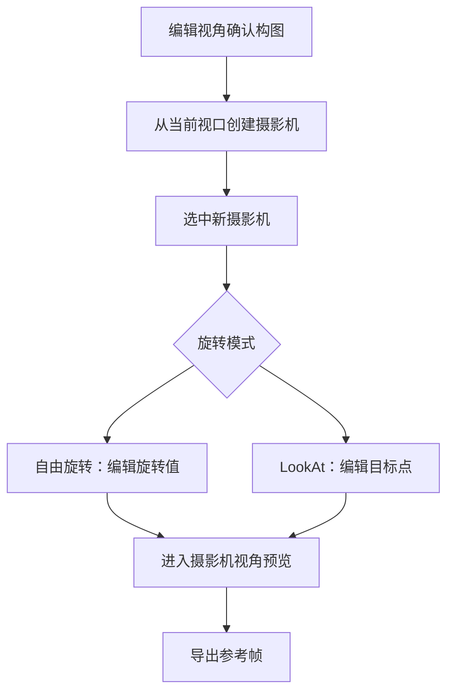

# 第三阶段开发前确认方案：摄影机可编辑闭环

## 1. 文档控制

- 产品/功能名称：3D 影视分镜工作台第三阶段：摄影机可编辑闭环
- 文档版本：v1.2
- 文档状态：已确认 / 开发中
- 创建日期：2026-06-22
- 更新日期：2026-06-22
- 负责人：待定
- 评审参与方：用户、产品、设计、工程
- 相关文档：
  - `docs/prd/3d-workbench-prd.md`
  - `docs/prd/change-log.md`
  - `docs/prd/m1-development-confirmation.md`
  - `docs/prd/m2-development-confirmation.md`
  - `docs/prd/m3-development-confirmation.md`
  - `docs/assets/reference/ui-reference-3d-director.png`
- 相关变更记录：`docs/prd/change-log.md` 2026-06-22 “调整第三阶段开发优先级”

## 2. 一页摘要

### 一句话结论

第三阶段先补齐摄影机作为场景对象的编辑闭环，使用户可以创建、选择、移动、旋转、LookAt、预览和导出以摄影机为准的参考帧，再进入关键帧时间线开发。

### 本次解决的问题

前两阶段已经完成 GLB 导入、模型拖拽和材质调整，但摄影机仍只能编辑 FOV 和注视目标，不能像模型一样被移动和旋转，也不能从当前视口保存机位。这会阻断影视分镜预演的核心流程：先摆空间，再定机位，再导出参考帧与参数。

### 本次交付内容

- 摄影机成为左侧“机位”中的可编辑资产。
- 支持新增摄影机，并可从当前编辑视口创建摄影机。
- 支持摄影机重命名、删除、显示/隐藏、锁定/解锁。
- 支持摄影机位置、旋转、注视目标和 FOV 数值编辑。
- 支持摄影机视口拖拽移动和旋转。
- 支持从 3D 视口直接点选模型和摄影机。
- 支持自由旋转与 LookAt 两种旋转模式。
- 支持进入/退出摄影机视角预览。
- 支持在右侧机位预览窗口实时显示当前机位画面。
- 支持注视目标来源切换：Suggest 搜索单选 / 手动坐标。
- 支持绑定全景图背景。
- 快照导出以当前活跃摄影机视角为准。

### 本次不交付内容

- 不做关键帧时间线。
- 不做本地项目保存。
- 不做相机路径、曲线、轨道车、摇臂、稳定器等高级摄影机 rig。
- 不做 Filmback、焦距、焦点、景深和后期调色参数。
- 不接入 AI 视频生成接口。

### 关键风险或未决问题

- 摄影机预览模式会改变主视口控制方式，需要清晰区分“编辑视角”和“摄影机视角”。
- LookAt 模式会由目标点反推旋转，自由旋转模式会直接保存 Euler 旋转，两者切换时必须避免参数跳变。
- 本阶段仍为内存状态，刷新页面后机位会丢失。

## 3. 背景与问题

### 业务背景

产品定位是轻量 3D 影视分镜预演工作台。主流程应服务于导演或创作者在 AI 视频生成前确认场景空间、角色站位、摄影机构图和参考帧。摄影机不是附属参数，而是分镜表达的核心资产。

### 用户问题

- 用户能调整模型，但无法直接移动或旋转摄影机。
- 用户已经在编辑视角找到了一个好构图，却不能一键保存为机位。
- 用户不能进入摄影机视角确认最终参考帧。
- 快照导出缺少明确的“以哪个摄影机为准”的操作闭环。
- 用户不能从视口直接点击模型或摄影机，只能通过左侧列表切换，空间编辑链路不顺。
- 右侧机位预览窗口不能实时反映当前机位画面。
- 注视目标只能输入坐标，不能直接引用项目内对象或机位。
- 缺少全景图背景绑定能力，环境表达不完整。

### 现有方案不足

- 摄影机数据只有位置、目标点和 FOV，没有旋转模式、显隐、锁定等基础属性。
- Three.js TransformControls 目前只绑定模型对象。
- 右侧相机面板只读展示位置和目标点，不支持完整编辑。
- 左侧机位列表只有选择入口，缺少资产级操作。

### 证据与依据

| 类型 | 内容 | 来源 | 可信度 |
| --- | --- | --- | --- |
| 已确认需求 | 用户明确指出摄影机移动旋转缺失，并确认需要自由旋转、LookAt、从当前视口创建摄影机和摄影机视角预览 | 项目沟通 | 高 |
| 竞品/行业依据 | Unreal Engine Cine Camera Actor 支持 Pilot、Picture-in-Picture、Look at Tracking、Filmback、Lens、Focus 等影视相机能力 | https://dev.epicgames.com/documentation/en-us/unreal-engine/cinematic-cameras-in-unreal-engine | 高 |
| 竞品/行业依据 | Unity Cinemachine Camera 支持 Solo 预览、Tracking Target、Look At Target、Lens 和位置/旋转控制模块 | https://docs.unity3d.com/Packages/com.unity.cinemachine@3.1/manual/CinemachineCamera.html | 高 |
| 技术依据 | Three.js 提供 PerspectiveCamera、TransformControls、CameraHelper，可支撑轻量摄影机编辑 | https://threejs.org/docs/ | 高 |

## 4. 目标用户与使用场景

### 用户角色

| 用户类型 | 目标 | 痛点 | 使用频率 |
| --- | --- | --- | --- |
| 导演/分镜创作者 | 快速摆机位并导出参考帧 | 不想进入完整 DCC 软件完成复杂相机设置 | 高频 |
| AI 视频创作者 | 为文生视频/图生视频准备可解释的镜头参数 | 只靠文字提示词难以稳定表达构图和机位 | 高频 |
| 美术/预演协作者 | 检查角色、模型与摄影机关系 | 缺少轻量的空间沟通工具 | 中频 |

### 使用场景

用户导入 `.glb` 场景或角色后，通过编辑视角调整模型与空间布局；随后从当前视口创建摄影机，微调摄影机位置、旋转、LookAt 目标和 FOV，进入摄影机视角确认最终构图，并导出快照作为分镜参考帧。

### 触发条件

- 用户点击左侧“新增机位”。
- 用户点击“从当前视口创建”。
- 用户选择某个机位并进入摄影机视角。
- 用户在相机属性面板调整参数。
- 用户在 3D 视口中直接点击模型或摄影机。

### 用户旅程

| 步骤 | 用户行为 | 用户目标 | 系统响应 |
| --- | --- | --- | --- |
| 1 | 调整编辑视角 | 找到满意构图 | 视口保持 OrbitControls 编辑模式 |
| 2 | 从当前视口创建摄影机 | 保存当前构图为机位 | 系统新增相机并选中 |
| 3 | 选择移动或旋转模式 | 微调机位 | TransformControls 绑定摄影机 rig |
| 4 | 切换自由旋转或 LookAt | 控制镜头朝向 | 系统保存旋转或由目标点反推朝向 |
| 5 | 在视口中点击模型或摄影机 | 直接切换当前编辑目标 | 系统同步更新左侧列表高亮和右侧属性面板 |
| 6 | 进入摄影机视角 | 检查最终画面 | 主视口切换到活跃摄影机视角 |
| 7 | 导出快照 | 形成参考帧 | PNG 使用活跃摄影机画面导出 |

## 5. 目标与成功指标

### 产品目标

- 让摄影机成为与模型同等重要的可编辑资产。
- 支撑影视分镜中“机位确认”和“参考帧导出”的核心闭环。
- 为后续关键帧时间线提供稳定的数据模型。

### 体验目标

- 用户不需要理解复杂摄影机术语，也能完成新增、选择、调整、预览和导出。
- 摄影机视角与编辑视角切换清晰，不丢失当前编辑视角。
- LookAt 与自由旋转两种模式的行为可预测。

### 成功指标

| 指标 | 类型 | 目标值或观察方式 | 是否验收项 |
| --- | --- | --- | --- |
| 从当前视口创建摄影机 | 定性 | 新机位位置、旋转、FOV 与当前视口一致 | 是 |
| 摄影机拖拽移动/旋转 | 定性 | 数值面板和 3D rig 同步更新 | 是 |
| 视口点选对象/摄影机 | 定性 | 点击画面可直接切换当前选中目标 | 是 |
| 摄影机视角预览 | 定性 | 进入后主视口采用活跃摄影机参数，退出后恢复编辑视角 | 是 |
| 机位预览实时更新 | 定性 | 调整机位时右侧预览窗口同步变化 | 是 |
| 注视目标选择 | 定性 | 可在资产列表和手动坐标之间切换 | 是 |
| 全景图绑定 | 定性 | 绑定后视口和机位预览都能显示环境背景 | 是 |
| 快照导出 | 定性 | 导出画面与活跃摄影机预览一致 | 是 |

### 非目标

- 不追求完整专业摄影机参数系统。
- 不做多镜头剪辑和时间线。
- 不做性能复杂优化和大规模场景管理。

## 6. 范围、非范围与优先级

### 本次范围

- 摄影机数据结构扩展。
- 摄影机列表操作。
- 摄影机属性面板。
- 视口摄影机 rig 与 TransformControls 绑定。
- 视口射线拾取与画面点选。
- 编辑视角与摄影机视角切换。
- 机位实时预览。
- 注视目标来源选择与 Suggest 搜索。
- 全景图背景绑定。
- 快照使用活跃摄影机导出。

### 本次不做

- 时间线、关键帧、插值播放。
- 本地保存。
- 多 Shot 管理。
- 专业焦距/传感器/景深。

### 后续版本

- 单镜头关键帧时间线。
- 摄影机路径和镜头运动预设。
- 画幅/安全框/构图辅助线。
- Filmback、焦距、焦点和景深。
- 多镜头 Shot 管理和参数 JSON 导出。

### 优先级

| 优先级 | 功能/能力 | 用户价值 | 说明 |
| --- | --- | --- | --- |
| P0 | 摄影机新增、选择、移动、旋转、LookAt、预览、快照 | 完成机位确认闭环 | 本阶段必须完成 |
| P1 | 显示/隐藏、锁定/解锁、删除、重命名 | 管理多个机位 | 本阶段完成基础版 |
| P2 | 画中画、小预览、镜头预设、安全框 | 提升专业构图效率 | 后续评审 |

## 7. 用户流程与业务流程

### 主流程

1. 用户在编辑视角中浏览场景。
2. 用户点击“从当前视口创建摄影机”。
3. 系统新增摄影机并选中。
4. 用户通过数值或视口控制器微调位置、旋转、目标点和 FOV。
5. 用户也可以通过视口点击模型或摄影机切换当前编辑目标。
6. 用户进入摄影机视角确认构图。
7. 用户导出快照。

### 分支流程

- 用户选择自由旋转：旋转控件直接更新摄影机 Euler 旋转。
- 用户选择 LookAt：系统根据摄影机位置和目标点计算朝向。
- 用户锁定摄影机：禁用数值编辑和视口拖拽。
- 用户点击视口中的模型或摄影机：切换当前选中目标并联动面板。

### 异常流程

- 删除当前摄影机后，系统自动选择剩余第一台摄影机。
- 如果最后一台摄影机被删除，系统自动创建默认摄影机，保证快照能力可用。
- 如果摄影机隐藏，仍保留列表和参数，但视口 rig 不显示。

### 流程图



## 8. 方案说明

### 产品方案

摄影机在左侧机位列表中以资产形式管理，在右侧属性面板中编辑参数，在中间视口中通过摄影机 rig 和 TransformControls 进行拖拽。主视口保留“编辑视角”和“摄影机视角”两套状态，用户可以进入/退出摄影机视角。

### 设计方案

- 沿用参考 UI 的三栏结构。
- 左侧机位列表增加新增、显隐、锁定、删除。
- 右侧相机属性面板增加模式切换、拖拽模式、数值编辑和预览按钮。
- 右侧相机属性面板增加实时预览、注视目标来源切换、资产搜索和全景图绑定，并将全景图入口上移为高频场景设置。
- FOV 需要同时支持滑杆快速调节和数值输入精调，避免单一交互控件造成参数编辑受阻。
- 中间视口顶部显示当前是否处于摄影机视角。
- 中间视口支持射线拾取，点击模型或摄影机即可选中对应资产。

### 信息架构

- 左侧：对象、机位。
- 中间：3D 视口、摄影机 rig、TransformControls、视角状态提示、点击拾取。
- 右侧：快照管理、相机属性。
- 右侧：快照管理、相机属性、机位实时预览、背景绑定。
- 底部：选择/对象/相机/快照等工具入口。

### 页面/区域结构

- 机位列表：新增、选择、显隐、锁定、删除。
- 相机属性：名称、视口拖拽模式、旋转模式、位置、旋转、注视坐标、FOV、预览按钮。
- 相机属性：名称、视口拖拽模式、旋转模式、注视目标来源、目标资产 Suggest 搜索、注视坐标、FOV、全景图绑定。
- 相机属性：全景图绑定、名称、镜头朝向（自由朝向 / 注视目标）、视口拖拽模式、注视目标来源、目标资产 Suggest 搜索、注视坐标、FOV（滑杆 + 数值输入）。
- 视口：摄影机辅助模型、注视目标点、连线、当前视角标签、点选交互。

### 状态说明

- 空状态：至少保留一台默认摄影机，不出现无摄影机状态。
- 加载状态：本阶段不涉及异步摄影机加载。
- 错误状态：无。
- 禁用状态：锁定摄影机后禁用编辑；隐藏摄影机后禁用拖拽。
- 禁用状态：摄影机预览模式下禁用视口点选，避免误切换。
- 成功状态：参数编辑后实时同步视口和快照导出。

## 9. 功能需求

### 9.1 摄影机资产管理

用户问题：用户需要管理多个机位，不能只有一个固定相机。

用户故事：

- 作为创作者，我希望新增、选择、重命名和删除机位，以便比较不同构图。

入口：左侧“机位”区域、右侧相机属性面板。

主流程：

1. 用户点击新增机位或从当前视口创建。
2. 系统创建摄影机并自动选中。
3. 用户可以在左侧选择不同机位。

规则：

- 删除当前摄影机后自动选择下一台摄影机。
- 如果删除后没有摄影机，自动补一台默认摄影机。
- 机位名称允许为空但建议保留用户输入，UI 不做强拦截。

边界与异常：

- 锁定摄影机不可编辑。
- 隐藏摄影机不显示 rig，但仍可在列表中选择。

验收标准：

- 给定已有摄影机，当用户新增机位，则左侧列表出现新机位且右侧显示其属性。
- 给定当前摄影机，当用户删除，则列表移除该机位并选中剩余机位。

### 9.2 摄影机变换编辑

用户问题：用户需要像移动模型一样调整摄影机位置和朝向。

用户故事：

- 作为导演，我希望拖拽和输入数值调整摄影机，以便快速完成构图。

入口：右侧相机属性面板、3D 视口 TransformControls。

主流程：

1. 用户选择摄影机。
2. 用户选择移动或旋转模式。
3. 用户拖拽视口控制器或输入数值。
4. 系统同步更新摄影机 rig、相机参数和属性面板。

规则：

- 摄影机支持 translate 和 rotate。
- scale 对摄影机无意义，本阶段不提供摄影机缩放。
- LookAt 模式下旋转由位置和目标点计算，旋转字段展示结果但不作为主编辑通道。
- 交互层不再把 `LookAt` 表达为“另一种旋转按钮”，而是表达为“镜头朝向策略”，与视口拖拽模式分层。

边界与异常：

- 锁定或隐藏摄影机时不绑定 TransformControls。

验收标准：

- 给定选中未锁定摄影机，当用户拖拽移动控制器，则相机位置数值实时变化。
- 给定自由旋转模式，当用户拖拽旋转控制器，则相机旋转数值实时变化。

### 9.3 视口点选联动

用户问题：用户在 3D 画面里已经看到目标，但还需要回到左侧列表手动选择，操作割裂。

用户故事：

- 作为创作者，我希望直接点击画面中的模型或摄影机，以便更自然地切换编辑对象。

入口：中间 3D 视口。

主流程：

1. 用户在编辑视口中移动鼠标到模型或摄影机上。
2. 用户点击模型或摄影机。
3. 系统识别对应场景对象或摄影机 rig。
4. 左侧列表高亮对应项，右侧切换到对应属性面板。

规则：

- 点击模型时选中对应对象。
- 点击摄影机 rig 时选中对应摄影机。
- 点击空白区域时取消当前模型选中，回到相机面板。
- 点击 TransformControls 辅助器本身不触发切换。

边界与异常：

- 摄影机预览模式下不响应点选，避免误操作。
- 视口拖拽移动中不触发点选，防止把拖动误判为点击。

验收标准：

- 给定视口中存在模型，当用户点击模型，则左侧对象高亮且右侧显示模型属性。
- 给定视口中存在摄影机 rig，当用户点击摄影机，则左侧机位高亮且右侧显示相机属性。
- 给定用户点击空白区域，当当前选中为模型，则右侧返回相机属性面板。

### 9.4 自由旋转与 LookAt

用户问题：影视机位既需要手动旋转，也需要稳定盯住角色或目标点。

用户故事：

- 作为分镜创作者，我希望在自由旋转和 LookAt 之间切换，以便兼顾手动构图和目标追踪。

入口：右侧相机属性面板“旋转模式”。

主流程：

1. 用户选择自由旋转。
2. 系统允许编辑旋转值。
3. 用户选择 LookAt。
4. 系统根据注视坐标计算摄影机朝向。

规则：

- `free` 模式保存并应用 `rotation`。
- `lookAt` 模式保存 `target`，并在渲染层根据位置和目标点计算朝向。
- 从 `lookAt` 切回 `free` 时，保留当前计算出的旋转值。

边界与异常：

- 当目标点与摄影机位置重合时，保持上一帧旋转，避免朝向计算异常。

验收标准：

- 给定 LookAt 模式，当用户修改注视坐标，则相机 rig 和预览方向发生变化。
- 给定自由旋转模式，当用户修改旋转数值，则相机方向按数值变化。

### 9.5 摄影机视角预览与快照导出

用户问题：用户需要确认导出的参考帧是否就是当前机位画面。

用户故事：

- 作为创作者，我希望进入摄影机视角并直接导出快照，以便把构图交给分镜或 AI 视频流程。

入口：右侧相机属性面板、底部工具条、快照管理。

主流程：

1. 用户选择摄影机。
2. 用户点击进入摄影机视角。
3. 主视口切换为该摄影机画面。
4. 用户点击快照导出。
5. 系统导出与摄影机视角一致的 PNG。
6. 用户退出摄影机视角，系统恢复编辑视角。

规则：

- 摄影机视角预览使用活跃摄影机的 position、rotation/target 和 FOV。
- 退出预览后恢复进入前的编辑视角位置和 OrbitControls target。
- 快照优先使用活跃摄影机视角。

边界与异常：

- 若活跃摄影机被删除，自动退出预览并切换到下一台摄影机。

验收标准：

- 给定进入摄影机视角，当用户调整 FOV，则主视口画面实时变化。
- 给定摄影机视角预览，当用户导出快照，则快照列表新增图片且画面与预览一致。

### 9.6 机位实时预览、目标来源与全景图

用户问题：用户需要在属性面板里直接看到当前机位画面，并快速把注视目标绑定到对象/机位或环境背景。

用户故事：

- 作为创作者，我希望在右侧预览窗口实时看到机位画面，以便不用频繁进出摄影机视角。
- 作为创作者，我希望把注视目标绑定到对象或机位，或手动输入坐标，以便更快完成构图。
- 作为创作者，我希望绑定全景图背景，以便建立环境氛围。

入口：右侧相机属性面板。

规则：

- 机位预览跟随当前活跃摄影机实时刷新。
- 注视目标来源支持 `资产列表` 和 `手动坐标` 两种模式。
- `资产列表` 模式使用搜索输入与下拉结果一体化的 Suggest 组件，组件内提示文案固定为“搜索对象”。
- 资产列表仅展示项目内对象和其他机位，支持搜索和单选。
- 切回手动坐标时，默认保留当前解析出的注视坐标。
- 全景图作为项目级背景绑定，作用于主视口和机位预览。

验收标准：

- 给定调整摄影机位置、旋转、FOV 或注视目标，当用户观察右侧预览时，画面同步变化。
- 给定用户拖动 FOV 滑杆或直接输入 FOV 数值，当参数合法时，相机 FOV 和右侧预览同步更新。
- 给定相机处于 LookAt 模式，当用户在 Suggest 下拉中选择一个对象或机位时，机位朝向该目标。
- 给定绑定全景图成功后，主视口和机位预览均显示全景背景。
- 给定相机处于注视目标模式，当用户查看视口拖拽模式时，仅展示“移动”作为主编辑方式，不再展示手动旋转入口。

## 10. 非功能需求

### 性能要求

- 单场景 1 到 10 台摄影机时保持流畅编辑。
- 摄影机 rig 不应显著增加渲染压力。

### 兼容性要求

- 继续支持现代 Chromium 浏览器。
- 不引入服务端依赖。

### 可用性要求

- 摄影机和模型的编辑逻辑保持一致。
- 进入摄影机视角必须有明确视觉提示。
- 锁定状态下不可误拖拽。

### 可维护性要求

- 状态层只保存结构化摄影机数据。
- Three.js 层负责 rig、helper、TransformControls 和真实渲染相机同步。
- UI 层只发起原子操作，不直接操作 Three.js 对象。

### 安全与隐私要求

- 本阶段不上传任何模型或截图。
- 继续只使用浏览器内存状态。

## 11. 数据结构与存储

### 数据模型

```json
{
  "cameras": [
    {
      "id": "camera_001",
      "name": "相机1",
      "position": [10.68, 7, 3.74],
      "rotation": [-0.74, 1.12, 0.66],
      "target": [0, 0, 0],
      "fov": 45,
      "mode": "lookAt",
      "visible": true,
      "locked": false
    }
  ],
  "activeCameraId": "camera_001",
  "cameraPreviewActive": false
}
```

### 字段说明

| 字段 | 类型 | 说明 | 是否必填 | 默认值 | 备注 |
| --- | --- | --- | --- | --- | --- |
| id | string | 摄影机唯一 ID | 是 | 自动生成 | `camera_` 前缀 |
| name | string | 摄影机名称 | 是 | 相机 N | 可编辑 |
| position | Vec3 | 世界坐标位置 | 是 | `[8,5.2,7.4]` | 米制抽象单位 |
| rotation | Vec3 | Euler 旋转，弧度 | 是 | 由 target 计算 | `free` 模式主编辑字段 |
| target | Vec3 | LookAt 注视坐标 | 是 | `[0,0,0]` | `lookAt` 模式主编辑字段 |
| fov | number | 垂直视野角度 | 是 | `45` | 限制 18 到 90 |
| mode | `free` / `lookAt` | 旋转模式 | 是 | `lookAt` | 控制朝向来源 |
| visible | boolean | rig 是否显示 | 是 | `true` | 不影响快照 |
| locked | boolean | 是否锁定编辑 | 是 | `false` | 禁用拖拽和输入 |
| cameraPreviewActive | boolean | 是否进入摄影机视角 | 是 | `false` | 运行时状态 |

### 存储方式

- 本阶段继续只使用 Zustand 内存状态。
- 不写入 localStorage、IndexedDB 或后端。
- 页面关闭时释放运行时资源，摄影机数据随页面生命周期结束。

### 导入导出格式

- 本阶段只调整快照导出逻辑，不新增 JSON 参数导出。
- 后续时间线/Shot 阶段再统一设计镜头参数导出结构。

### 数据迁移或兼容策略

- 现有摄影机缺少 `rotation`、`mode`、`visible`、`locked` 字段时，用默认值补齐。
- 默认摄影机从 `target` 计算初始 `rotation`。

## 12. 技术方案

### 技术架构

- React UI 层：列表、按钮、表单、面板。
- Zustand 状态层：摄影机原子操作和预览状态。
- Three.js 渲染层：摄影机 rig、TransformControls、主渲染 camera、预览 camera、OrbitControls、射线拾取和全景背景贴图。
- 导出层：使用当前渲染 camera 生成 PNG。

### 模块边界

- `src/domain/projectTypes.ts`：定义摄影机字段。
- `src/domain/defaultProject.ts`：默认摄影机。
- `src/store/projectStore.ts`：新增/更新/删除/锁定/显隐/预览状态。
- `src/three/cameraRig.ts`：创建和同步摄影机 rig。
- `src/components/viewport/Viewport3D.tsx`：同步 Three.js 相机、TransformControls、预览和视口点选。
- `src/components/layout/LeftPanel.tsx`：机位资产管理。
- `src/components/panels/CameraInspector.tsx`：相机参数编辑。

### 关键依赖

- `three`
- `OrbitControls`
- `TransformControls`
- `zustand`

### 实现策略

- 为每台摄影机创建一个 `THREE.Group` rig，并注册到独立 camera registry。
- TransformControls 根据当前选中对象或摄影机决定绑定目标。
- 摄影机预览开启后，主渲染 camera 按活跃摄影机参数同步，OrbitControls 仅用于查看，不改写摄影机数据。
- 从当前视口创建摄影机时读取主渲染 camera 的 position、rotation、FOV 和 OrbitControls target。

### 技术风险

- TransformControls 绑定摄影机 rig 后，旋转轴和模型对象不同，需要手动验证。
- OrbitControls 与摄影机预览切换可能互相覆盖相机矩阵，需要保存和恢复编辑视角。
- Euler 旋转与 LookAt 切换可能存在万向节或显示不直观问题，MVP 接受基础可用。
- 射线拾取需要规避 TransformControls 和拖拽误触，避免点选与操作器冲突。

### 扩展策略

- 摄影机数据保留 `mode`，后续可增加 `lens`、`filmback`、`focus`、`safeFrame`。
- 摄影机 rig 与模型 registry 分离，后续可接入时间线关键帧。
- 预览状态独立于摄影机数据，后续可支持多画面预览或 PIP。

## 13. 验收标准

| 编号 | 验收项 | 前置条件 | 操作 | 预期结果 | 验证方式 |
| --- | --- | --- | --- | --- | --- |
| AC-001 | 新增摄影机 | 打开工作台 | 点击新增机位 | 左侧出现新机位并自动选中 | 手动 |
| AC-002 | 从当前视口创建 | 编辑视角处于非默认位置 | 点击从当前视口创建 | 新机位视角与当前编辑视角一致 | 手动 |
| AC-003 | 摄影机移动 | 选中未锁定摄影机 | 拖拽移动控制器 | rig 和位置数值同步 | 手动 |
| AC-004 | 摄影机旋转 | 自由旋转模式 | 拖拽旋转控制器 | rig 和旋转数值同步 | 手动 |
| AC-005 | LookAt | LookAt 模式 | 修改目标点 | 摄影机朝向目标点 | 手动 |
| AC-006 | 视口点选模型 | 视口内存在模型 | 点击模型 | 对应对象被选中且面板同步 | 手动 |
| AC-007 | 视口点选摄影机 | 视口内存在摄影机 rig | 点击摄影机 | 对应机位被选中且面板同步 | 手动 |
| AC-008 | 摄影机视角预览 | 选中摄影机 | 点击进入视角 | 主视口切换为该摄影机画面 | 手动 |
| AC-009 | 退出预览 | 已进入摄影机视角 | 点击退出视角 | 主视口恢复编辑视角 | 手动 |
| AC-010 | 机位实时预览 | 选中摄影机 | 调整机位参数 | 右侧预览窗口画面同步变化 | 手动 |
| AC-011 | 资产目标选择 | 相机处于 LookAt 模式 | 在 Suggest 组件中搜索并选择对象或机位 | 注视目标切换成功，输入框回填选中名称 | 手动 |
| AC-012 | 全景图绑定 | 项目已上传全景图 | 绑定背景 | 主视口与机位预览显示环境背景 | 手动 |
| AC-013 | FOV 双通道编辑 | 选中摄影机 | 拖动滑杆或输入数值 | FOV 数值更新，预览同步刷新 | 手动 |
| AC-014 | 朝向策略分层 | 选中摄影机 | 切换自由朝向 / 注视目标 | 注视目标模式下不再暴露手动旋转拖拽入口 | 手动 |
| AC-013 | 快照导出 | 已进入摄影机视角 | 点击导出快照 | PNG 与预览画面一致 | 手动 |
| AC-014 | 锁定摄影机 | 摄影机锁定 | 尝试拖拽/输入 | 控件禁用或不生效 | 手动 |
| AC-015 | 构建验证 | 完成开发 | 运行构建 | TypeScript 和 Vite 构建通过 | 自动 |

## 14. 排期与里程碑

| 阶段 | 目标 | 交付物 | 验收方式 | 状态 |
| --- | --- | --- | --- | --- |
| M3-1 | 文档确认 | 本 PRD 和变更记录 | 用户确认 | 已完成 |
| M3-2 | 状态与数据结构 | 摄影机数据和 store 操作 | 构建检查 | 开发中 |
| M3-3 | 视口交互 | rig、拖拽、LookAt、预览 | 手动验证 | 待完成 |
| M3-4 | UI 面板 | 左侧机位与右侧属性面板 | 手动验证 | 待完成 |
| M3-5 | 验收 | 构建和浏览器验证 | 自动/手动 | 待完成 |

## 15. 假设、约束、依赖与风险

### 假设

- 用户本阶段更关注机位确认，而非完整镜头运动。
- 摄影机旋转用 Euler 基础表达即可满足 MVP。
- 主视口预览可以先替代 PIP 小窗。

### 约束

- 只做浏览器内存状态。
- 继续只支持 `.glb` 导入。
- 不扩大到完整 DCC 摄影机系统。

### 依赖

- Three.js 摄影机、OrbitControls、TransformControls。
- 现有工作台三栏 UI 和 Zustand 状态层。

### 风险

| 风险 | 影响范围 | 概率 | 影响 | 应对策略 |
| --- | --- | --- | --- | --- |
| 预览切换覆盖编辑视角 | 主视口体验 | 中 | 中 | 保存进入前的编辑视角并在退出时恢复 |
| LookAt 与自由旋转切换跳变 | 摄影机方向 | 中 | 中 | 切换时同步当前计算旋转 |
| 多摄影机 rig 同步遗漏 | 列表/视口一致性 | 低 | 中 | 每次 store 更新统一 sync |

## 16. 开放问题

| 问题 | 影响范围 | 负责人 | 期望确认时间 | 状态 |
| --- | --- | --- | --- | --- |
| 后续是否要补 PIP 小预览 | M4/M5 | 产品 | 时间线前 | 待确认 |
| 后续镜头参数 JSON 是否以 Shot 为单位导出 | 导出结构 | 产品/工程 | 时间线阶段 | 待确认 |

## 17. 评审记录

| 日期 | 参与方 | 结论 | 待办 |
| --- | --- | --- | --- |
| 2026-06-22 | 用户、产品、工程 | 通过 | 写入文档并开始开发 |

## 18. 变更记录

| 日期 | 变更内容 | 原因 | 影响范围 | 状态 |
| --- | --- | --- | --- | --- |
| 2026-06-22 | 第三阶段由“单镜头关键帧时间线”调整为“摄影机可编辑闭环” | 摄影机移动旋转、创建和预览能力尚未补齐 | PRD、数据结构、视口交互、相机面板 | 已确认 |
| 2026-06-22 | 增加“视口点选模型/摄影机”能力 | 让用户能直接从画面切换编辑目标，减少对侧栏依赖 | 视口交互、列表联动、属性面板、验收标准 | 已完成 |
| 2026-06-23 | 增加机位实时预览、目标来源选择和全景图绑定 | 提升机位调整效率和环境表达能力 | 相机属性面板、视口渲染、目标解析、背景贴图、验收标准 | 已完成 |
| 2026-06-23 | 收紧 LookAt 交互边界，并将资产目标选择器升级为 Suggest 组件 | 降低旋转/注视逻辑混淆，提升目标搜索效率 | 相机属性面板、交互状态、验收标准 | 已完成 |
| 2026-06-23 | 补强 FOV 编辑通道，增加滑杆与数值输入双控件 | 提升相机参数编辑稳定性与精调效率 | 相机属性面板、交互验收标准 | 已完成 |
| 2026-06-23 | 重构相机交互分层：全景图上移、LookAt 改为镜头朝向策略 | 降低“旋转模式”和“拖拽模式”混淆 | 相机属性面板结构、交互语义、验收标准 | 已完成 |
