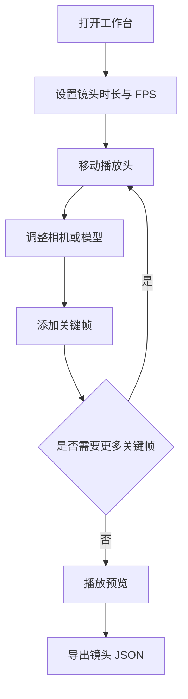

# 第三阶段开发前确认方案：单镜头关键帧时间线（已暂缓）

## 1. 文档控制

- 产品/功能名称：3D 影视分镜工作台第三阶段：单镜头关键帧时间线
- 文档版本：v0.1
- 文档状态：已暂缓
- 创建日期：2026-06-22
- 更新日期：2026-06-22
- 负责人：待定
- 评审参与方：用户、产品、设计、工程
- 相关文档：
  - `docs/prd/3d-workbench-prd.md`
  - `docs/prd/change-log.md`
  - `docs/prd/m1-development-confirmation.md`
  - `docs/prd/m2-development-confirmation.md`
  - `docs/assets/reference/ui-reference-3d-director.png`

## 2. 一页摘要

> 2026-06-22 更新：本方案已被“第三阶段：摄影机可编辑闭环”覆盖。原因是当前产品仍缺少摄影机移动、旋转、自由旋转、LookAt、从当前视口创建摄影机和摄影机视角预览等基础能力。时间线能力在摄影机编辑底座完成后再重新评审。

### 一句话结论

第三阶段建议实现“单镜头关键帧时间线”，让用户能为当前相机和模型记录关键帧、移动播放头、播放预览，并导出当前镜头参数 JSON。

### 本次解决的问题

当前工作台已经可以导入和调整模型，但还无法表达“镜头运动”与“对象运动”。影视分镜预演的核心价值不只是静态摆位，而是让导演能判断运动节奏、起止构图和镜头变化。

### 本次交付内容

- 底部时间线区域。
- 单镜头时长、FPS、播放头。
- 添加/删除关键帧。
- 摄影机关键帧：位置、目标点、FOV。
- 模型关键帧：位置、旋转、缩放。
- 播放/暂停预览。
- 线性插值。
- 当前镜头参数 JSON 导出。

### 本次不交付内容

- 不做多 Shot 管理。
- 不做本地项目保存。
- 不做曲线编辑器、缓入缓出、贝塞尔路径。
- 不做材质参数关键帧。
- 不做视频渲染导出。
- 不接入 AI 视频生成接口。

### 关键风险或未决问题

- 时间线和 TransformControls 都会修改对象变换，需要明确播放状态和编辑状态的优先级。
- 相机当前仍以编辑视角为主，需要确认第三阶段是否创建“可关键帧的故事相机”。
- 本阶段仍不做本地保存，刷新页面后关键帧会丢失。

## 3. 背景与问题

### 业务背景

产品定位是影视分镜预演工作台，核心价值是把 3D 空间中的模型、机位和运动转化为可复用参考。第一阶段完成工作台骨架、GLB 导入和快照导出；第二阶段完成模型变换、拖拽和材质编辑。下一步需要让静态空间变成可预演镜头。

### 用户问题

- 用户能摆好模型，但无法记录镜头起点和终点。
- 用户能调整相机 FOV，但无法预览推近、横移、环绕等运动。
- 用户能导出当前帧，但无法导出完整镜头参数。
- 用户无法判断一个镜头的运动节奏是否适合分镜表达。

### 现有方案不足

- 静态快照只能表达单帧构图。
- 只靠截图无法表达镜头运动。
- 传统 3D 软件时间线功能重，学习成本高。

### 证据与依据

| 类型 | 内容 | 来源 | 可信度 |
| --- | --- | --- | --- |
| 已确认需求 | 用户要求 3D 工作台需要关键帧时间线 | 前期沟通 | 高 |
| 产品定位 | 影视分镜预演需要表达镜头运动和对象运动 | 主 PRD | 高 |
| 竞品观察 | AI 视频工具常用首尾帧、镜头运动、参考参数控制生成 | 前期调研 | 中 |
| 当前产品状态 | 已完成模型导入、编辑和材质调整，缺少运动表达 | 当前代码实现 | 高 |

## 4. 目标用户与使用场景

### 用户角色

| 用户类型 | 目标 | 痛点 | 使用频率 |
| --- | --- | --- | --- |
| 导演/分镜师 | 快速判断镜头运动是否成立 | 不想打开复杂 3D 软件做简单预演 | 高频 |
| AI 视频创作者 | 生成前准备首尾帧和镜头参数 | 文本提示无法稳定控制空间运动 | 高频 |
| 3D 创作者 | 给团队输出可讨论的镜头参考 | 静态截图沟通成本高 | 中频 |

### 使用场景

- 角色站位确定后，用户想做一个推近镜头。
- 用户想记录角色从 A 点走到 B 点的简单运动。
- 用户想把当前镜头的起点、终点和参数导出给后续 AI 视频流程。

### 触发条件

- 用户已经导入或创建至少一个对象。
- 用户已经有一个相机或编辑视角。
- 用户需要从静态构图进入镜头运动设计。

### 用户旅程

| 步骤 | 用户行为 | 用户目标 | 系统响应 |
| --- | --- | --- | --- |
| 1 | 设置镜头时长和 FPS | 确定镜头基础节奏 | 时间线显示秒数和帧数 |
| 2 | 移动播放头到 0 秒 | 设置起始状态 | 视口展示当前帧状态 |
| 3 | 调整相机或模型 | 设置起点构图 | 视口实时反馈 |
| 4 | 点击添加关键帧 | 记录起始状态 | 时间线上出现关键帧标记 |
| 5 | 移动播放头到结束时间 | 设置结束状态 | 视口切换到目标时间 |
| 6 | 调整相机或模型并添加关键帧 | 记录结束状态 | 时间线出现第二个关键帧 |
| 7 | 点击播放 | 预览运动 | 系统按线性插值播放 |
| 8 | 导出镜头 JSON | 留存参数 | 系统下载结构化 JSON |

## 5. 目标与成功指标

### 产品目标

- 让用户可以在单镜头内记录并预览相机和模型运动。
- 让用户可以导出包含关键帧的镜头参数 JSON。
- 为后续多 Shot 管理和 AI 视频提示词包打基础。

### 体验目标

- 时间线不要变成复杂剪辑软件，第一版只保留必要控件。
- 添加关键帧动作应足够明确，用户知道当前记录的是相机还是模型。
- 播放预览时视口运动稳定，不出现明显跳动或控件冲突。

### 成功指标

| 指标 | 类型 | 目标值或观察方式 | 是否验收项 |
| --- | --- | --- | --- |
| 创建关键帧闭环 | 定性 | 用户可创建至少两个关键帧并播放 | 是 |
| 运动预览 | 定性 | 视口能展示线性插值结果 | 是 |
| 导出数据完整性 | 定性 | JSON 包含 duration、fps、playhead、tracks、keyframes | 是 |
| 复杂度控制 | 定性 | 不引入曲线编辑器和多 Shot 管理 | 否 |

### 非目标

- 本阶段不追求专业剪辑软件级时间线。
- 本阶段不追求复杂摄影机路径。
- 本阶段不追求视频导出。

## 6. 范围、非范围与优先级

### 本次范围

- 单镜头时间线。
- 播放头。
- 播放/暂停。
- 添加/删除关键帧。
- 摄影机和模型 transform 关键帧。
- 线性插值。
- 单镜头 JSON 导出。

### 本次不做

- 多镜头 Shot 列表。
- 本地保存。
- 曲线编辑器。
- 材质关键帧。
- 音频轨道。
- 视频导出。

### 后续版本

- 多 Shot 管理。
- 首帧/尾帧批量导出。
- 缓入缓出曲线。
- 镜头预设：推近、拉远、环绕、横移。
- AI 视频提示词包导出。

### 优先级

| 优先级 | 功能/能力 | 用户价值 | 说明 |
| --- | --- | --- | --- |
| P0 | 时间线基础控件 | 能进入关键帧编辑 | 时长、FPS、播放头、播放/暂停 |
| P0 | 添加/删除关键帧 | 能记录镜头状态 | 支持相机和当前选中模型 |
| P0 | 线性插值播放 | 能预览运动 | 先做简单可靠 |
| P0 | 镜头 JSON 导出 | 能复用参数 | 为后续 AI 流程准备 |
| P1 | 关键帧列表/轨道显示 | 提升可读性 | 先做简化轨道 |
| P2 | 首尾帧快捷跳转 | 提升效率 | 可后续补 |

## 7. 用户流程与业务流程

### 主流程

1. 用户在底部时间线设置镜头时长和 FPS。
2. 用户移动播放头到某个时间。
3. 用户选中相机或模型并调整状态。
4. 用户点击添加关键帧。
5. 用户移动播放头到另一个时间并再次调整状态。
6. 用户点击播放预览。
7. 用户导出镜头 JSON。

### 分支流程

- 如果当前选中模型，则添加模型 transform 关键帧。
- 如果当前未选中模型，则默认添加相机关键帧。
- 如果同一对象同一时间已有关键帧，则更新该关键帧。

### 异常流程

- 如果没有可关键帧对象，添加关键帧按钮禁用。
- 如果镜头时长小于 1 秒，自动修正为 1 秒。
- 如果播放过程中用户开始拖拽对象，则暂停播放。

### 流程图



## 8. 方案说明

### 产品方案

第三阶段在现有底部区域增加简化时间线。时间线是单镜头维度，不引入多 Shot 管理。用户可以在当前播放头时间为相机或选中模型添加关键帧，播放时系统根据关键帧线性插值更新视口。

### 设计方案

- 底部浮动工具条上方或替换为底部时间线面板。
- 时间线高度控制在 120px 到 160px。
- 左侧显示镜头时长、FPS、播放/暂停、添加关键帧、导出 JSON。
- 中间显示时间刻度和关键帧点。
- 当前播放头使用高对比细线。
- 关键帧点用小菱形或圆点，不做复杂轨道。

### 信息架构

- 顶部：保持不变。
- 左侧：对象/相机列表保持不变。
- 中央：3D 视口保持主导。
- 右侧：属性面板保持不变。
- 底部：新增时间线控制。

### 状态说明

- 空状态：没有关键帧时显示“移动播放头并添加关键帧”。
- 加载状态：无。
- 错误状态：导出失败时提示“镜头参数导出失败”。
- 禁用状态：无选中对象且无相机时，添加关键帧禁用。
- 成功状态：添加关键帧后时间线上出现标记。

## 9. 功能需求

### 9.1 时间线基础控件

用户问题：

用户需要知道当前镜头时长、当前时间和帧数。

用户故事：

- 作为分镜师，我希望设置镜头时长和 FPS，以便按影视节奏预览镜头。

入口：

- 底部时间线面板。

主流程：

1. 用户输入镜头时长。
2. 用户输入或选择 FPS。
3. 用户拖动播放头。

规则：

- 默认时长 5 秒。
- 默认 FPS 为 24。
- 播放头范围为 0 到 duration。
- 帧数 = time * fps。

边界与异常：

- 时长小于 1 秒时自动修正为 1 秒。
- FPS 小于 1 时自动修正为 24。

验收标准：

- 给定默认项目，当页面打开，则时间线显示 5 秒、24 FPS 和 0 秒播放头。
- 给定用户拖动播放头，当播放头变化，则当前时间和帧数同步变化。

### 9.2 添加/删除关键帧

用户问题：

用户需要记录某个时间点的相机或模型状态。

用户故事：

- 作为导演，我希望在某个时间点记录相机和模型状态，以便构建镜头运动。

入口：

- 时间线面板的“添加关键帧”按钮。

主流程：

1. 用户选择模型或相机。
2. 用户移动播放头。
3. 用户点击添加关键帧。
4. 系统记录当前状态。

规则：

- 当前选中模型时，记录模型 transform。
- 未选中模型但有激活相机时，记录相机 position、target、fov。
- 同一对象同一时间重复添加关键帧时，更新原关键帧。
- 删除关键帧第一版不做二次确认。

边界与异常：

- 无对象、无相机时按钮禁用。
- 锁定对象仍允许记录当前状态，但不允许播放时被编辑。

验收标准：

- 给定用户选中模型，当点击添加关键帧，则时间线上出现该模型关键帧。
- 给定同一对象同一时间已有关键帧，当再次添加，则原关键帧被更新而不是重复新增。

### 9.3 播放预览与线性插值

用户问题：

用户需要预览关键帧之间的运动。

用户故事：

- 作为分镜师，我希望播放镜头预览，以便判断镜头运动是否自然。

入口：

- 时间线面板播放按钮。

主流程：

1. 用户点击播放。
2. 系统从当前播放头开始推进。
3. 系统根据关键帧线性插值更新视口。
4. 到达镜头结束时间后停止。

规则：

- 插值方式：线性。
- 播放时暂停 TransformControls 主动编辑。
- 用户拖拽模型时暂停播放。

边界与异常：

- 关键帧少于两个时仍允许播放，但对象保持当前状态。
- 到达结尾后播放状态自动停止。

验收标准：

- 给定同一对象有两个 transform 关键帧，当点击播放，则对象在两个状态之间线性运动。
- 给定相机有两个关键帧，当点击播放，则 FOV 和相机参数随时间变化。

### 9.4 镜头 JSON 导出

用户问题：

用户需要把镜头参数交给后续分镜或 AI 视频流程。

用户故事：

- 作为 AI 视频创作者，我希望导出镜头关键帧参数，以便复用镜头设计。

入口：

- 时间线面板“导出 JSON”按钮。

主流程：

1. 用户完成关键帧编辑。
2. 用户点击导出 JSON。
3. 系统下载当前镜头参数文件。

规则：

- JSON 必须包含 schemaVersion、duration、fps、tracks、keyframes。
- 不包含 GLB 二进制和贴图二进制。
- 导出文件名格式：`shot-YYYYMMDD-HHmmss.json`。

边界与异常：

- 没有关键帧时仍可导出基础镜头信息。

验收标准：

- 给定用户点击导出 JSON，当导出完成，则文件包含当前镜头时长、FPS、对象轨道和关键帧数据。

## 10. 非功能需求

### 性能要求

- 播放预览时不应明显阻塞视口交互。
- 关键帧数量少于 200 个时，时间线渲染应保持流畅。

### 兼容性要求

- 继续支持当前 Vite + React + Three.js 浏览器环境。
- 不引入需要原生能力的依赖。

### 可用性要求

- 添加关键帧、播放、导出必须有清晰按钮。
- 无关键帧时需要空状态提示。
- 播放状态与编辑状态必须视觉区分。

### 可维护性要求

- 时间线状态和 Three.js 运行时状态解耦。
- 插值逻辑独立成工具函数，后续可替换为缓动曲线。

### 安全与隐私要求

- 本阶段仍只做内存状态。
- 导出 JSON 只包含参数，不上传任何文件。

## 11. 数据结构与存储

### 数据模型

```ts
type TimelineState = {
  duration: number;
  fps: number;
  playhead: number;
  isPlaying: boolean;
  tracks: TimelineTrack[];
};

type TimelineTrack = {
  id: string;
  targetId: string;
  targetType: "camera" | "object";
  keyframes: TimelineKeyframe[];
};

type TimelineKeyframe = {
  id: string;
  time: number;
  position?: Vec3;
  rotation?: Vec3;
  scale?: Vec3;
  target?: Vec3;
  fov?: number;
};
```

### 字段说明

| 字段 | 类型 | 说明 | 是否必填 | 默认值 | 备注 |
| --- | --- | --- | --- | --- | --- |
| duration | number | 镜头时长，单位秒 | 是 | 5 | 最小 1 |
| fps | number | 帧率 | 是 | 24 | 默认影视常用帧率 |
| playhead | number | 当前播放头时间 | 是 | 0 | 范围 0-duration |
| tracks | TimelineTrack[] | 关键帧轨道 | 是 | [] | 按对象或相机分组 |
| targetId | string | 关联对象或相机 ID | 是 | 无 | 用于播放时查找目标 |
| keyframes | TimelineKeyframe[] | 关键帧列表 | 是 | [] | 按 time 排序 |

### 存储方式

- 第三阶段继续使用内存状态。
- 不做本地项目保存。
- 页面关闭后时间线状态丢失。

### 导入导出格式

- 支持导出单镜头 JSON。
- 不支持导入时间线 JSON。

### 数据迁移或兼容策略

- 当前 schemaVersion 继续使用 `0.1`。
- 后续多 Shot 管理时，TimelineState 可迁移到 Shot 节点内。

## 12. 技术方案

### 技术架构

- Zustand 扩展 timeline 状态。
- React 实现底部 TimelinePanel。
- 插值逻辑放入 `src/timeline/interpolation.ts`。
- JSON 导出逻辑放入 `src/export/shotExport.ts`。
- Three.js 视口订阅播放状态并应用插值结果。

### 模块边界

```text
src/
  components/
    timeline/
      TimelinePanel.tsx
      TimelineRuler.tsx
      KeyframeTrack.tsx
  timeline/
    interpolation.ts
    keyframeTools.ts
  export/
    shotExport.ts
```

### 关键依赖

- 不新增第三方依赖。

### 实现策略

- 先实现单轨道/多目标数据结构。
- 添加关键帧时从 store 中读取当前对象或相机状态。
- 播放时用 `requestAnimationFrame` 推进 playhead。
- 每帧根据当前 playhead 计算各轨道插值，并同步到 Three.js 对象或相机状态。

### 技术风险

- 播放过程中同步 Zustand 可能导致渲染频繁，需要控制更新粒度。
- 相机关键帧目前需要明确是编辑相机还是故事相机。
- TransformControls 和播放状态需要互斥。

### 扩展策略

- 线性插值函数后续可替换为缓动曲线。
- TimelineTrack 后续可扩展为材质轨道、可见性轨道、镜头备注轨道。
- TimelineState 后续可嵌入多 Shot 数据结构。

## 13. 验收标准

| 编号 | 验收项 | 前置条件 | 操作 | 预期结果 | 验证方式 |
| --- | --- | --- | --- | --- | --- |
| AC-001 | 时间线显示 | 打开工作台 | 查看底部区域 | 显示时长、FPS、播放头和播放按钮 | 手动 |
| AC-002 | 添加模型关键帧 | 选中模型 | 点击添加关键帧 | 时间线出现模型关键帧 | 手动 |
| AC-003 | 添加相机关键帧 | 未选中模型且有激活相机 | 点击添加关键帧 | 时间线出现相机关键帧 | 手动 |
| AC-004 | 播放模型动画 | 同一模型有两个关键帧 | 点击播放 | 模型在两个状态之间线性运动 | 手动 |
| AC-005 | 导出 JSON | 已有关键帧 | 点击导出 JSON | 下载包含 tracks 和 keyframes 的 JSON | 手动 |
| AC-006 | 播放结束 | 播放头接近结尾 | 等待播放结束 | 播放自动停止，播放头停在结尾 | 手动 |

## 14. 排期与里程碑

| 阶段 | 目标 | 交付物 | 验收方式 | 状态 |
| --- | --- | --- | --- | --- |
| M3-1 | 时间线状态与 UI | TimelinePanel、duration、fps、playhead | 构建 + 手动 | 待开始 |
| M3-2 | 关键帧增删 | keyframeTools、轨道显示 | 构建 + 手动 | 待开始 |
| M3-3 | 播放插值 | interpolation、视口同步 | 构建 + 手动 | 待开始 |
| M3-4 | JSON 导出 | shotExport | 构建 + 手动 | 待开始 |

## 15. 假设、约束、依赖与风险

### 假设

- 第三阶段只做单镜头。
- 用户接受线性插值作为第一版预览效果。
- 当前相机可作为关键帧相机使用。

### 约束

- 不做本地保存。
- 不做视频导出。
- 不新增复杂第三方时间线库。

### 依赖

- 第一阶段的 3D 视口。
- 第二阶段的对象状态和 Three.js 对象映射。

### 风险

| 风险 | 影响范围 | 概率 | 影响 | 应对策略 |
| --- | --- | --- | --- | --- |
| 播放状态和拖拽状态冲突 | 视口交互 | 中 | 高 | 播放时禁用 TransformControls，拖拽时暂停播放 |
| Zustand 高频更新导致卡顿 | 播放性能 | 中 | 中 | 插值尽量直接同步运行时对象，必要状态低频写回 |
| 相机模型不清晰 | 相机关键帧 | 中 | 中 | 本阶段先使用激活相机数据，后续再区分编辑视角与故事相机 |

## 16. 开放问题

| 问题 | 影响范围 | 负责人 | 期望确认时间 | 状态 |
| --- | --- | --- | --- | --- |
| 第三阶段是否确认只做单镜头时间线，不做多 Shot 管理？ | 产品范围 | 用户 | 开发前 | 待确认 |
| 是否确认本阶段只做线性插值，不做缓入缓出？ | 运动效果 | 用户 | 开发前 | 待确认 |
| 是否确认本阶段要导出单镜头 JSON？ | 导出能力 | 用户 | 开发前 | 待确认 |
| 是否确认继续不做本地保存？ | 数据策略 | 用户 | 开发前 | 待确认 |

## 17. 评审记录

| 日期 | 参与方 | 结论 | 待办 |
| --- | --- | --- | --- |
| 2026-06-22 | 用户、Codex | 待评审 | 等待用户确认开放问题 |

## 18. 变更记录

| 日期 | 变更内容 | 原因 | 影响范围 | 状态 |
| --- | --- | --- | --- | --- |
| 2026-06-22 | 新增第三阶段单镜头关键帧时间线方案 | 用户要求继续开发 | 第三阶段范围与技术方案 | 待确认 |
