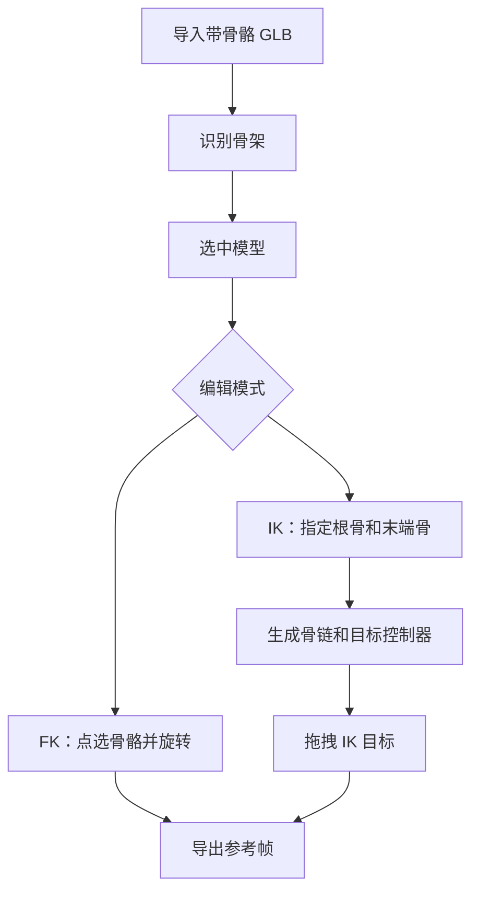

# 第四阶段开发前确认方案：模型骨骼控制（FK / IK）

## 1. 文档控制

- 产品/功能名称：3D 影视分镜工作台第四阶段：模型骨骼控制（FK / IK）
- 文档版本：v1.0
- 文档状态：已确认 / 开发中
- 创建日期：2026-06-22
- 更新日期：2026-06-22
- 负责人：待定
- 评审参与方：用户、产品、设计、工程
- 相关文档：
  - `docs/prd/3d-workbench-prd.md`
  - `docs/prd/change-log.md`
  - `docs/prd/m2-development-confirmation.md`
  - `docs/prd/m3-camera-editing-confirmation.md`
- 相关变更记录：`docs/prd/change-log.md` 2026-06-22 “确认第四阶段骨骼控制范围”

## 2. 一页摘要

### 一句话结论

第四阶段新增“带骨骼模型的静态 Pose 编辑”，支持骨骼识别、骨骼树、视口点选、`FK` 旋转编辑，以及通过用户指定根骨骼和末端骨骼创建任意骨链的 `IK` 目标控制。

### 本次解决的问题

当前工作台已支持模型、材质、摄影机和快照，但对于带骨骼角色只能整体移动，不能调整肢体 Pose。这会限制影视分镜预演中常见的角色摆姿、站姿校正、手脚指向和视线关系确认。

### 本次交付内容

- 仅针对“自带蒙皮骨骼”的 `.glb` 模型识别骨架。
- 左侧骨骼树。
- 视口骨骼辅助线和骨骼点选。
- `FK / IK` 模式切换。
- `FK` 模式下对选中骨骼进行旋转编辑。
- `IK` 模式下指定根骨骼和末端骨骼，自动生成骨链。
- 拖拽 IK 目标控制器，实时求解骨链 Pose。
- 当前静态 Pose 和 IK 链配置保存到项目内存状态。

### 本次不交付内容

- 不做骨骼关键帧时间线。
- 不做动画 Clip 播放、混合和导出。
- 不做自动绑骨、重蒙皮、权重编辑。
- 不做角色语义识别，例如自动判断“左手”“右脚”。
- 不做完整 DCC 级约束系统。

### 关键风险或未决问题

- `IK` 求解不是通用“零配置自动生效”，需要用户指定根骨骼和末端骨骼。
- 不同 `GLB` 的骨架层级和命名差异很大，第一版不能依赖语义命名。
- 多 `SkinnedMesh` 共用骨架或复杂共享骨架场景，第一版优先支持单骨架模型。

## 3. 背景与问题

### 业务背景

影视分镜预演不仅需要确认模型在空间中的位置，还需要确认人物姿态、朝向、手脚指向和肢体与摄影机构图的关系。对于 AI 视频和预演场景，静态 Pose 往往已经能解决大量沟通和镜头确认问题。

### 用户问题

- 用户能移动整个角色，但不能调整手臂、腿部或头部等局部姿态。
- 仅靠整体旋转无法完成“抬手”“转头”“抬腿”等分镜高频动作。
- 角色姿态无法与摄影机构图联动校正。
- 没有骨骼树和骨骼点选时，复杂角色很难精确控制。

### 现有方案不足

- 导入流程没有识别 `SkinnedMesh` 和骨架信息。
- 状态层没有骨骼 Pose、骨链和当前模式的数据结构。
- 视口没有骨骼辅助器、骨骼句柄和 IK 目标控制器。
- 右侧属性面板只有模型整体变换和材质，没有局部骨骼编辑能力。

### 证据与依据

| 类型 | 内容 | 来源 | 可信度 |
| --- | --- | --- | --- |
| 已确认需求 | 用户确认仅支持带骨骼的 `.glb`，保留静态 Pose，不做骨骼时间线；`IK` 需要支持任意骨链；交互形态为左侧骨骼树 + 视口点选 + 右侧面板 | 项目沟通 | 高 |
| 技术依据 | `SkinnedMesh` 是 three.js 用于骨骼蒙皮动画的官方对象类型 | https://threejs.org/docs/ | 高 |
| 技术依据 | `SkeletonHelper` 是 three.js 官方骨架可视化辅助器 | https://threejs.org/docs/ | 高 |
| 技术依据 | `CCDIKSolver` 是 three.js 官方 addon，用 CCD 算法解 IK，输入需要显式 IK 配置 | `node_modules/three/examples/jsm/animation/CCDIKSolver.js` | 高 |

## 4. 目标用户与使用场景

### 用户角色

| 用户类型 | 目标 | 痛点 | 使用频率 |
| --- | --- | --- | --- |
| 导演/分镜创作者 | 快速摆出角色姿态配合镜头 | 不想进入完整角色动画软件 | 高频 |
| AI 视频创作者 | 为角色动作和构图准备更稳定的姿态参考 | 靠提示词难稳定控制手脚朝向 | 高频 |
| 预演协作者 | 用少量操作快速建立静态 Pose | 骨架复杂时缺少轻量控制界面 | 中频 |

### 使用场景

用户导入带骨骼的角色模型后，先整体摆位，再进入骨骼编辑模式，切换 `FK` 或 `IK` 调整手臂、腿部、头部等局部姿态，最后结合摄影机视角导出参考帧。

### 触发条件

- 用户选中带骨骼的模型。
- 用户在左侧骨骼树中点选骨骼。
- 用户切换 `FK / IK` 模式。
- 用户创建 IK 链并拖动 IK 目标。

### 用户旅程

| 步骤 | 用户行为 | 用户目标 | 系统响应 |
| --- | --- | --- | --- |
| 1 | 导入带骨骼的 `.glb` | 获得可摆姿角色 | 系统识别骨架并记录骨骼层级 |
| 2 | 选中模型 | 进入局部姿态编辑 | 左侧显示骨骼树，视口显示骨架辅助 |
| 3 | 选择 `FK` 模式并点选骨骼 | 调整单个关节朝向 | 系统更新选中骨骼和右侧属性 |
| 4 | 旋转骨骼 | 完成局部 Pose | 模型实时变形 |
| 5 | 切换 `IK` 模式 | 用目标拖拽控制骨链 | 系统根据根骨/末端骨生成 IK 链 |
| 6 | 拖动 IK 目标 | 快速调整肢体末端位置 | 系统实时求解骨链 Pose |
| 7 | 进入摄影机视角并导出快照 | 形成带姿态的分镜参考 | 摄影机画面反映最新 Pose |

## 5. 目标与成功指标

### 产品目标

- 让带骨骼角色具备静态 Pose 编辑能力。
- 用最少交互成本支持分镜高频的肢体摆姿。
- 为后续骨骼关键帧时间线打好数据基础。

### 体验目标

- 用户不需要理解完整动画系统，也能完成基本 Pose 调整。
- `FK` 和 `IK` 切换清楚，且不会互相覆盖到不可理解。
- 骨骼树、视口点选和右侧面板三者联动稳定。

### 成功指标

| 指标 | 类型 | 目标值或观察方式 | 是否验收项 |
| --- | --- | --- | --- |
| 骨骼识别 | 定性 | 导入带骨骼模型后能看到骨骼树和骨架辅助 | 是 |
| FK 编辑 | 定性 | 旋转骨骼后模型姿态实时变化 | 是 |
| IK 链创建 | 定性 | 用户可指定根骨和末端骨生成骨链 | 是 |
| IK 拖拽 | 定性 | 拖动目标控制器后骨链姿态实时更新 | 是 |

### 非目标

- 不做角色动画制作软件。
- 不追求专业动画师级别的约束与曲线系统。
- 不做通用自动 IK rig 生成。

## 6. 范围、非范围与优先级

### 本次范围

- 带骨骼 `.glb` 的骨架识别。
- 左侧骨骼树。
- 视口骨架辅助和骨骼点选。
- `FK` 旋转编辑。
- 任意骨链 `IK` 创建与目标拖拽。
- Pose 数据和 IK 链配置状态。

### 本次不做

- 骨骼关键帧。
- 骨骼动画导出。
- 自动语义骨骼识别。
- 多骨架共享复杂场景的完整支持。

### 后续版本

- 骨骼 Pose 预设。
- 骨骼关键帧时间线。
- IK 约束可视化和限制设置。
- 更复杂的角色控制器，例如头部 LookAt、手掌目标、足部落地。

### 优先级

| 优先级 | 功能/能力 | 用户价值 | 说明 |
| --- | --- | --- | --- |
| P0 | 骨骼识别、骨骼树、FK 编辑、IK 链创建与拖拽 | 完成静态 Pose 编辑闭环 | 本阶段必须完成 |
| P1 | 骨架辅助显示开关、骨骼重置、IK 链重命名/删除 | 提升可用性 | 本阶段基础版完成 |
| P2 | 约束编辑、Pose 预设、镜像编辑 | 提升专业效率 | 后续评审 |

## 7. 用户流程与业务流程

### 主流程

1. 用户导入带骨骼模型。
2. 系统识别骨架并记录骨骼层级。
3. 用户选中模型后进入骨骼编辑。
4. 用户在 `FK` 模式下旋转骨骼，或在 `IK` 模式下创建并编辑骨链。
5. 用户结合摄影机导出参考帧。

### 分支流程

- 用户选择 `FK`：直接旋转当前骨骼。
- 用户选择 `IK`：选择根骨骼和末端骨骼，系统自动生成祖先链。
- 用户点击视口中的骨骼句柄：切换当前选中骨骼。

### 异常流程

- 模型不含 `SkinnedMesh`：不显示骨骼编辑区。
- 所选根骨骼不是末端骨骼祖先：拒绝创建 IK 链并提示。
- 删除对象时同时释放骨架辅助器、句柄和 IK 运行时资源。

### 流程图



## 8. 方案说明

### 产品方案

选中带骨骼模型后，左侧出现该模型骨骼树；中间视口显示骨架辅助和可点击骨骼句柄；右侧对象属性面板增加骨骼编辑区。用户可以在 `FK` 模式下直接编辑骨骼旋转，或在 `IK` 模式下通过根骨骼与末端骨骼创建任意祖先骨链，并拖拽 IK 目标求解 Pose。

### 设计方案

- 保持现有三栏结构，不新增大面板。
- 左侧骨骼树只在选中带骨骼模型时出现。
- 右侧对象属性中增加“骨骼”子区域，内含模式切换、骨骼属性和 IK 链管理。
- 视口骨骼句柄采用轻量点位，不引入重型 gizmo。

### 信息架构

- 左侧：对象、机位、当前模型骨骼树。
- 中间：3D 视口、骨架辅助、骨骼句柄、IK 目标控制器。
- 右侧：快照、模型属性、材质、骨骼控制。

### 页面/区域结构

- 骨骼树：层级展示骨骼名称，可点选。
- 骨骼控制区：`FK / IK` 模式切换、选中骨骼信息、旋转输入、IK 链列表、创建/删除链。
- 视口：骨架辅助线、骨骼点、IK 目标点。

### 状态说明

- 空状态：选中对象无骨架时，不显示骨骼编辑区。
- 禁用状态：模型锁定时禁用骨骼编辑。
- 错误状态：IK 链创建参数非法时阻止创建。
- 成功状态：骨骼旋转和 IK 拖拽实时更新模型 Pose。

## 9. 功能需求

### 9.1 骨架识别与骨骼树

用户问题：带骨骼模型导入后，用户需要知道有哪些可编辑骨骼。

用户故事：

- 作为创作者，我希望系统自动识别骨架并展示骨骼树，以便我快速定位要编辑的关节。

入口：导入 `.glb`、左侧骨骼树。

主流程：

1. 用户导入 `.glb`。
2. 系统遍历对象树，查找 `SkinnedMesh` 和骨骼。
3. 若找到骨架，则在对象数据中记录骨骼层级。
4. 用户选中对象时，左侧显示骨骼树。

规则：

- 第一版仅支持每个对象使用第一套识别到的骨架。
- 骨骼名称优先使用源名称；无名称时生成默认名。

边界与异常：

- 无骨架模型不显示骨骼树。
- 多骨架复杂对象第一版按“首个骨架”处理。

验收标准：

- 给定带骨骼模型导入成功，当用户选中该对象，则左侧出现骨骼树。
- 给定无骨骼模型，当用户选中该对象，则不显示骨骼编辑区。

### 9.2 FK 编辑

用户问题：用户需要对单个关节做精细姿态调整。

用户故事：

- 作为创作者，我希望点选某根骨骼并旋转它，以便快速做出静态 Pose。

入口：左侧骨骼树、3D 视口骨骼句柄、右侧骨骼控制区。

主流程：

1. 用户切换到 `FK` 模式。
2. 用户在骨骼树或视口点选骨骼。
3. 用户在右侧编辑骨骼旋转，或在视口旋转控制器中编辑。
4. 系统实时更新骨骼局部旋转和模型 Pose。

规则：

- `FK` 只编辑骨骼旋转，不支持骨骼平移和缩放。
- 编辑使用骨骼本地旋转。

边界与异常：

- 模型锁定时禁用编辑。
- 摄影机预览模式下，骨骼仍可显示，但不抢占摄影机逻辑。

验收标准：

- 给定选中骨骼，当用户修改旋转，则模型局部姿态实时变化。
- 给定从视口点选骨骼，则左侧骨骼树和右侧骨骼信息同步更新。

### 9.3 IK 链创建

用户问题：用户希望通过末端控制器快速拖动手脚，而不是逐节旋转。

用户故事：

- 作为创作者，我希望指定根骨和末端骨，让系统自动生成一条可拖拽的 IK 骨链。

入口：右侧骨骼控制区。

主流程：

1. 用户切换到 `IK` 模式。
2. 用户选择末端骨骼。
3. 用户选择根骨骼。
4. 系统校验根骨骼是否为末端骨骼祖先。
5. 校验通过后自动生成骨链和 IK 目标。

规则：

- 允许用户为任意祖先链创建 IK，不限制为人形预设链。
- 骨链按“根骨骼到末端骨骼的祖先路径”自动生成。
- 每条骨链应保存链路骨骼列表、末端骨骼和目标位置。

边界与异常：

- 根骨骼不是祖先时禁止创建。
- 不允许空链。

验收标准：

- 给定合法根骨和末端骨，当用户创建骨链，则右侧出现链配置，视口出现 IK 目标。
- 给定非法骨骼组合，当用户创建时，则系统拒绝并提示。

### 9.4 IK 拖拽求解

用户问题：用户需要直接拖动末端目标而不是逐节拧关节。

用户故事：

- 作为创作者，我希望拖动 IK 目标点，以便快速把手脚摆到目标位置。

入口：视口 IK 目标控制器、右侧 IK 链列表。

主流程：

1. 用户选中一条 IK 链。
2. 视口高亮其目标控制器。
3. 用户拖拽目标控制器。
4. 系统用 CCD 求解骨链。
5. 模型 Pose 实时更新。

规则：

- 第一版采用 CCD 求解。
- 求解结果回写到骨骼本地旋转。
- IK 目标位置作为链配置的一部分保存。

边界与异常：

- 目标过远时允许出现极限姿态，不做复杂稳定器。
- 不做高级约束面板，只保留基础链路求解。

验收标准：

- 给定已创建 IK 链，当用户拖动目标点，则对应骨链姿态实时变化。
- 给定切回 `FK` 模式，当前 Pose 保留，不自动重置。

## 10. 非功能需求

### 性能要求

- 常见角色骨架规模下保持可编辑响应。
- 骨骼辅助器和句柄不应显著拖慢视口。

### 兼容性要求

- 继续支持现代 Chromium 浏览器。
- 仅依赖现有前端技术栈，不引入服务端。

### 可用性要求

- 左侧骨骼树、视口点选和右侧面板的选中状态必须一致。
- `FK / IK` 模式切换清晰可见。
- 无骨架模型不显示误导性入口。

### 可维护性要求

- 状态层保存结构化 Pose 和 IK 链配置。
- 渲染层单独管理 `SkinnedMesh`、辅助器、目标控制器和求解器。
- UI 层不直接操作 `Bone` 实例。

### 安全与隐私要求

- 本阶段不上传模型、Pose 或截图。
- 继续只用浏览器内存状态。

## 11. 数据结构与存储

### 数据模型

```json
{
  "objects": [
    {
      "id": "object_character_a",
      "name": "角色A",
      "rig": {
        "hasSkeleton": true,
        "mode": "fk",
        "showSkeleton": true,
        "activeBoneId": "bone_head",
        "activeIkChainId": "ik_chain_001",
        "bones": [
          {
            "id": "bone_head",
            "name": "Head",
            "parentId": "bone_neck",
            "rotation": [0, 0, 0]
          }
        ],
        "ikChains": [
          {
            "id": "ik_chain_001",
            "name": "右臂链",
            "rootBoneId": "bone_right_shoulder",
            "effectorBoneId": "bone_right_hand",
            "linkBoneIds": [
              "bone_right_forearm",
              "bone_right_upperarm",
              "bone_right_shoulder"
            ],
            "targetPosition": [0.8, 1.2, 0.5],
            "enabled": true
          }
        ]
      }
    }
  ]
}
```

### 字段说明

| 字段 | 类型 | 说明 | 是否必填 | 默认值 | 备注 |
| --- | --- | --- | --- | --- | --- |
| rig.hasSkeleton | boolean | 是否识别到骨架 | 是 | false | 无骨架时不显示编辑区 |
| rig.mode | `fk` / `ik` | 当前骨骼编辑模式 | 否 | `fk` | 仅带骨架对象使用 |
| rig.showSkeleton | boolean | 是否显示骨架辅助器 | 否 | true | |
| rig.activeBoneId | string | 当前选中骨骼 | 否 | 空 | |
| rig.activeIkChainId | string | 当前选中 IK 链 | 否 | 空 | |
| rig.bones | BoneRecord[] | 骨骼列表 | 否 | [] | 保存层级和局部旋转 |
| rig.ikChains | IkChainRecord[] | IK 链列表 | 否 | [] | 保存链配置和目标位置 |

### 存储方式

- 本阶段继续只使用 Zustand 内存状态。
- 不做本地存盘。
- 页面关闭时释放骨架辅助器、句柄和 IK 运行时资源。

### 导入导出格式

- 导入仅支持“自带骨骼和蒙皮”的 `.glb` 进入骨骼编辑。
- 本阶段不单独导出 Pose 文件，Pose 随项目状态保留在内存中。

### 数据迁移或兼容策略

- 老对象默认 `rig` 为空。
- 新导入对象只有识别到骨架时才补充 `rig`。

## 12. 技术方案

### 技术架构

- React UI 层：骨骼树、骨骼控制区、IK 链管理。
- Zustand 状态层：Pose、选中骨骼、IK 链配置。
- Three.js 渲染层：`SkinnedMesh`、`SkeletonHelper`、骨骼句柄、IK 目标和求解器。

### 模块边界

- `src/domain/projectTypes.ts`：增加 rig、bone、ik chain 类型。
- `src/store/projectStore.ts`：增加骨骼和 IK 原子操作。
- `src/three/glbLoader.ts`：识别骨架元信息。
- `src/three/skeletonRegistry.ts`：管理骨架运行时对象。
- `src/components/layout/LeftPanel.tsx`：增加骨骼树。
- `src/components/panels/ObjectInspector.tsx`：集成骨骼控制区。
- `src/components/panels/RigInspector.tsx`：新增骨骼和 IK 面板。
- `src/components/viewport/Viewport3D.tsx`：增加骨骼点选、骨骼句柄和 IK 目标拖拽。

### 关键依赖

- `three`
- `SkinnedMesh`
- `SkeletonHelper`
- `TransformControls`
- `CCDIKSolver`
- `zustand`

### 实现策略

- 导入模型后遍历对象树，提取首个 `SkinnedMesh` 的骨骼层级。
- 为每根骨骼创建轻量可点击句柄，供视口点选。
- `FK` 模式下把 `TransformControls` 绑定到当前骨骼，仅开放旋转。
- `IK` 模式下按根骨到末端骨的祖先链生成链路配置。
- 运行时使用 CCD 求解器或基于其思路的适配层，驱动选中骨链。

### 技术风险

- `CCDIKSolver` 原生要求显式 IK 配置，不是自动通用 IK。
- 不同模型骨骼朝向和局部旋转轴可能导致 FK/IK 手感差异。
- 多骨架共享场景会增加运行时同步复杂度。

### 扩展策略

- 后续可为 IK 链增加限制、迭代次数、混合系数。
- 后续可把骨骼 Pose 接入关键帧时间线。
- 后续可增加镜像 Pose、重置 Pose 和 Pose 预设。

## 13. 验收标准

| 编号 | 验收项 | 前置条件 | 操作 | 预期结果 | 验证方式 |
| --- | --- | --- | --- | --- | --- |
| AC-001 | 骨架识别 | 导入带骨骼 `.glb` | 选中模型 | 左侧出现骨骼树，视口显示骨架辅助 | 手动 |
| AC-002 | FK 点选 | 已识别骨架 | 点击骨骼树或视口骨骼 | 当前骨骼被选中，面板同步 | 手动 |
| AC-003 | FK 旋转 | 选中骨骼，模式为 FK | 修改骨骼旋转 | 模型局部 Pose 实时变化 | 手动 |
| AC-004 | IK 链创建 | 选中带骨骼模型，模式为 IK | 选择根骨和末端骨并创建 | 链列表新增，视口出现目标控制器 | 手动 |
| AC-005 | IK 非法校验 | 模式为 IK | 选择非法骨骼组合创建 | 系统拒绝创建并提示 | 手动 |
| AC-006 | IK 拖拽 | 已存在 IK 链 | 拖动目标控制器 | 对应骨链姿态实时变化 | 手动 |
| AC-007 | 模式切换 | 已编辑过骨骼 Pose | 在 FK / IK 间切换 | 当前 Pose 保留，编辑目标正确切换 | 手动 |
| AC-008 | 无骨架模型 | 导入普通模型 | 选中模型 | 不显示骨骼编辑区 | 手动 |
| AC-009 | 构建验证 | 完成开发 | 运行构建 | TypeScript 和 Vite 构建通过 | 自动 |

## 14. 排期与里程碑

| 阶段 | 目标 | 交付物 | 验收方式 | 状态 |
| --- | --- | --- | --- | --- |
| M4-1 | 文档确认 | 本 PRD、主 PRD 修正、变更记录 | 用户确认 | 已完成 |
| M4-2 | 数据结构 | rig、bone、ik chain 状态 | 构建检查 | 开发中 |
| M4-3 | 视口交互 | 骨架辅助、点选、FK/IK 拖拽 | 手动验证 | 待完成 |
| M4-4 | UI 面板 | 骨骼树和骨骼控制区 | 手动验证 | 待完成 |
| M4-5 | 验收 | 构建和本地验证 | 自动/手动 | 待完成 |

## 15. 假设、约束、依赖与风险

### 假设

- 用户当前更需要静态 Pose，而不是动画。
- 任意骨链 IK 的第一版可以接受“手动选根骨和末端骨”的配置方式。

### 约束

- 只支持带蒙皮骨骼的 `.glb`。
- 只做浏览器内存状态。
- 不做本地保存和动画时间线。

### 依赖

- Three.js `SkinnedMesh`、`SkeletonHelper`、`TransformControls`、`CCDIKSolver`。
- 现有工作台对象选中、视口点选和右侧面板结构。

### 风险

| 风险 | 影响范围 | 概率 | 影响 | 应对策略 |
| --- | --- | --- | --- | --- |
| 模型骨架结构差异大 | 骨骼识别、IK 链创建 | 中 | 高 | 第一版只支持首个骨架，链路按祖先关系生成 |
| IK 求解不稳定 | IK 拖拽体验 | 中 | 中 | 先做基础 CCD，限制为静态 Pose 场景 |
| FK/IK 与整体对象拖拽冲突 | 视口交互 | 中 | 中 | 模式切换后明确控制目标，只绑定一个 TransformControls 对象 |

## 16. 开放问题

| 问题 | 影响范围 | 负责人 | 期望确认时间 | 状态 |
| --- | --- | --- | --- | --- |
| 后续是否需要骨骼 Pose 重置和镜像 | M5 | 产品 | 骨骼时间线前 | 待确认 |
| IK 链是否需要暴露更多约束参数 | M5 | 产品/工程 | 使用验证后 | 待确认 |

## 17. 评审记录

| 日期 | 参与方 | 结论 | 待办 |
| --- | --- | --- | --- |
| 2026-06-22 | 用户、产品、工程 | 通过 | 写入文档并开始开发 |

## 18. 变更记录

| 日期 | 变更内容 | 原因 | 影响范围 | 状态 |
| --- | --- | --- | --- | --- |
| 2026-06-22 | 新增第四阶段“模型骨骼控制（FK / IK）”方案 | 为带骨骼角色提供静态 Pose 编辑能力 | 数据结构、视口交互、左侧骨骼树、右侧对象面板 | 已确认 |
