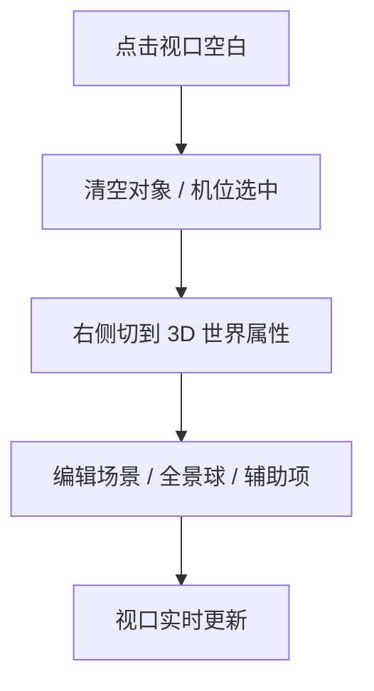

# 第五阶段开发前确认方案：3D 世界属性面板

## 1. 文档控制

- 产品/功能名称：3D 影视分镜工作台第五阶段：3D 世界属性面板
- 文档版本：v2.0
- 文档状态：已确认 / 开发中
- 创建日期：2026-06-24
- 更新日期：2026-06-25
- 负责人：待定
- 评审参与方：用户、产品、设计、工程
- 相关文档：
  - `docs/prd/3d-workbench-prd.md`
  - `docs/prd/change-log.md`
  - `docs/prd/m3-camera-editing-confirmation.md`
  - `docs/prd/m4-skeleton-control-confirmation.md`
- 相关变更记录：
  - `docs/prd/change-log.md` 2026-06-24 “确认 3D 世界属性面板方案”
  - `docs/prd/change-log.md` 2026-06-25 “补齐 M5 / M6 评审级 PRD 结构”

## 2. 一页摘要

### 一句话结论

第五阶段补齐工作台的“世界态”编辑入口：当用户未选中对象或机位时，右侧属性区切换为 3D 世界属性面板，统一管理场景整体变换、全景球、标签、吸附和地面辅助参数。

### 本次解决的问题

当前工作台只有对象态和机位态，没有真正的世界态。用户一旦不想编辑具体资产，而是想调舞台、背景或辅助视图，就没有明确入口，导致右侧属性面板在产品语义上缺了一层。

### 本次交付内容

- 新增真正的未选中状态。
- 右侧属性区按 `对象 / 机位 / 世界` 三态分发。
- 世界根节点的位置、旋转、缩放编辑。
- 全景球绑定、显示/隐藏、半径、水平旋转。
- 元素标签开关。
- 网格吸附开关、位移步长、旋转角度、缩放步长。
- 地面显示、高度、透明度。
- 视口空白点击退出选中，进入世界态。

### 本次不交付内容

- 不做世界级 `TransformControls`。
- 不做环境光、HDRI 曝光、雾效、天气、太阳或时间系统。
- 不做标签分类、样式系统和批量过滤。
- 不做世界参数预设保存。

### 关键风险或未决问题

- 世界变换必须与机位变换隔离，否则会破坏镜头语义。
- 全景图从机位面板迁移到世界态后，入口职责必须保持唯一，避免重复控制。
- 用户点击空白进入世界态时，需要清楚知道“选中清空了，但当前工作机位还在”。

## 3. 背景、问题与依据

### 背景

前四阶段已经逐步建立了对象编辑、机位编辑、快照和骨骼控制能力，工作台已经不再只是“把模型放进去”。这时右侧属性区必须从“资产编辑区”升级成“上下文编辑区”，不仅服务于对象和机位，也服务于整个舞台环境。

### 用户问题

- 用户未选中任何对象或机位时，右侧没有可编辑内容。
- 用户无法整体调整舞台位置、旋转和缩放。
- 用户需要全景球来承载环境图，但缺少半径和方向控制。
- 用户需要统一控制标签、吸附和地面这些工作台辅助项。

### 现有方案不足

- 旧状态默认总有选中项，空选中态不存在。
- 全景图控制分散在机位上下文，不适合作为项目级环境能力。
- 网格、地面和标签更像硬编码显示项，而不是可被产品确认和验收的功能。

### 证据与依据

| 类型 | 内容 | 来源 | 可信度 |
| --- | --- | --- | --- |
| 用户反馈 | 用户明确要求未选中状态下的世界属性面板，并补充全景球、标签、吸附和地面控制 | 项目沟通 | 高 |
| 产品判断 | 影视预演工具通常把对象、机位、舞台环境拆成不同层级管理 | 内部判断 | 中 |
| 技术依据 | Three.js 可以用 `Group` 组织世界根节点，并把机位保持在外层以隔离世界变换 | Three.js 官方能力与当前架构 | 高 |

## 4. 目标用户、场景与用户旅程

### 用户角色

| 用户类型 | 目标 | 痛点 | 使用频率 |
| --- | --- | --- | --- |
| 导演 / 分镜创作者 | 快速统一调整舞台、背景和辅助参数 | 只能编辑对象或机位，舞台控制缺位 | 高频 |
| AI 视频创作者 | 把世界环境作为镜头表达的一部分控制 | 环境参数没有固定入口 | 高频 |
| 协作美术 / 预演执行 | 复核标签、地面和背景关系 | 缺少集中控制面板 | 中频 |

### 使用场景

- 用户摆好对象和机位后，想整体转一点舞台，让构图更顺。
- 用户想给场景挂一个全景球背景，并微调半径和水平旋转。
- 用户想开标签看对象和机位名称，或开吸附做更稳的拖拽编辑。
- 用户想把地面抬高一点、调淡一点，观察空间层次。

### 触发条件

- 页面打开但未主动选中资产。
- 点击 3D 视口空白区域。
- 用户想调整环境和辅助参数而不是具体对象。

### 用户旅程

| 步骤 | 用户行为 | 用户目标 | 系统响应 |
| --- | --- | --- | --- |
| 1 | 点击视口空白 | 退出对象或机位编辑 | 清空选中态，保留当前工作机位 |
| 2 | 查看右侧 | 进入世界级上下文 | 右侧切换为 3D 世界属性 |
| 3 | 调整世界变换 | 快速修正整个舞台姿态 | 对象、地面、全景球整体变化 |
| 4 | 绑定全景图 | 补充背景环境 | 视口出现全景球 |
| 5 | 开启标签或吸附 | 提升编辑与阅读效率 | 视口辅助项实时生效 |
| 6 | 调整地面 | 校正空间层次 | 地面高度和透明度即时变化 |

## 5. 目标、非目标与成功指标

### 产品目标

- 建立对象、机位、世界三层完整属性编辑入口。
- 把环境与辅助参数从隐式运行时逻辑变成显式产品能力。
- 为后续舞台模板、场景预设和多镜头工作流预留稳定结构。

### 体验目标

- 用户进入世界态时，不需要猜测“当前到底在编辑什么”。
- 世界态参数调整即时反馈，不需要额外确认。
- 世界级操作不能悄悄破坏机位数据。

### 非目标

- 不把本阶段扩展成完整场景编辑器。
- 不做灯光、后期、氛围或预设系统。
- 不处理世界级资源持久化。

### 成功指标

| 指标 | 类型 | 目标值或观察方式 | 是否验收项 |
| --- | --- | --- | --- |
| 世界态切换正确 | 定性 | 点击空白进入世界态，点击对象或机位退出世界态 | 是 |
| 世界根变换正确 | 定性 | 对象、地面、全景球变化，机位不跟着变 | 是 |
| 全景球控制可用 | 定性 | 绑定后可见，半径和水平旋转实时反馈 | 是 |
| 吸附参数联动 | 定性 | 对象或机位拖拽按设定步长吸附 | 是 |
| 标签与地面控制可见 | 定性 | 开关和数值调整后视口即时反馈 | 是 |

## 6. 范围、优先级与版本边界

### 本次范围

- 世界态面板分发逻辑
- 世界根节点变换
- 全景球控制
- 标签显示
- 网格吸附
- 地面控制

### 本次不做

- 世界 gizmo
- 环境光、曝光和灯光控制
- 世界参数预设
- 安全框、九宫格等构图辅助线

### 后续版本

- 世界模板 / 舞台预设
- 灯光与曝光控制
- 标签筛选和样式系统
- 更完整的辅助视图体系

### 优先级

| 优先级 | 功能/能力 | 用户价值 | 说明 |
| --- | --- | --- | --- |
| P0 | 世界态切换、世界变换、全景球、地面、吸附 | 补齐基础工作台闭环 | 本阶段必须完成 |
| P1 | 标签显示 | 提升空间阅读效率 | 本阶段建议完成 |
| P2 | 更多环境参数 | 扩展舞台控制深度 | 后续评审 |

## 7. 产品方案与用户流程

### 产品方案

右侧 `属性` 页不再只围绕“被选中的资产”，而是围绕“当前编辑上下文”分发。世界态是和对象态、机位态并列的第三种上下文，用于控制舞台、环境和辅助参数。世界参数不混入对象或机位面板，以避免语义混乱。

### 页面/区域结构

- 左侧：对象列表、机位列表、骨骼树
- 中间：3D 视口、标签层、全景球、地面和网格
- 右侧：`属性 / 快照` tabs，其中 `属性` 页在世界态展示 3D 世界属性面板

### 主流程

1. 用户点击视口空白进入世界态。
2. 用户在右侧编辑世界参数。
3. 中间视口实时反馈变更。
4. 用户重新选择对象或机位，回到对应资产编辑上下文。

### 分支流程

- 若用户只想调环境背景，可只绑定或替换全景球，不影响对象和机位数据。
- 若用户开启吸附，吸附参数会作用于对象和机位拖拽。

### 异常流程

- 未绑定全景图时，全景球参数可展示但显示空状态说明。
- 世界缩放不得小于安全下限，避免对象翻转或归零。

### 状态说明

- 空状态：未绑定全景图时显示“当前未绑定全景图”
- 加载状态：绑定或切换全景图时显示处理中状态
- 错误状态：全景图加载失败时提示失败原因
- 禁用状态：无
- 成功状态：参数修改即时生效

### 流程图



## 8. 功能需求与规则

### 8.1 世界态面板分发

用户问题：

用户需要明确区分当前在编辑对象、机位，还是整个 3D 世界。

用户故事：

- 作为创作者，我希望在未选中资产时看到世界属性面板，以便调整舞台和环境，而不是误以为系统没有内容可编辑。

入口：

- 页面默认初始化后
- 点击视口空白区域后

主流程：

1. 系统判断 `activeObjectId` 与 `selectedCameraId`。
2. 若两者都为空，则渲染世界面板。
3. 若任一存在，则渲染对应资产面板。

规则：

- 点击空白会清空对象和机位选中，但保留 `activeCameraId`。
- 选中对象时必须清空机位选中；选中机位时必须清空对象选中。
- 世界态不是“没有工作机位”，而是“没有当前选中资产”。

规格明细：

| 维度 | 说明 |
| --- | --- |
| 展示内容 | 右侧 3D 世界属性面板 |
| 数据来源 | `activeObjectId`、`selectedCameraId`、`activeCameraId` |
| 数据规则 | `activeCameraId` 与 `selectedCameraId` 解耦 |
| 交互规则 | 点击空白进入世界态；选中对象或机位退出世界态 |
| 状态规则 | 无选中对象和机位时进入世界态 |
| 权限规则 | 第一版不做世界态只读权限 |
| 联动规则 | 右侧面板分发、视口选中态与世界态同步 |
| 持久化规则 | 世界态仅保存在当前项目状态 |
| 性能约束 | 切换态时不重建整个右侧结构和视口 |

边界与异常：

- 若选中 id 指向已删除资产，系统应自动修正为空。
- 视口空白点击必须避免误伤 gizmo 或辅助器点击。

验收标准：

- 给定已选中对象或机位，当用户点击视口空白，则右侧应切回世界属性面板。
- 给定当前处于世界态，当用户点击对象或机位，则右侧应退出世界态并显示对应属性面板。

### 8.2 世界根节点变换

用户问题：

用户需要整体平移、旋转或缩放舞台，而不是逐个移动对象。

用户故事：

- 作为创作者，我希望调整整个舞台的变换，以便快速修正站位关系和舞台姿态。

入口：

- 右侧世界属性面板

主流程：

1. 用户进入世界态。
2. 用户修改世界位置、旋转或缩放。
3. 系统更新 `worldRoot` 变换。
4. 视口中的对象、地面、网格和全景球整体变化。

规则：

- 世界根节点包含对象、地面、网格、全景球。
- 机位 rig 保持在世界根外部，不参与世界根变换。
- 世界缩放设最小安全值，防止归零。

规格明细：

| 维度 | 说明 |
| --- | --- |
| 展示内容 | 位置 X/Y/Z、旋转 X/Y/Z、缩放 X/Y/Z |
| 数据来源 | `worldSettings.rootTransform` |
| 数据规则 | 旋转内部使用弧度，UI 按角度展示 |
| 交互规则 | 数值编辑即实时生效 |
| 状态规则 | 世界态下可见 |
| 权限规则 | 无 |
| 联动规则 | 只影响世界根，不影响机位数据 |
| 持久化规则 | 保存在项目内存状态中 |
| 性能约束 | 修改时避免重复遍历重建子树 |

组件专项清单：

#### 表单 / 属性编辑器

- 表单目的：编辑世界根变换
- 字段列表：`position.x/y/z`、`rotation.x/y/z`、`scale.x/y/z`
- 字段类型：数值输入
- 默认值：`worldSettings.rootTransform`
- 必填规则：进入世界态即可编辑
- 校验规则：数值合法，缩放大于安全下限
- 输入限制：世界缩放最小值限制
- 提交时机：实时生效
- 保存成功反馈：视口整体变化
- 保存失败处理：回退到上一个合法值
- 重置、取消与撤销：本阶段不做独立撤销
- 脏数据提醒：本阶段不做

边界与异常：

- 世界缩放过小时应自动纠正。
- 世界旋转与对象局部旋转效果叠加时，不得影响对象自身数据。

验收标准：

- 给定处于世界态，当用户修改场景位置，则对象、地面和全景球应整体平移。
- 给定处于世界态，当用户修改场景旋转或缩放，则机位数据应保持不变。

### 8.3 全景球控制

用户问题：

用户需要项目级背景环境，而不是把环境图绑在某一台机位上。

用户故事：

- 作为创作者，我希望在世界态绑定全景图并调整全景球参数，以便给场景提供稳定背景环境。

入口：

- 右侧世界属性面板中的全景球区域

主流程：

1. 用户选择本地全景图。
2. 系统创建纹理并绑定到全景球。
3. 用户切换显示、调整半径或水平旋转。
4. 视口实时更新全景球表现。

规则：

- 全景图入口统一收敛到世界态。
- 全景球使用内翻球体承载背景图。
- 水平旋转仅改变球体朝向，不改变机位。

规格明细：

| 维度 | 说明 |
| --- | --- |
| 展示内容 | 绑定入口、显示开关、半径、水平旋转 |
| 数据来源 | `worldSettings.panoramaSphere` 与本地图像资源 |
| 数据规则 | 记录 `assetId`、可见性、半径和水平旋转 |
| 交互规则 | 绑定后实时显示，参数调整即时反馈 |
| 状态规则 | 未绑定时显示空状态 |
| 权限规则 | 无 |
| 联动规则 | 影响主视口与机位预览的背景呈现 |
| 持久化规则 | 本阶段仅内存保存 |
| 性能约束 | 替换或移除时要释放旧纹理资源 |

组件专项清单：

#### 上传 / 导入 / 文件解析

- 支持格式：常见全景图片格式
- 文件大小限制：本阶段不强拦截，但失败需提示
- 数量限制：单次绑定一个全景图
- 选择入口：文件选择器
- 拖拽上传：本阶段不做
- 解析流程：`File` -> 纹理加载 -> 绑定全景球材质
- 进度展示：基础处理中状态
- 成功后的数据写入：写入 `panoramaSphere.assetId`
- 失败原因与提示：图片损坏、纹理加载失败、格式不支持
- 重试、取消与清理策略：替换时释放旧纹理
- 临时资源释放策略：替换、删除或页面关闭时释放相关资源

边界与异常：

- 未绑定全景图时，半径和水平旋转可以显示，但应说明未生效。
- 全景图加载失败时，保留旧环境结果或回到空状态。

验收标准：

- 给定世界态且绑定成功，当用户开启显示，则视口应出现全景球背景。
- 给定已绑定全景图，当用户修改半径或水平旋转，则视口中的全景球应实时变化。

### 8.4 标签、吸附与地面辅助

用户问题：

用户需要工作台辅助项来提升阅读效率和编辑稳定性。

用户故事：

- 作为创作者，我希望统一控制标签、吸附和地面，以便更快读场景、摆对象和理解空间。

入口：

- 右侧世界属性面板中的辅助设置区域

主流程：

1. 用户切换标签显示。
2. 用户开启或关闭吸附，并调整位移、旋转、缩放步长。
3. 用户切换地面显示并修改高度、透明度。
4. 视口实时反馈辅助项变化。

规则：

- 吸附参数统一映射到对象和机位的 `TransformControls`。
- 标签仅控制显示，不改变对象和机位数据。
- 地面属于世界根节点的一部分。

规格明细：

| 维度 | 说明 |
| --- | --- |
| 展示内容 | 标签开关、吸附开关与步长、地面开关与参数 |
| 数据来源 | `worldSettings.labelsVisible`、`snap`、`ground` |
| 数据规则 | 吸附参数使用明确数值；地面透明度在合法范围内 |
| 交互规则 | 开关和数值修改后即时生效 |
| 状态规则 | 关闭标签或地面后视口对应元素隐藏 |
| 权限规则 | 无 |
| 联动规则 | 吸附作用于对象和机位拖拽；标签覆盖视口显示层 |
| 持久化规则 | 保存在项目内存状态 |
| 性能约束 | 标签显示数量较多时仍需保持视口可用 |

组件专项清单：

#### 设置 / 配置 / 偏好

- 配置项：`labelsVisible`、`snap.enabled`、`snap.translate`、`snap.rotateDeg`、`snap.scale`、`ground.visible`、`ground.y`、`ground.opacity`
- 默认值：来自默认项目设置
- 可选值：布尔开关与数值
- 生效时机：修改后立即生效
- 作用范围：当前项目 / 当前工作台
- 是否持久化：本阶段仅内存
- 重置规则：本阶段不做一键恢复默认
- 与已有数据的兼容策略：旧项目缺失字段时补默认值

边界与异常：

- 当前没有可拖拽对象或机位时，吸附参数修改只更新配置，不需要即时可见反馈。
- 地面透明度超出范围时应回退到合法值。

验收标准：

- 给定处于世界态，当用户切换标签显示，则视口中的对象和机位标签显示状态应变化。
- 给定开启吸附，当用户拖拽对象或机位，则拖拽应按设定步长吸附。
- 给定显示地面，当用户调整地面高度或透明度，则地面视觉应实时变化。

## 9. 数据、技术与非功能要求

### 数据模型

```json
{
  "selectedCameraId": "string | null",
  "activeCameraId": "string | null",
  "worldSettings": {
    "rootTransform": {
      "position": [0, 0, 0],
      "rotation": [0, 0, 0],
      "scale": [1, 1, 1]
    },
    "labelsVisible": false,
    "snap": {
      "enabled": false,
      "translate": 0.5,
      "rotateDeg": 15,
      "scale": 0.1
    },
    "ground": {
      "visible": true,
      "y": 0,
      "opacity": 0.2
    },
    "panoramaSphere": {
      "assetId": null,
      "visible": false,
      "radius": 60,
      "horizontalRotationDeg": 0
    }
  }
}
```

### 字段说明

| 字段 | 类型 | 说明 | 是否必填 | 默认值 | 备注 |
| --- | --- | --- | --- | --- | --- |
| selectedCameraId | string \| null | 当前选中的机位 | 否 | `null` | 与 `activeCameraId` 解耦 |
| activeCameraId | string \| null | 当前工作机位 | 否 | 默认工作机位 | 快照和预览使用 |
| worldSettings.rootTransform | object | 世界根节点变换 | 是 | 默认零位 | 不作用于机位 |
| worldSettings.labelsVisible | boolean | 标签显示开关 | 是 | `false` | 影响视口 overlay |
| worldSettings.snap | object | 吸附设置 | 是 | 默认步长 | 对象和机位拖拽复用 |
| worldSettings.ground | object | 地面设置 | 是 | 可见、高度 0、透明度 0.2 | 影响地面渲染 |
| worldSettings.panoramaSphere | object | 全景球设置 | 是 | 未绑定 | 世界级背景 |

### 存储、导入导出与兼容策略

- 世界态相关设置保存在项目内存状态。
- 全景球资源本阶段不做项目持久化。
- 旧项目若缺少 `worldSettings` 或 `selectedCameraId`，加载时补默认值。

### 技术架构

- `projectTypes.ts`：补充世界态与世界设置字段
- `projectStore.ts`：补充清空选中、更新世界设置、全景球资源管理
- `RightPanel.tsx`：补充世界态分发
- `WorldInspector.tsx`：3D 世界属性面板
- `Viewport3D.tsx`：`worldRoot`、全景球、地面、标签和吸附联动

### 模块边界

- 世界态分发在 `RightPanel`
- 世界参数编辑 UI 在 `WorldInspector`
- 世界根、地面、全景球和标签逻辑在视口层
- 吸附参数配置在 store，拖拽层消费

### 关键依赖

- Three.js `Group`、球体几何、材质与纹理
- 现有对象 / 机位拖拽控制系统
- 右侧属性区与快照 tabs 分发结构

### 实现策略

- 以 `THREE.Group` 作为 `worldRoot`
- 机位 rig 保持在世界根外部
- 全景球作为内翻球体处理
- 标签使用屏幕空间 overlay
- 吸附参数统一映射到 `TransformControls`

### 非功能需求

- 性能要求：世界参数调整不能明显阻塞视口交互
- 兼容性要求：全景图支持常见图片格式
- 可用性要求：世界态切换要清晰，空状态要可理解
- 可维护性要求：世界参数与对象 / 机位参数分层清晰
- 安全与隐私要求：全景图仅本地处理，不上传外部服务

## 10. 验收、风险、开放问题与评审记录

### 验收标准

| 编号 | 验收项 | 前置条件 | 操作 | 预期结果 | 验证方式 |
| --- | --- | --- | --- | --- | --- |
| AC-001 | 默认进入世界态 | 打开工作台 | 不做任何选中操作 | 右侧显示 3D 世界属性面板 | 手动 |
| AC-002 | 点击空白退出选中 | 已选中对象或机位 | 点击视口空白 | 右侧切回 3D 世界属性面板 | 手动 |
| AC-003 | 世界位置编辑 | 处于世界态 | 修改场景位置 | 对象、地面、全景球整体平移 | 手动 |
| AC-004 | 世界旋转编辑 | 处于世界态 | 修改场景旋转 | 对象、地面、全景球整体旋转，机位不变 | 手动 |
| AC-005 | 世界缩放编辑 | 处于世界态 | 修改场景缩放 | 对象、地面、全景球整体缩放，机位不变 | 手动 |
| AC-006 | 全景球绑定 | 处于世界态 | 绑定全景图 | 视口出现全景球背景 | 手动 |
| AC-007 | 全景球参数 | 已绑定全景图 | 修改半径或水平旋转 | 视口中的全景球实时变化 | 手动 |
| AC-008 | 标签显示 | 处于世界态 | 切换展示元素标签 | 视口中的对象和机位标签显示状态变化 | 手动 |
| AC-009 | 网格吸附 | 选中对象或机位 | 开启吸附并拖拽 | 拖拽按设定步长吸附 | 手动 |
| AC-010 | 地面参数 | 处于世界态 | 调整地面高度或透明度 | 地面视觉实时变化 | 手动 |
| AC-011 | 构建验证 | 完成开发 | 运行构建 | TypeScript 和 Vite 构建通过 | 自动 |

### 排期与里程碑

| 阶段 | 目标 | 交付物 | 验收方式 | 状态 |
| --- | --- | --- | --- | --- |
| M5-1 | 世界态结构 | `selectedCameraId`、`worldSettings`、右侧分发 | 手动检查 | 已确认 |
| M5-2 | 世界面板 | `WorldInspector`、世界变换、地面、标签 | 手动检查 | 已确认 |
| M5-3 | 全景球与吸附 | 全景图绑定、吸附参数联动 | 手动检查 | 已确认 |

### 假设、约束与依赖

- 假设：用户能够接受“世界态不等于机位丢失”的交互语义
- 约束：本阶段不做世界参数持久化和预设
- 依赖：现有视口结构、相机数据结构、拖拽控制系统

### 风险

| 风险 | 影响范围 | 概率 | 影响 | 应对策略 |
| --- | --- | --- | --- | --- |
| 世界变换误伤机位 | 镜头语义 | 中 | 高 | 把机位 rig 固定在世界根外部 |
| 全景球与旧背景逻辑冲突 | 环境表达 | 中 | 中 | 收敛为单一世界态入口 |
| 吸附参数传播不一致 | 拖拽体验 | 中 | 中 | 统一通过 store 配置并由控制层消费 |

### 开放问题

| 问题 | 影响范围 | 负责人 | 期望确认时间 | 状态 |
| --- | --- | --- | --- | --- |
| 后续是否需要把全景球升级为更完整的环境系统 | 世界环境能力 | 待定 | 后续阶段前 | 待后续评估 |
| 标签是否需要分类和筛选 | 辅助显示能力 | 待定 | 后续阶段前 | 待后续评估 |

### 评审记录

| 日期 | 参与方 | 结论 | 待办 |
| --- | --- | --- | --- |
| 2026-06-24 | 用户、产品、工程 | 确认世界态与 3D 世界属性面板方案 | 进入开发实现 |
| 2026-06-25 | 用户、产品、工程 | 按评审级 PRD 标准补齐结构 | 统一后续阶段文档口径 |

### 变更记录

| 日期 | 变更内容 | 原因 | 影响范围 |
| --- | --- | --- | --- |
| 2026-06-24 | 新增 3D 世界属性面板，并将全景图控制迁移到世界态 | 补齐未选中状态下的基础世界控制能力 | 状态结构、右侧面板、视口渲染、交互规则 |
| 2026-06-25 | 按新版 PRD 标准重写 M5 文档 | 统一文档结构并补齐规格、数据、风险和评审内容 | `docs/prd/m5-world-inspector-confirmation.md` 全文 |
