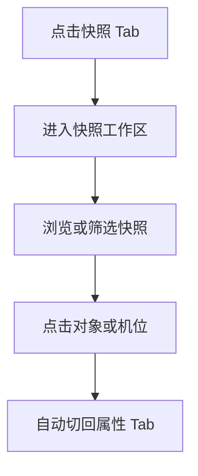

# 第六阶段开发前确认方案：快照工作区与右侧 Tabs

## 1. 文档控制

- 产品/功能名称：3D 影视分镜工作台第六阶段：快照工作区与右侧 Tabs
- 文档版本：v2.0
- 文档状态：已确认 / 开发中
- 创建日期：2026-06-24
- 更新日期：2026-06-25
- 负责人：待定
- 评审参与方：用户、产品、设计、工程
- 相关文档：
  - `docs/prd/3d-workbench-prd.md`
  - `docs/prd/change-log.md`
  - `docs/prd/m5-world-inspector-confirmation.md`
- 相关变更记录：
  - `docs/prd/change-log.md` 2026-06-24 “确认快照工作区与右侧 Tabs 方案”
  - `docs/prd/change-log.md` 2026-06-25 “补齐 M5 / M6 评审级 PRD 结构”

## 2. 一页摘要

### 一句话结论

第六阶段把右侧区域正式拆成 `属性 / 快照` 双 tabs，把快照从属性面板顶部剥离成独立工作区，并补充机位来源和筛选能力，解决“编辑参数”和“浏览结果”混在同一滚动区的问题。

### 本次解决的问题

快照数量一多，右侧原本的属性区会被挤压得难以编辑；同时快照卡片缺少来源机位信息，用户在比较不同镜头结果时很难快速定位截图来源，整个右侧区域在任务语义上开始打架。

### 本次交付内容

- 右侧新增 `属性` / `快照` tabs
- `属性` 页继续承载对象、机位、世界三态属性面板
- `快照` 页承载拍摄入口与快照列表
- 快照卡片补充机位名和创建时间等元信息
- 快照列表支持 `全部 / 当前机位` 筛选
- 在快照页状态下重新选中对象或机位时，右侧自动回到属性页

### 本次不交付内容

- 不做快照重命名、删除、批量操作
- 不做多维筛选、排序、分组或收藏
- 不做本地持久化快照管理
- 不做快照详情页和比对模式

### 关键风险或未决问题

- 快照到底是“结果历史”还是“项目资产”，本阶段按工作区和历史列表来承载，不能和对象列表语义混淆。
- tabs 引入后，属性编辑和快照浏览必须各自独立滚动，不能互相抢容器。
- 当前机位筛选依赖 `activeCameraId`，需要和选中态切换保持一致。

## 3. 背景、问题与依据

### 背景

随着对象、机位、世界态逐步补齐，快照已经不再只是一个导出按钮，而是创作者频繁查看和对比的结果集合。继续把快照挂在属性区顶部，会让“编辑参数”和“浏览结果”两件事互相打断。

### 用户问题

- 快照很多时，右侧属性面板可视区域被明显压缩。
- 用户很难知道一张快照来自哪台机位。
- 快照和属性混在一起，切换上下文效率低。

### 现有方案不足

- 单滚动区同时承载参数编辑和截图浏览两种任务。
- 快照卡片信息密度过低，机位来源不清楚。
- 没有“只看当前机位”这种对比视角。

### 证据与依据

| 类型 | 内容 | 来源 | 可信度 |
| --- | --- | --- | --- |
| 用户反馈 | 用户明确指出快照增多后会挤压属性面板，且现有快照看不出来源机位 | 项目沟通 | 高 |
| 产品判断 | 参数编辑和结果浏览属于两种不同任务上下文，更适合通过 tab 分层 | 内部判断 | 中 |

## 4. 目标用户、场景与用户旅程

### 用户角色

| 用户类型 | 目标 | 痛点 | 使用频率 |
| --- | --- | --- | --- |
| 导演 / 分镜创作者 | 快速对比不同机位快照 | 快照和属性互相挤压，来源难识别 | 高频 |
| 协作成员 | 查阅镜头截图与来源机位 | 不知道图是从哪个机位拍的 | 中频 |

### 使用场景

- 用户连续为多个机位拍摄快照后，需要快速浏览和对比。
- 用户正在看快照，突然要回去改对象或机位参数，希望系统自动回到编辑页。
- 用户只想看当前工作机位的快照，不想被其他机位干扰。

### 触发条件

- 用户点击右侧快照 tab
- 用户拍摄新快照
- 用户切换 `全部 / 当前机位` 筛选
- 用户在快照页重新选中对象或机位

### 用户旅程

| 步骤 | 用户行为 | 用户目标 | 系统响应 |
| --- | --- | --- | --- |
| 1 | 点击快照 tab | 进入结果浏览工作区 | 右侧切换到快照页 |
| 2 | 查看快照卡片 | 识别缩略图、来源机位和时间 | 列表展示缩略图、机位名、创建时间 |
| 3 | 切到当前机位筛选 | 聚焦某个镜头结果 | 列表仅展示当前工作机位快照 |
| 4 | 点击对象或机位 | 回到编辑上下文 | 右侧自动切回属性页 |

## 5. 目标、非目标与成功指标

### 产品目标

- 把快照从附属区块升级为独立工作区。
- 提升快照来源识别和多机位对比效率。
- 保持属性编辑面板在快照增多时依然稳定可用。

### 体验目标

- 用户一眼能分清当前在“编辑属性”还是“浏览快照”。
- 快照卡片信息足够清楚，不需要点开才能知道机位来源。
- 回到对象或机位编辑时不需要额外手动切 tab。

### 非目标

- 不构建完整图库或媒体库系统。
- 不做快照评论、标注、审核和版本管理。
- 不做复杂筛选、排序、分组和批量工作流。

### 成功指标

| 指标 | 类型 | 目标值或观察方式 | 是否验收项 |
| --- | --- | --- | --- |
| 属性区不被快照挤压 | 定性 | 快照多于 10 张时，属性区仍保持独立滚动和完整可用 | 是 |
| 快照来源可识别 | 定性 | 卡片可看到机位名或“编辑视角”标识 | 是 |
| 当前机位筛选可用 | 定性 | 切换筛选后只显示当前工作机位快照 | 是 |
| 自动回属性 | 定性 | 快照页下选中对象或机位后自动回到属性页 | 是 |

## 6. 范围、优先级与版本边界

### 本次范围

- 右侧 tabs 布局
- 快照页独立滚动区
- 快照卡片元信息
- `全部 / 当前机位` 筛选
- 选中对象或机位后自动回属性

### 本次不做

- 快照详情页
- 快照删除与整理
- 标签、收藏、批量下载
- 多条件搜索和排序

### 后续版本

- 快照删除 / 重命名 / 收藏
- 快照与 Shot 绑定
- 快照标注与比对模式
- 更完整的结果资产管理

### 优先级

| 优先级 | 功能/能力 | 用户价值 | 说明 |
| --- | --- | --- | --- |
| P0 | 右侧 tabs、快照独立区、机位名展示 | 解决当前编辑阻塞和识别问题 | 本阶段必须完成 |
| P1 | 当前机位筛选 | 提升多机位浏览效率 | 本阶段建议完成 |
| P2 | 快照管理增强 | 形成结果资产工作流 | 后续评审 |

## 7. 产品方案与用户流程

### 产品方案

右侧区域拆成两层：第一层是 `属性 / 快照` tab 选择器，第二层是对应工作区。属性页继续承载当前上下文的编辑任务；快照页只承载结果浏览和拍摄任务。这样可以把“我在调参数”和“我在看结果”明确拆开。

### 页面/区域结构

- `属性`：对象 / 机位 / 世界属性面板
- `快照`：拍摄按钮、筛选区、快照卡片列表

### 主流程

1. 用户切到快照页查看截图。
2. 用户按全部或当前机位筛选。
3. 用户浏览快照卡片。
4. 用户切回资产编辑，或直接点选对象 / 机位。
5. 系统自动回到属性页。

### 分支流程

- 若快照没有关联机位，则以“编辑视角”展示来源。
- 若当前机位下没有快照，当前机位筛选显示空状态。

### 异常流程

- 快照为空时，显示明确空状态而不是空白列表。
- 若当前工作机位为空，则当前机位筛选应回退到明确提示，而不是展示错误结果。

### 状态说明

- 空状态：暂无快照 / 当前机位下还没有快照
- 加载状态：拍摄后新快照插入列表前显示处理中状态
- 错误状态：快照写入状态失败时给出提示
- 禁用状态：无当前机位时，当前机位筛选可禁用或提示
- 成功状态：拍摄后新快照插入列表顶部

### 流程图



## 8. 功能需求与规则

### 8.1 右侧 Tabs 分发

用户问题：

用户需要在参数编辑和快照浏览之间清晰切换，而不是在同一块区域里上下抢空间。

用户故事：

- 作为创作者，我希望右侧有清晰的 `属性 / 快照` 切换，以便分开处理编辑和查看结果。

入口：

- 右侧顶部 tabs
- 选中对象或机位后的自动切换

主流程：

1. 用户点击 `属性` 或 `快照` tab。
2. 系统切换当前右侧工作区。
3. 若用户在快照页重新选中对象或机位，系统自动切回属性页。

规则：

- 默认进入 `属性` tab。
- 选中对象或机位时，右侧自动切回 `属性` tab。
- 切换 tab 只改变右侧工作区，不改变当前项目上下文。

规格明细：

| 维度 | 说明 |
| --- | --- |
| 展示内容 | `属性` / `快照` tabs |
| 数据来源 | 右侧工作区状态、当前选中上下文 |
| 数据规则 | 默认值为 `properties` |
| 交互规则 | 点击可切换；选中资产触发自动回属性 |
| 状态规则 | 快照页下仍保留当前工作机位和选中上下文 |
| 权限规则 | 无 |
| 联动规则 | 与对象选中、机位选中、快照列表同步 |
| 持久化规则 | tab 状态仅保存在当前会话内 |
| 性能约束 | 切换不应重建整个右侧内容树 |

边界与异常：

- 自动回属性只应在用户重新进入资产编辑上下文时触发，不应因为普通状态刷新误切换。
- 若当前没有选中资产，切回属性页也应正常显示世界态或相机态。

验收标准：

- 给定打开工作台，当右侧初始化完成，则应出现 `属性` / `快照` 两个 tabs 且默认选中 `属性`。
- 给定当前处于快照页，当用户点击对象或机位，则右侧应自动切回属性页。

### 8.2 快照工作区与独立滚动

用户问题：

快照变多后，用户需要一个不挤压属性面板的独立浏览区域。

用户故事：

- 作为创作者，我希望快照在独立区域里滚动浏览，以便属性编辑区始终保持完整可用。

入口：

- 右侧快照页

主流程：

1. 用户切到快照页。
2. 系统展示拍摄入口、筛选区和快照列表。
3. 用户滚动浏览快照，不影响属性页布局。

规则：

- 快照页与属性页不共享滚动容器。
- 属性页不应因为快照数量变化而高度塌陷。
- 快照列表按创建时间倒序展示。

规格明细：

| 维度 | 说明 |
| --- | --- |
| 展示内容 | 拍摄按钮、筛选控件、快照卡片列表 |
| 数据来源 | `snapshots` 状态 |
| 数据规则 | 默认按创建时间倒序展示 |
| 交互规则 | 切页后独立滚动，只影响快照工作区 |
| 状态规则 | 无快照时展示空状态 |
| 权限规则 | 无 |
| 联动规则 | 新快照生成后列表顶部插入 |
| 持久化规则 | 快照数据延续当前会话内存状态 |
| 性能约束 | 大于 10 张快照时保持滚动稳定 |

组件专项清单：

#### 数据列表 / 表格 / 卡片流

- 列表目的：浏览当前项目的快照结果
- 数据来源：`snapshots`
- 首次加载时机：进入快照页后立即加载
- 字段与展示规则：缩略图、快照名、机位名、创建时间
- 默认排序：创建时间倒序
- 可切换排序：本阶段不做
- 分页方式：无分页，独立滚动
- 每页数量：不限制
- 搜索与筛选：支持 `全部 / 当前机位`
- 空状态：暂无快照 / 当前机位下暂无快照
- 行操作：本阶段不做行内管理
- 批量操作：本阶段不做
- 刷新策略：拍摄成功后即时刷新并插入顶部
- 新增、编辑、删除后的回写策略：仅新增，删除本阶段不做

边界与异常：

- 若快照很多，滚动只影响快照页，不影响属性页布局。
- 若列表中存在没有 `cameraId` 的快照，不能影响其正常展示。

验收标准：

- 给定快照数量大于 10，当用户切换到属性页，则属性面板不应受快照列表高度影响。
- 给定快照数量大于 10，当用户切换到快照页，则只有快照工作区滚动。

### 8.3 快照卡片元信息

用户问题：

用户需要知道快照从哪个机位拍的，否则很难做镜头对比。

用户故事：

- 作为创作者，我希望每张快照卡片都带上来源机位信息，以便快速识别镜头来源。

入口：

- 快照工作区中的快照卡片

主流程：

1. 系统读取快照记录。
2. 根据 `cameraId` 关联机位名称。
3. 卡片展示缩略图、快照名、机位名和创建时间。

规则：

- 若快照没有 `cameraId`，显示 `编辑视角`。
- 若 `cameraId` 存在但机位已删除，仍需显示降级标识，避免卡片空白。
- 机位名称以拍摄时记录或当前可解析名称展示。

规格明细：

| 维度 | 说明 |
| --- | --- |
| 展示内容 | 缩略图、快照名、机位名、创建时间 |
| 数据来源 | `snapshots` 与 `cameras` |
| 数据规则 | `cameraId` 缺失时使用 `编辑视角` 回退 |
| 交互规则 | 本阶段仅浏览，不做卡片点击详情 |
| 状态规则 | 无机位信息时有明确降级展示 |
| 权限规则 | 无 |
| 联动规则 | 机位变化不应导致历史卡片失真为空 |
| 持久化规则 | 仅保存在内存快照数据中 |
| 性能约束 | 机位名映射不应导致整列表频繁重复计算 |

边界与异常：

- 若机位已删除，卡片仍应可读。
- 若时间缺失，应回退到可读默认值或隐藏该项而非报错。

验收标准：

- 给定已生成带机位的快照，当用户查看快照卡片，则卡片应显示对应机位名。
- 给定没有 `cameraId` 的快照，当用户查看卡片，则应显示 `编辑视角`。

### 8.4 当前机位筛选

用户问题：

用户在多机位快照里需要快速只看当前镜头结果。

用户故事：

- 作为创作者，我希望按当前工作机位筛选快照，以便专注比较某个镜头的结果。

入口：

- 快照工作区筛选控件

主流程：

1. 用户切换到 `当前机位`。
2. 系统读取 `activeCameraId`。
3. 列表只展示 `cameraId === activeCameraId` 的快照。
4. 用户切回 `全部`，恢复全列表。

规则：

- 当前机位筛选依赖 `activeCameraId`，而不是 `selectedCameraId`。
- 无 `activeCameraId` 时，当前机位筛选需禁用或展示明确提示。
- 切换筛选不改变快照原始数据顺序，只改变当前视图结果集。

规格明细：

| 维度 | 说明 |
| --- | --- |
| 展示内容 | `全部` / `当前机位` 筛选控件 |
| 数据来源 | `snapshots`、`activeCameraId` |
| 数据规则 | 过滤条件为 `cameraId === activeCameraId` |
| 交互规则 | 点击切换立即生效 |
| 状态规则 | 无当前机位或无匹配快照时展示明确空状态 |
| 权限规则 | 无 |
| 联动规则 | 与当前工作机位同步，而不是和选中态绑定 |
| 持久化规则 | 筛选状态仅保存在当前会话 |
| 性能约束 | 筛选切换需即时完成 |

组件专项清单：

#### 搜索 / 筛选 / 排序

- 搜索范围：本阶段不做文本搜索
- 触发方式：点击切换
- 防抖时间：无
- 筛选项来源：固定选项 `全部 / 当前机位`
- 多筛选条件关系：本阶段无多条件
- 默认筛选：`全部`
- 清空规则：切回 `全部`
- 与分页的联动：本阶段无分页
- 与 URL、本地状态或项目状态的同步：仅与当前 UI 会话状态同步

边界与异常：

- 当前工作机位为空时，当前机位筛选不能返回误导性列表。
- 当前工作机位切换后，当前机位筛选结果应同步更新。

验收标准：

- 给定存在多机位快照，当用户切换到 `当前机位`，则列表应只显示当前工作机位快照。
- 给定当前机位下没有快照，当用户切换到 `当前机位`，则应显示明确空状态。

## 9. 数据、技术与非功能要求

### 数据模型

```json
{
  "rightPanelTab": "properties | snapshots",
  "snapshotFilter": "all | activeCamera",
  "snapshot": {
    "id": "string",
    "name": "string",
    "cameraId": "string | null",
    "createdAt": "string",
    "imageDataUrl": "string"
  }
}
```

### 字段说明

| 字段 | 类型 | 说明 | 是否必填 | 默认值 | 备注 |
| --- | --- | --- | --- | --- | --- |
| rightPanelTab | string | 右侧当前工作区 | 是 | `properties` | `属性 / 快照` |
| snapshotFilter | string | 快照筛选方式 | 是 | `all` | `all` 或 `activeCamera` |
| snapshot.cameraId | string \| null | 快照来源机位 | 否 | `null` | `null` 表示编辑视角 |
| snapshot.createdAt | string | 创建时间 | 是 | 生成时写入 | 卡片展示用 |
| snapshot.imageDataUrl | string | 快照图片数据 | 是 | 拍摄时生成 | 本阶段仍在内存中 |

### 存储、导入导出与兼容策略

- 快照和 tabs 状态都继续保存在内存中。
- 旧快照若缺少 `cameraId`，按 `编辑视角` 处理。
- 不新增本地持久化或导出格式变化。

### 技术架构

- `RightPanel.tsx`：tabs 分发与自动回属性逻辑
- `SnapshotPanel.tsx`：拍摄入口、筛选和快照列表
- `projectStore.ts`：补充 `rightPanelTab` 与 `snapshotFilter` 状态

### 模块边界

- tabs 状态在 store 中管理
- 快照页布局和卡片展示在 `SnapshotPanel`
- 资产选中触发自动回属性逻辑在右侧容器层处理

### 关键依赖

- 现有快照数据结构
- `activeCameraId` 工作机位概念
- 右侧属性区现有分发逻辑

### 实现策略

- 优先保持快照数据结构兼容，只补充展示逻辑和右侧容器结构
- tabs 切换不影响快照数据，不重拍、不重算
- 当前机位筛选只做视图过滤，不改底层数据

### 非功能需求

- 性能要求：快照较多时右侧依然滚动稳定
- 兼容性要求：兼容现有快照数据结构
- 可用性要求：状态切换明确，空状态可理解
- 可维护性要求：属性区和快照区的容器职责分离
- 安全与隐私要求：快照仍只在本地内存中处理

## 10. 验收、风险、开放问题与评审记录

### 验收标准

| 编号 | 验收项 | 前置条件 | 操作 | 预期结果 | 验证方式 |
| --- | --- | --- | --- | --- | --- |
| AC-001 | 右侧 Tabs | 打开工作台 | 查看右侧顶部 | 出现 `属性` / `快照` 两个 tabs | 手动 |
| AC-002 | 属性区独立 | 快照数量大于 10 | 切换到属性页 | 属性面板不受快照列表高度影响 | 手动 |
| AC-003 | 快照区独立 | 快照数量大于 10 | 切换到快照页 | 仅快照列表滚动显示 | 手动 |
| AC-004 | 机位名展示 | 已生成带机位的快照 | 查看快照卡片 | 卡片显示对应机位名 | 手动 |
| AC-005 | 当前机位筛选 | 存在多机位快照 | 切换到 `当前机位` | 只显示当前工作机位快照 | 手动 |
| AC-006 | 选中自动回属性 | 当前处于快照页 | 点击对象或机位 | 右侧自动切回属性页 | 手动 |

### 排期与里程碑

| 阶段 | 目标 | 交付物 | 验收方式 | 状态 |
| --- | --- | --- | --- | --- |
| M6-1 | 右侧 tabs 结构 | `属性 / 快照` 容器分发 | 手动检查 | 已确认 |
| M6-2 | 快照工作区 | 独立滚动、卡片元信息 | 手动检查 | 已确认 |
| M6-3 | 筛选与自动回属性 | 当前机位筛选、选中联动 | 手动检查 | 已确认 |

### 假设、约束与依赖

- 假设：快照当前更适合作为工作区而不是对象资产系统
- 约束：本阶段不做快照管理增强和持久化
- 依赖：现有快照生成逻辑、工作机位状态、右侧属性分发机制

### 风险

| 风险 | 影响范围 | 概率 | 影响 | 应对策略 |
| --- | --- | --- | --- | --- |
| tabs 分发干扰资产编辑 | 右侧工作流 | 中 | 中 | 选中资产时自动回属性 |
| 当前机位筛选语义不清 | 快照浏览 | 中 | 中 | 明确依赖 `activeCameraId` |
| 快照列表过长影响右侧流畅度 | 浏览体验 | 中 | 中 | 独立滚动并保留后续优化空间 |

### 开放问题

| 问题 | 影响范围 | 负责人 | 期望确认时间 | 状态 |
| --- | --- | --- | --- | --- |
| 后续是否需要给快照增加删除和重命名 | 快照管理能力 | 待定 | 后续阶段前 | 待后续评估 |
| 当前机位筛选是否需要扩展为多机位条件 | 多镜头浏览能力 | 待定 | 后续阶段前 | 待后续评估 |

### 评审记录

| 日期 | 参与方 | 结论 | 待办 |
| --- | --- | --- | --- |
| 2026-06-24 | 用户、产品、工程 | 确认快照工作区与右侧 tabs 方案 | 进入开发实现 |
| 2026-06-25 | 用户、产品、工程 | 按评审级 PRD 标准补齐结构 | 统一后续阶段文档口径 |

### 变更记录

| 日期 | 变更内容 | 原因 | 影响范围 |
| --- | --- | --- | --- |
| 2026-06-24 | 将快照管理从属性区顶部迁移到独立快照 tab，并补充机位名与筛选 | 避免快照列表挤压属性编辑空间，提升快照可识别性 | 右侧布局、快照信息结构、交互流程 |
| 2026-06-25 | 按新版 PRD 标准重写 M6 文档 | 统一文档结构并补齐规格、数据、风险和评审内容 | `docs/prd/m6-snapshot-workspace-confirmation.md` 全文 |
