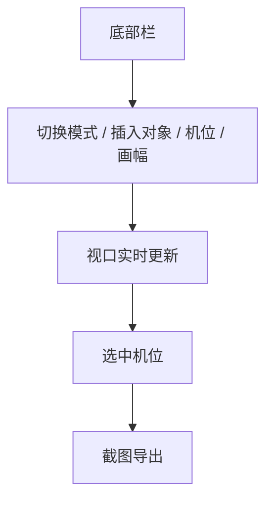

# 第七阶段开发前确认方案：底部菜单真实交互闭环

## 1. 文档控制

- 产品/功能名称：3D 影视分镜工作台第七阶段：底部菜单真实交互闭环
- 文档版本：v1.0
- 文档状态：已确认 / 开发中
- 创建日期：2026-06-25
- 更新日期：2026-06-25
- 负责人：待定
- 评审参与方：用户、产品、设计、工程
- 相关文档：
  - `docs/prd/3d-workbench-prd.md`
  - `docs/prd/change-log.md`
  - `docs/prd/m3-camera-editing-confirmation.md`
  - `docs/prd/m5-world-inspector-confirmation.md`
  - `docs/prd/m6-snapshot-workspace-confirmation.md`
- 相关变更记录：`docs/prd/change-log.md` 2026-06-25 “确认底部菜单交互闭环方案”

## 2. 一页摘要

### 一句话结论

把底部工具条从“视觉占位”升级为真正可工作的高频操作区，承载移动模式切换、对象插入、全景图绑定、机位创建、画幅比例切换和按机位截图。

### 本次解决的问题

当前底部栏只有简单高亮或单一按钮，无法作为真实工作流入口。用户需要从底部快速完成常见操作，而不是频繁在左侧列表、右侧面板和视口事件之间来回切换。

### 本次交付内容

- 移动菜单：移动 / 旋转 / 缩放，支持快捷键 `V / R / S`
- 对象菜单：本地上传、男性素体、女性素体、群众、几何模型
- 全景图快捷入口
- 添加机位快捷入口
- 画幅比例菜单：默认、`21:9`、`16:9`、`4:3`、`1:1`、`3:4`、`9:16`、`2:3`、`3:2`
- 截图按钮：仅在选中机位时可用
- 视口增加画幅参考框，截图按当前画幅比例导出

### 本次不交付内容

- 不做底部时间线
- 不做多级资产库
- 不做复杂群众模板、路径排布和随机化参数
- 不做对象拖入式资源面板

### 关键风险或未决问题

- 底部栏若只增加入口不增加状态表达，会继续造成“按钮很多但逻辑不清”。
- 画幅比例若只改文案、不影响预览与导出，会形成伪功能。

## 3. 背景、问题与依据

### 背景

主 PRD 早期已将底部浮动工具条定义为高频操作入口，但第一阶段只完成视觉骨架。随着对象、机位、全景图、快照等能力逐步落地，底部栏需要承担真正的工作流组织作用。

### 用户问题

- 底部栏不能高效切换移动 / 旋转 / 缩放
- 常用对象插入入口缺失
- 添加机位、绑定全景图和截图分散在其他区域
- 画幅比例没有独立入口，也不能反映到当前镜头输出

### 现有方案不足

- 工具条仍偏“占位 UI”
- 快捷键未形成闭环
- 截图没有选中机位前置约束
- 画幅比例没有与预览、导出联动

### 证据与依据

| 类型 | 内容 | 来源 | 可信度 |
| --- | --- | --- | --- |
| 用户反馈 | 用户明确要求底部菜单包含移动、对象、全景图、添加机位、画幅比例、截图 6 项能力，并补齐菜单内容 | 项目沟通 | 高 |
| 竞品参考 | Blender、Unreal、Unity 等工具都会把高频编辑模式与创建入口放在靠近视口的工具区，并给出快捷键 | 行业通用交互 | 中 |
| 产品判断 | 影视分镜预演强调高频、轻量、低切换成本，因此底部栏适合承载“立即执行”的动作，而非深层配置 | 内部判断 | 高 |

## 4. 目标用户、场景与用户旅程

### 用户角色

| 用户类型 | 目标 | 痛点 | 使用频率 |
| --- | --- | --- | --- |
| 导演 / 分镜创作者 | 快速搭景、摆位、定机位、截图 | 入口分散，操作路径长 | 高频 |
| AI 视频创作者 | 快速试错不同构图和画幅 | 切换画幅与截图效率低 | 高频 |

### 使用场景

用户在中间视口持续工作，希望在不离开当前注意力区域的情况下，完成模式切换、插入占位物、增加机位、切画幅和截图。

### 触发条件

- 需要切换移动模式时
- 需要快速加入人物或几何占位物时
- 需要把当前视口保存为机位时
- 需要切换输出画幅或按机位截图时

### 用户旅程

| 步骤 | 用户行为 | 用户目标 | 系统响应 |
| --- | --- | --- | --- |
| 1 | 点击移动菜单或按快捷键 | 切换当前操作模式 | 视口 gizmo 与工具高亮同步 |
| 2 | 从对象菜单插入素体或几何体 | 快速补位或构图 | 新对象进入场景并自动选中 |
| 3 | 点击全景图或添加机位 | 快速完成环境 / 机位动作 | 弹出文件选择或创建机位 |
| 4 | 切换画幅比例 | 检查当前镜头输出边界 | 视口画幅框、预览与导出联动 |
| 5 | 点击截图 | 输出当前机位快照 | 仅机位选中时允许截图 |

## 5. 目标、非目标与成功指标

### 产品目标

- 让底部栏成为真实的高频工作区
- 降低跨面板切换成本
- 把画幅比例和截图纳入镜头工作流

### 体验目标

- 按钮语义清晰，点击后有明确结果
- 快捷键与按钮行为保持一致
- 禁用态足够明确，避免误操作

### 非目标

- 不把底部栏做成完整资源管理器
- 不实现专业镜头参数库或时间线

### 成功指标

| 指标 | 类型 | 目标值或观察方式 | 是否验收项 |
| --- | --- | --- | --- |
| 移动快捷键生效 | 定性 | `V / R / S` 可切换模式，视口和按钮同步 | 是 |
| 对象插入成功 | 定性 | 素体、群众、几何体可快速生成并进入列表 | 是 |
| 画幅联动 | 定性 | 切换画幅后，视口参考框、右侧预览与截图结果同步变化 | 是 |
| 截图前置校验 | 定性 | 未选中机位时底部截图按钮禁用 | 是 |

## 6. 范围、优先级与版本边界

### 本次范围

- 移动菜单
- 对象菜单
- 全景图入口
- 添加机位入口
- 画幅比例菜单
- 截图禁用态与导出联动

### 本次不做

- 多级素材库
- 对象删除或批量管理入口
- 画幅安全区与电视安全线

### 后续版本

- 自定义画幅
- 群众随机化朝向、阵列方向
- 常用资产模板
- 快捷键提示浮层

### 优先级

| 优先级 | 功能/能力 | 用户价值 | 说明 |
| --- | --- | --- | --- |
| P0 | 移动菜单、对象插入、截图前置约束 | 形成底部栏真实工作流 | 本阶段必须完成 |
| P1 | 画幅比例联动 | 强化影视输出语义 | 本阶段建议完成 |
| P2 | 群众高级参数与更多资产模板 | 提升批量搭景效率 | 后续评审 |

## 7. 产品方案与用户流程

### 产品方案

底部栏采用“命令按钮 + 下拉菜单”组合：

- 即时动作：全景图、添加机位、截图
- 需要二级选择的动作：移动、对象、画幅比例

### 页面/区域结构

- 移动：显示当前模式，展开后可切换三种变换模式
- 对象：显示上传、人物、群众、几何体入口
- 全景图：直接打开图片文件选择
- 添加机位：直接从当前视口创建机位
- 画幅比例：选择输出比例并影响视口参考框与截图
- 截图：按当前选中机位导出

### 主流程

1. 用户在视口工作时通过底部栏切换变换模式。
2. 用户按需从对象菜单插入占位资源。
3. 用户设置画幅比例。
4. 用户选中机位并截图。

### 分支流程

- 群众插入支持输入数量和间距，再一次性生成。
- 几何模型按快速模板生成方块、球体、圆柱。

### 异常流程

- 未选中机位时，截图按钮禁用。
- 上传非 `.glb` 文件时，沿用现有 GLB 导入错误提示。

### 状态说明

- 默认状态：按钮可见，截图按钮依赖机位选中态
- 选中状态：当前工具按钮高亮
- 禁用状态：截图按钮在无机位选中时禁用

### 流程图



## 8. 功能需求与规则

### 8.1 移动菜单

用户故事：

- 作为创作者，我希望在底部快速切换移动、旋转、缩放，并支持快捷键，以便保持编辑节奏。

规则：

- 菜单项为 `移动(V)`、`旋转(R)`、`缩放(S)`
- 按钮状态与 `TransformControls` 模式同步
- 快捷键在输入框焦点内不生效

验收标准：

- 给定视口处于普通编辑态，当用户按 `R`，则当前模式切到旋转，按钮同步高亮。

### 8.2 对象菜单

用户故事：

- 作为创作者，我希望从底部快速插入素体、群众和几何体，以便快速搭景。

规则：

- 本地上传：调用现有 GLB 导入流程
- 男性素体 / 女性素体：生成内置占位模型
- 群众：支持输入行数、列数与间距，按规则阵列批量插入
- 几何模型：提供立方体、球体、圆柱体、环状体、圆锥、棱锥六种基础体
- 新插入对象写入左侧列表，并选中最后一个新增对象

验收标准：

- 给定点击“男性素体”，当插入成功，则场景出现男性素体且左侧列表新增对应对象。

### 8.3 全景图与添加机位

用户故事：

- 作为创作者，我希望从底部直接绑定全景图或创建机位，以便减少跨区域操作。

规则：

- 全景图入口接受图片文件
- 添加机位默认沿用“从当前视口创建机位”逻辑

验收标准：

- 给定当前编辑视角已调整，当用户点击“添加机位”，则新增机位与当前视角一致。

### 8.4 画幅比例与截图

用户故事：

- 作为创作者，我希望先确定镜头画幅，再按当前机位截图，以便得到真正可用的参考帧。

规则：

- 画幅提供常用预设：`2.39:1`、`16:9`、`9:16`、`1:1`、`4:5`
- 画幅提供默认和常用预设：`默认`、`21:9`、`16:9`、`4:3`、`1:1`、`3:4`、`9:16`、`2:3`、`3:2`
- 画幅切换影响：
  - 中间视口参考框
  - 右侧机位预览的宽高比
  - 截图裁切比例
- 当选择“默认”时：
  - 不显示画幅参考框
  - 不对截图做裁切
  - 以整个当前视口作为输出范围
- 底部截图仅在 `selectedCameraId` 存在时可点

验收标准：

- 给定未选中机位，当用户观察底部截图按钮，则按钮处于禁用态。
- 给定当前画幅为 `9:16` 且已选中机位，当用户点击截图，则导出图为竖屏比例。

## 9. 数据、技术与非功能要求

### 数据结构

```json
{
  "activeTool": "move",
  "transformMode": "translate",
  "outputFrame": {
    "presetId": "default",
    "label": "默认"
  }
}
```

### 技术方案

- `BottomToolbar.tsx`：工具条交互、菜单、快捷键、文件选择
- `Viewport3D.tsx`：对象生成、画幅参考框、截图裁切
- `sceneObjects.ts`：内置素体与几何体生成函数
- `projectStore.ts`：新增输出画幅状态与对象插入状态写入

### 非功能要求

- 快捷键应在普通编辑态稳定可用
- 画幅切换与截图不应明显卡顿
- 新对象插入能力应保持模块解耦，便于后续接入更多模板

## 10. 验收、风险、开放问题与评审记录

### 验收标准

| 编号 | 验收项 | 前置条件 | 操作 | 预期结果 | 验证方式 |
| --- | --- | --- | --- | --- | --- |
| AC-001 | 移动菜单 | 打开工作台 | 展开移动菜单 | 显示移动 / 旋转 / 缩放及快捷键提示 | 手动 |
| AC-002 | 快捷键切换 | 视口未聚焦输入框 | 按 `V/R/S` | 模式切换成功 | 手动 |
| AC-003 | GLB 上传入口 | 打开对象菜单 | 点击本地上传 | 打开文件选择器 | 手动 |
| AC-004 | 素体插入 | 打开对象菜单 | 点击男性素体或女性素体 | 场景与左侧列表新增对象 | 手动 |
| AC-005 | 群众插入 | 输入行数、列数与间距 | 点击插入群众 | 按阵列批量生成多个群众对象 | 手动 |
| AC-006 | 几何体插入 | 打开对象菜单 | 点击六种几何体入口 | 场景新增对应几何体 | 手动 |
| AC-007 | 全景图入口 | 点击全景图 | 选择图片 | 成功绑定全景图 | 手动 |
| AC-008 | 添加机位 | 当前编辑视角已调整 | 点击添加机位 | 新机位按当前视角创建 | 手动 |
| AC-009 | 画幅联动 | 已切换画幅 | 查看视口和预览 | 参考框与预览比例同步变化；默认比例不显示参考框 | 手动 |
| AC-010 | 截图禁用态 | 未选中机位 | 查看截图按钮 | 按钮禁用 | 手动 |
| AC-011 | 截图导出 | 已选中机位 | 点击截图 | 生成按当前画幅裁切的 PNG | 手动 |

### 风险与开放问题

- 群众目前是规则阵列，不含随机化，后续若追求更自然站位需要扩展参数。

### 评审结论

- 底部栏按“真实高频工作流入口”建设，不再仅作视觉占位。
- 画幅比例必须联动预览和截图，避免出现伪开关。
