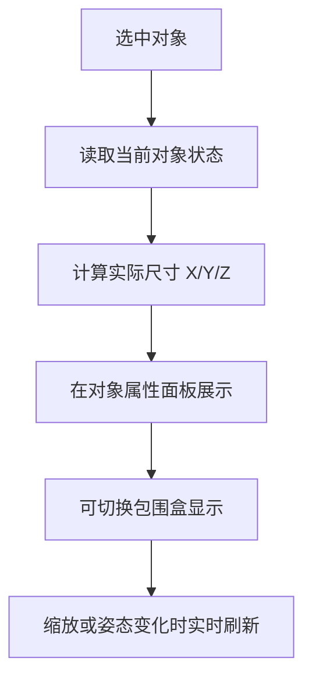

# 第八阶段开发前确认方案：对象实际尺寸显示

## 1. 文档控制

- 产品/功能名称：3D 影视分镜工作台第八阶段：对象实际尺寸显示
- 文档版本：v0.3
- 文档状态：已确认 / 开发中
- 创建日期：2026-06-25
- 更新日期：2026-06-25
- 负责人：待定
- 评审参与方：用户、产品、设计、工程
- 相关文档：
  - `docs/prd/3d-workbench-prd.md`
  - `docs/prd/change-log.md`
  - `docs/prd/m2-development-confirmation.md`
  - `docs/prd/m7-bottom-toolbar-confirmation.md`
- 相关变更记录：`docs/prd/change-log.md` 2026-06-25 “启动对象实际尺寸功能调研”

## 2. 一页摘要

### 一句话结论

在对象属性面板中新增“实际尺寸”区块，按对象包围盒计算 `X / Y / Z` 轴向尺寸，第一版单位只做 `米（m）`，精度展示到毫米级，并支持显示/关闭包围盒。

### 本次解决的问题

当前工作台只能看到对象的 `position / rotation / scale`，但用户很难直接知道模型“现在到底有多大”。这会影响角色、道具、场景比例判断，也会影响镜头构图与站位参考。

### 本次交付内容

- 对象属性面板新增“实际尺寸”只读展示
- 展示字段使用 `X / Y / Z`
- 单位统一为 `米（m）`
- 数值展示精度到毫米级
- 支持显示/关闭包围盒
- 对象缩放、骨骼姿态变化后尺寸实时刷新
- 文档中明确“实际尺寸”与 `Scale` 的区别

### 本次不交付内容

- 不支持直接输入尺寸反向改 `Scale`
- 不做 `cm / mm / ft` 等多单位切换
- 不做通用测量模式（两点测距、对象间距离）
- 不做自动归一化到标准身高 / 标准尺寸

### 关键风险或未决问题

- 骨骼模型在不同姿态下，包围盒尺寸会发生变化，需要确保用户理解这是结果尺寸而不是原始建模尺寸
- 不规则物体开启包围盒后，需避免视觉遮挡过强

## 3. 背景、问题与依据

### 背景

产品已经支持 `.glb` 导入、对象缩放、机位编辑、快照与骨骼控制。随着功能变多，导入模型的真实体量是否合理，开始直接影响影视预演结果。仅靠网格和视觉估算，无法稳定判断角色、道具和场景比例。

### 用户问题

- 导入模型后，用户不知道对象当前实际有多大
- `Scale` 数值只能表示缩放倍数，不能表达对象真实尺寸
- 不同来源的 `glb` 资产尺度不统一，容易出现人物过大或过小
- 镜头构图、人物站位和环境关系需要更明确的尺寸参考

### 现有方案不足

- 右侧面板没有任何尺寸结果信息
- 用户只能通过缩放试错
- 缺少统一口径来判断导入模型是否合理

### 证据与依据

| 类型 | 内容 | 来源 | 可信度 |
| --- | --- | --- | --- |
| 用户反馈 | 用户明确提出调研“对象实际尺寸”功能，并确认字段命名使用 `X / Y / Z`、单位只做 `米`、尺寸按包围盒计算，并补充显示/关闭包围盒需求 | 项目沟通 | 高 |
| 行业依据 | Unreal Engine 官方文档明确区分项目单位系统，并默认长度单位为 `cm`，说明“尺寸结果”和“单位系统”应作为独立产品概念处理 | [Unreal Engine Units of Measurement](https://dev.epicgames.com/documentation/en-us/unreal-engine/units-of-measurement-in-unreal-engine) | 高 |
| 技术依据 | Three.js 可通过对象包围盒计算当前场景状态下的轴向尺寸，适合作为轻量工作台第一版实现口径 | Three.js 能力判断 | 高 |
| 产品判断 | 对当前产品阶段而言，“先显示尺寸结果，再决定是否支持尺寸编辑”比直接做可编辑尺寸系统更稳 | 内部判断 | 高 |

## 4. 目标用户、场景与用户旅程

### 用户角色

| 用户类型 | 目标 | 痛点 | 使用频率 |
| --- | --- | --- | --- |
| 导演 / 分镜创作者 | 判断角色、道具、机位之间的空间比例 | 只能凭肉眼估算模型大小 | 高频 |
| AI 视频创作者 | 统一不同来源模型的尺度感 | 导入资产体量不稳定，影响提示词和构图参考 | 高频 |
| 协作美术 / 预演执行 | 快速校对模型是否符合设定体量 | 无法直接看到对象尺寸结果 | 中频 |

### 使用场景

用户导入一个角色或道具后，先在右侧面板查看对象的实际 `X / Y / Z` 尺寸，判断是否符合预期；若不合理，再通过现有缩放能力调节到合适范围。

### 触发条件

- 用户选中对象
- 导入新模型后自动选中对象
- 用户调整对象缩放
- 用户在骨骼模式下改变姿态

### 用户旅程

| 步骤 | 用户行为 | 用户目标 | 系统响应 |
| --- | --- | --- | --- |
| 1 | 导入或选中对象 | 查看当前对象状态 | 右侧显示对象属性 |
| 2 | 查看“实际尺寸”区块 | 判断对象真实大小 | 系统展示 `X / Y / Z`，单位为 `m` |
| 3 | 调整对象缩放或姿态 | 修正模型尺寸或体态 | 尺寸数值实时刷新 |
| 4 | 继续摆位或构图 | 完成预演编辑 | 尺寸作为辅助参考持续可见 |

## 5. 目标、非目标与成功指标

### 产品目标

- 让对象大小从“凭感觉”变成“可观察结果”
- 建立导入模型尺度校准的第一层能力
- 为后续测量模式和标准化尺寸功能打基础

### 体验目标

- 用户能快速理解 `Scale` 是倍数，`X / Y / Z` 是实际尺寸结果
- 尺寸信息无需额外操作即可看见
- 尺寸变化与当前对象状态保持同步

### 非目标

- 不把本阶段做成 CAD 式完整测量系统
- 不在本阶段支持尺寸反算缩放
- 不引入多单位制和换算 UI

### 成功指标

| 指标 | 类型 | 目标值或观察方式 | 是否验收项 |
| --- | --- | --- | --- |
| 尺寸可见性 | 定性 | 选中对象时能稳定看到 `X / Y / Z` 实际尺寸 | 是 |
| 尺寸实时刷新 | 定性 | 调整缩放或姿态后尺寸结果同步更新 | 是 |
| 包围盒可视化 | 定性 | 用户可手动开启或关闭对象包围盒显示 | 是 |
| 用户理解成本 | 定性 | 不需要额外培训即可区分 `Scale` 与“实际尺寸” | 是 |

## 6. 范围、优先级与版本边界

### 本次范围

- 对象属性面板增加“实际尺寸”
- 显示 `X / Y / Z`
- 单位固定为 `m`
- 精度到毫米级
- 包围盒显示开关
- 定义尺寸与 `Scale` 的关系

### 本次不做

- 尺寸编辑
- 多单位切换
- 测距工具
- 自动标准化尺寸

### 后续版本

- 直接输入尺寸反算缩放
- `cm` 等单位切换
- 相机到对象距离、对象到对象距离
- 标准身高 / 标准尺寸归一化

### 优先级

| 优先级 | 功能/能力 | 用户价值 | 说明 |
| --- | --- | --- | --- |
| P0 | `X / Y / Z` 实际尺寸显示、包围盒开关 | 解决导入模型尺度不可见问题 | 本阶段必须完成 |
| P1 | 尺寸说明与口径提示 | 降低误解成本 | 本阶段建议完成 |
| P2 | 尺寸编辑和测量 | 扩展为更完整空间标尺体系 | 后续评审 |

## 7. 产品方案与用户流程

### 产品方案

在右侧对象属性面板的变换区块下方新增“实际尺寸”区块，按对象包围盒展示 `X / Y / Z` 结果值，单位固定为 `m`，精度到毫米级。  
第一版默认只读，不允许直接输入修改；同时提供“显示包围盒”开关，用于辅助理解不规则物体的尺寸范围。

### 页面/区域结构

- 名称
- 视口拖拽模式
- 位置 / 旋转 / 缩放
- 实际尺寸 `X / Y / Z`
- 显示包围盒
- 骨骼 / 材质

### 主流程

1. 用户选中对象
2. 右侧展示 `Scale` 与“实际尺寸”
3. 用户调整缩放
4. 实际尺寸结果同步刷新

### 分支流程

- 若对象带骨骼且姿态变化导致包围盒变化，尺寸结果同步更新
- 若对象不可见但仍被选中，尺寸仍可展示
- 若用户开启包围盒，则视口显示对应辅助线框

### 异常流程

- 如果对象几何异常导致尺寸不可计算，则展示占位值并记录错误

### 状态说明

- 空状态：未选中对象时不展示该区块
- 加载状态：导入完成前不展示尺寸
- 错误状态：尺寸计算失败时展示 `--`
- 成功状态：显示 `X / Y / Z` 数值和 `m`

### 流程图

## 8. 功能需求与规则

### 8.1 对象实际尺寸展示

用户问题：

用户需要知道对象实际有多大，而不仅仅是缩放倍数。

用户故事：

- 作为创作者，我希望在对象面板直接看到 `X / Y / Z` 实际尺寸，以便判断导入模型是否合适。
- 作为创作者，我希望能打开包围盒显示，以便理解不规则物体的尺寸范围。

入口：

- 右侧对象属性面板

主流程：

1. 用户选中对象
2. 系统计算对象当前尺寸
3. 面板显示 `X / Y / Z`

规则：

- 字段命名使用 `X / Y / Z`
- 尺寸按对象包围盒计算
- 单位固定为 `m`
- 精度展示到毫米级
- 第一版只读
- 尺寸结果与 `Scale` 分开展示
- 提供包围盒显示/关闭开关

规格明细：

| 维度 | 说明 |
| --- | --- |
| 展示内容 | `X`、`Y`、`Z` 三个字段，统一展示单位 `m`，配套“显示包围盒”开关 |
| 数据来源 | 当前选中对象的运行时几何、姿态与变换结果 |
| 数据规则 | 基于包围盒计算；单位固定为米；数值精度到毫米级；不可计算时显示 `--` |
| 交互规则 | 本阶段只读，无点击编辑能力；包围盒可手动开关 |
| 状态规则 | 未选中对象不显示；选中对象则显示 |
| 联动规则 | 对象缩放、骨骼姿态变化时实时更新；包围盒显示与尺寸结果口径保持一致 |
| 持久化规则 | 不额外持久化，始终由当前对象状态派生 |
| 性能约束 | 计算应足够轻量，不影响视口拖拽流畅度 |

边界与异常：

- 对于空对象、辅助对象和异常几何，需要定义兜底展示策略
- 不规则物体的包围盒可能明显大于视觉主体，这是预期行为，需要通过开关辅助理解

验收标准：

- 给定选中一个对象，当右侧对象面板渲染完成，则能看到 `X / Y / Z` 的实际尺寸值，单位为 `m`，精度到毫米级。

### 8.2 尺寸与缩放的关系说明

用户问题：

用户容易把 `Scale` 和“实际尺寸”混为一谈。

用户故事：

- 作为创作者，我希望系统把“缩放倍数”和“结果尺寸”分开，以便我知道自己是在改过程还是看结果。

规则：

- `Scale` 保留为编辑项
- `X / Y / Z` 保留为结果项
- 不支持通过尺寸直接反改缩放
- 尺寸结果口径统一为包围盒

验收标准：

- 给定对象 `Scale` 已改变，当用户查看对象面板，则 `Scale` 与 `X / Y / Z` 分组展示，不互相覆盖。

## 9. 数据、技术与非功能要求

### 数据结构

第一版建议不新增持久化字段，尺寸结果和包围盒显示均以当前运行时对象动态计算。

### 技术方案

- 在对象面板层新增“实际尺寸”展示区块
- 在 Three.js 运行时基于对象包围盒计算尺寸结果
- 在视口层增加对象包围盒辅助显示能力
- 尺寸计算逻辑独立封装，避免直接写死在 UI 组件内

### 非功能要求

- 计算逻辑需与对象编辑解耦
- 不影响拖拽与实时刷新体验
- 后续可扩展到多单位、测距和尺寸编辑

## 10. 验收、风险、开放问题与评审记录

### 验收标准

| 编号 | 验收项 | 前置条件 | 操作 | 预期结果 | 验证方式 |
| --- | --- | --- | --- | --- | --- |
| AC-001 | 尺寸展示 | 已选中对象 | 查看右侧对象面板 | 显示 `X / Y / Z`，单位为 `m`，精度到毫米级 | 手动 |
| AC-002 | 缩放联动 | 已选中对象 | 调整对象缩放 | 尺寸结果实时刷新 | 手动 |
| AC-003 | 姿态联动 | 选中带骨骼对象 | 调整 FK / IK 姿态 | 尺寸结果同步刷新 | 手动 |
| AC-004 | 包围盒开关 | 已选中对象 | 切换“显示包围盒” | 视口中的包围盒显示状态同步变化 | 手动 |
| AC-005 | 非对象状态 | 未选中对象 | 查看右侧面板 | 不展示对象尺寸区块 | 手动 |

### 风险

- 旋转或骨骼姿态变化后，尺寸结果采用包围盒口径，可能与用户对“模型本体大小”的直觉存在偏差
- 不同来源的 `glb` 单位约定不统一，第一版只能显示“当前结果”，不能保证“建模原始单位”正确

### 开放问题

- 包围盒线框样式是否需要弱化以减少遮挡
- 是否需要在同阶段补充“一键标准化到目标高度”

### 评审结论

- 已确认：字段命名使用 `X / Y / Z`
- 已确认：本次单位只做 `米（m）`
- 已确认：尺寸按包围盒计算
- 已确认：数值精度到毫米级
- 已确认：不规则物体增加显示/关闭包围盒功能
