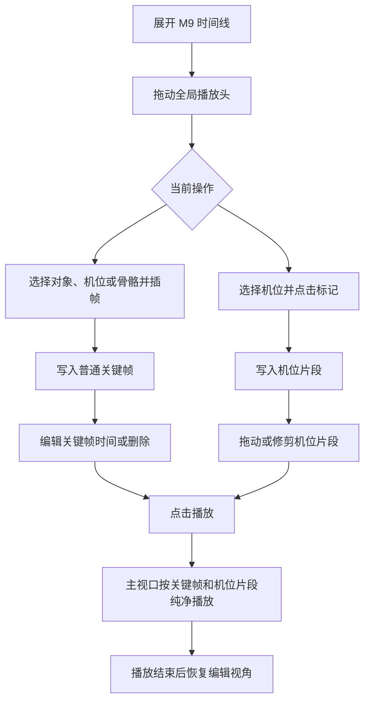

# 第九阶段产品需求文档：关键帧动画与机位切换第一版

## 1. 文档信息

| 文档版本 | 修订日期（YYYY/MM/DD） | 变更内容 | 变更原因 | 备注 |
| --- | --- | --- | --- | --- |
| 2.0 | 2026/06/30 | 按最新文档结构重写 M9 产品需求文档，补充功能优先级、详细功能规则、状态规则、异常规则、非功能性需求和测试验收项 | 原文档包含过多过程信息和技术说明，不适合作为正式需求文档直接使用 | 当前版本对应已实现的关键帧动画、机位片段和纯净播放预览第一版 |

## 2. 一页摘要

### 一句话结论

M9 将 3D 工作台从“静态摆位和快照工具”升级为“可记录关键帧、可调整时间、可按机位片段播放预览”的轻量动画预演工具。

### 本次解决的问题

- 用户只能表达当前场景状态，无法表达对象、摄影机和骨骼控制随时间变化。
- 用户已经能创建机位和快照，但无法指定动画播放过程中哪个时间段使用哪台机位观看。
- 用户新增关键帧后需要修正节奏，因此关键帧必须支持选中、删除和拖动改时刻。
- 带骨骼 GLB 既需要支持整体对象动画，也需要在明确进入骨骼控制态时支持 `FK / IK` 骨骼关键帧。
- 播放预览需要展示接近最终结果的纯净画面，不能被编辑辅助器遮挡。

### 功能优先级

| 优先级 | 功能/能力 | 用户价值 | 本版结论 |
| --- | --- | --- | --- |
| P0 | 时间线基础与播放头 | 建立动画编辑时间基准 | 本版交付 |
| P0 | 手动插帧和自动关键帧 | 形成对象、机位、骨骼关键帧写入闭环 | 本版交付 |
| P0 | 关键帧轨道结构与编辑 | 支持查看、选中、删除、拖动关键帧 | 本版交付 |
| P0 | 顶部机位片段轨 | 明确最终播放时使用哪台机位观看 | 本版交付 |
| P0 | 播放预览与视口接管 | 在主视口查看纯净动画预览 | 本版交付 |
| P1 | 帧 / 秒切换、上一秒 / 下一秒、FPS 编辑 | 提升时间线编辑效率 | 本版交付 |
| P1 | 导出动画占位入口 | 为后续视频输出预留入口，并避免误导 | 本版只做提示 |
| P2 | 曲线编辑、音频轨、多序列、完整剪辑 | 提升专业动画能力 | 后续版本 |

### 本次交付内容

- 底部可展开 / 收起的时间线面板。
- 全局播放头、帧 / 秒刻度、FPS 编辑、上一秒、下一秒、播放 / 暂停。
- 空时间线保留可操作轨道和播放头。
- 手动插帧与自动关键帧开关。
- 对象整体 `position / rotation / scale` 关键帧。
- 机位 `position / rotation / target / fov` 关键帧。
- 骨骼 `FK` 旋转关键帧与 `IK` 目标点位置关键帧。
- 树状轨道：固定机位轨、汇总轨、对象组、机位组、绑定轨、详细通道。
- 用户可见关键帧点支持选中、删除和拖动改时刻。
- 顶部机位片段轨支持新增、选中、删除、整体拖动和左右边界修剪。
- 播放时主视口按关键帧和机位片段进入纯净预览，播放结束后恢复编辑视角。
- `导出动画` 保留占位入口，明确提示视频渲染流程未接入。

### 本次不交付内容

- 不做真实视频导出、帧序列导出或动画 JSON 导出。
- 不开放时间线总时长编辑 UI。
- 不开放循环播放 UI。
- 不开放自动关键帧模式切换 UI，当前默认使用 `add_replace`。
- 不做曲线编辑器、缓动编辑、音频轨、材质轨、世界属性轨和多动画序列管理。
- 不把机位片段轨扩展为完整非线性剪辑系统，不做转场、片段颜色、片段命名和备注。

### 关键风险或待确认问题

- 骨骼 `FK / IK` 回放需要持续用真实带骨骼 GLB 验证，尤其是整体对象动画和骨骼动画叠加场景。
- 时间线信息密度较高，窄宽度下轨道可读性仍有优化空间。
- `导出动画` 当前只是占位入口，后续需要单独确认视频输出格式和结果归档规则。

## 3. 背景、问题与依据

### 背景

前序阶段已经完成工作台骨架、GLB 导入、对象编辑、摄影机编辑、世界属性、快照工作区、底部工具栏、对象实际尺寸和骨骼控制。用户已经可以搭建静态 3D 分镜画面，但仍缺少“时间”这一维度。

M9 的目标不是把产品升级成完整 DCC 动画软件，而是建立轻量预演所需的时间线主干：用户可以在几个关键时刻记录对象、机位和骨骼状态，并通过独立机位轨决定最终预览画面。

### 用户问题

- 静态 Pose 和静态机位不能表达动作节奏。
- 机位参数变化和最终观看机位切换容易混淆，需要在时间线上分层表达。
- 关键帧只能新增会导致节奏不可修正，必须支持删除和拖动。
- 带骨骼模型在未进入骨骼控制态时，应默认支持对象整体动画，而不是误进入骨骼插帧分支。
- 播放预览如果显示编辑辅助器，会遮挡最终画面判断。

### 现有方案不足

- 工作台状态主要描述当前时刻，缺少可采样、可回放的动画状态。
- 对象、机位、骨骼分别可编辑，但没有统一的关键帧写入、编辑和播放逻辑。
- 快照导出可以输出静态画面，但无法承载动画预演结果。

### 证据与依据

| 类型 | 内容 | 来源 | 可信度 |
| --- | --- | --- | --- |
| 用户反馈 | 要增加关键帧动画，并支持对象、机位、骨骼动作记录 | 项目沟通 | 高 |
| 用户反馈 | 时间线需要顶部机位轨，通过“标记”记录机位切换 | 项目沟通与参考图 | 高 |
| 用户反馈 | 关键帧需要能删除、拖动，用户看得到的关键帧点都应可编辑 | 项目验收 | 高 |
| 用户反馈 | 上传带骨骼 GLB 后默认应能做对象整体动画 | 项目验收 | 高 |
| 技术依据 | 当前实现已有 `AnimationTimelineState`、`cameraCuts`、关键帧采样和主视口播放接管 | 当前代码实现 | 高 |

## 4. 用户、场景与用户旅程

### 用户角色

| 用户类型 | 目标 | 痛点 | 使用频率 |
| --- | --- | --- | --- |
| 导演 / 分镜创作者 | 快速验证角色运动、机位运动和多机位观看节奏 | 静态画面无法表达时序 | 高频 |
| AI 视频创作者 | 在生成前用 3D 预演锁定动作、机位和画幅 | 纯提示词难稳定表达连续运动 | 高频 |
| 预演执行 / 动作协作者 | 用模型和骨骼做基础动作参考 | 单个 Pose 不能说明动作过程 | 中高频 |

### 使用场景

- 在 6 秒默认时间线中制作对象从 A 点移动到 B 点的基础动画。
- 给摄影机记录位置、目标点和 FOV 变化，验证镜头运动。
- 在顶部机位轨安排机位片段，预演多机位观看顺序。
- 对带骨骼角色记录 `FK` 骨骼旋转或 `IK` 目标点位置，形成基础动作段落。
- 播放时查看隐藏编辑辅助元素后的最终画面。

### 触发条件

- 用户已经完成基本场景搭建。
- 用户需要表达某个对象、机位或骨骼控制在时间上的变化。
- 用户需要检查最终播放画面而不只是当前编辑视角。

### 用户旅程

| 步骤 | 用户行为 | 用户目标 | 系统响应 |
| --- | --- | --- | --- |
| 1 | 展开底部时间线 | 进入动画编辑 | 显示工具栏、刻度、机位轨、汇总轨和轨道树 |
| 2 | 拖动播放头 | 选择记录时刻 | 更新 `animation.currentTime` 并采样当前状态 |
| 3 | 选中对象、机位或骨骼控制节点 | 确定插帧目标 | 右侧属性和视口同步当前目标 |
| 4 | 点击手动插帧或开启自动关键帧后编辑 | 记录动画状态 | 对应通道写入关键帧 |
| 5 | 选中机位并点击“标记” | 记录播放观看机位 | 顶部机位轨生成机位片段 |
| 6 | 拖动 / 删除关键帧或修剪机位片段 | 修正节奏 | 时间线数据与 UI 同步更新 |
| 7 | 点击播放 | 查看预演结果 | 主视口按关键帧和机位片段纯净播放，结束后恢复编辑视角 |

## 5. 产品方案与用户流程

### 产品方案

M9 采用统一动画时间线系统，但在 UI 上区分两类时间数据：

- 普通关键帧：对象、机位参数、骨骼 `FK / IK` 的属性值随时间变化。
- 机位片段：最终播放时使用哪台机位观看。

这种分层避免把“摄影机自身如何运动”和“最终从哪台摄影机观看”混在同一轨道中。

### 页面/区域结构

- 折叠态 Dock：显示当前时间、总时长、自动关键帧状态和展开入口。
- 展开态顶部工具栏：`标记`、FPS 输入、上一秒、播放 / 暂停、下一秒、自动关键帧、手动插帧、删除、导出动画。
- 时间刻度：支持帧 / 秒显示。
- 固定机位轨：展示和编辑机位片段。
- 汇总轨：展示普通关键帧概览。
- 树状轨道：对象组、机位组、绑定轨和详细通道。
- 反馈区：展示插帧、标记、删除、导出占位等操作反馈。

### 主流程

1. 用户展开时间线。
2. 用户拖动播放头到目标时间。
3. 用户选中对象、机位、`FK` 骨骼或 `IK` 目标点。
4. 用户点击手动插帧，或开启自动关键帧后编辑属性。
5. 系统写入对应通道关键帧并在轨道中显示。
6. 用户选中机位并点击“标记”，系统在顶部机位轨生成机位片段。
7. 用户拖动关键帧、删除关键帧、拖动机位片段或修剪片段边界。
8. 用户点击播放，主视口进入纯净播放预览。

### 分支流程

- 选中普通对象且未进入骨骼控制态：手动插帧记录对象整体 `position / rotation / scale`。
- 选中带骨骼对象且 `boneControlActive = true`、模式为 `FK`：记录当前活动骨骼 `boneRotation`。
- 选中带骨骼对象且 `boneControlActive = true`、模式为 `IK`：记录当前活动 IK 链 `ikTargetPosition`。
- 选中机位：记录机位 `position / rotation / target / fov`。
- 播放时如果当前时间命中机位片段：主视口使用片段对应机位。
- 播放时如果当前时间未命中机位片段：主视口回退到当前工作机位。

### 异常流程

- 未选中对象、机位或骨骼控制节点时点击手动插帧：不写入关键帧，提示“请先选择对象、机位或骨骼控制节点”。
- 未选中任何机位时点击“标记”：不新增机位片段，提示“请先选择一个机位，再记录切换点”。
- 点击“导出动画”：只提示“动画导出功能待接入视频渲染流程”，不生成文件。
- 删除或拖动聚合关键帧：只作用于聚合点携带的引用，不误删无关关键帧。

### 状态说明

- 空状态：无关键帧或机位片段时，仍显示可操作轨道、刻度和播放头。
- 选中状态：选中的关键帧或机位片段高亮，删除按钮可用。
- 拖动状态：拖动关键帧、片段或修剪边界时，按 FPS 量化时间并实时更新 UI。
- 播放状态：播放头推进，主视口进入纯净预览，编辑辅助元素隐藏。
- 停止状态：播放到结尾后停止；再次播放时从 `0` 秒开始。
- 禁用状态：无可删除目标时删除按钮不可用；无机位时“标记”不能成功。
- 成功状态：插帧、标记、删除、拖动后显示反馈并更新轨道。

### 流程图

## 6. 功能需求与规则

### 6.0 功能需求索引

| 需求编号 | 功能名称 | 优先级 | 用户任务 | 关联测试 |
| --- | --- | --- | --- | --- |
| M9-FR-001 | 时间线基础与播放头 | P0 | 定位和播放当前动画时间 | M9-AC-001 / M9-AC-002 / M9-AC-003 |
| M9-FR-002 | 手动插帧与自动关键帧 | P0 | 记录对象、机位、骨骼状态 | M9-AC-004 / M9-AC-005 / M9-AC-006 |
| M9-FR-003 | 关键帧轨道结构与编辑 | P0 | 查看、删除、拖动关键帧 | M9-AC-007 / M9-AC-008 / M9-AC-009 |
| M9-FR-004 | 机位片段轨 | P0 | 标记和编辑最终观看机位 | M9-AC-010 / M9-AC-011 / M9-AC-012 |
| M9-FR-005 | 播放预览与视口接管 | P0 | 查看纯净动画预览 | M9-AC-013 / M9-AC-014 |
| M9-FR-006 | 导出动画占位入口 | P1 | 明确当前无法导出动画 | M9-AC-015 |

### 6.1 M9-FR-001 时间线基础与播放头

用户问题：

- 用户需要一个全局时间基准来定位、编辑和播放动画状态。

用户故事：

- 作为分镜创作者，我希望通过播放头定位当前时刻，以便在同一时间基准上编辑对象、机位和骨骼。

入口：

- 底部时间线 Dock。
- 时间线展开态刻度区。
- 工具栏上一秒 / 下一秒 / 播放按钮。

主流程：

1. 用户展开时间线。
2. 用户通过刻度、滑杆、上一秒或下一秒改变当前时间。
3. 系统更新当前播放头时间。
4. 系统按当前时间采样对象、机位和骨骼状态。
5. 用户点击播放后，系统持续推进当前时间，到结尾后停止。

规则：

- 时间线默认总时长为 `6` 秒；当前 UI 不开放总时长编辑。
- 当前时间按 FPS 量化，并限制在 `0 ~ duration`。
- FPS 默认 `24`，输入范围限制为 `1~60`。
- 播放中显示暂停入口；停止后保持当前时间。
- 到达结尾后再次播放，应从 `0` 秒开始。
- 无关键帧时仍允许移动播放头。
- 时间变化会触发动画采样并更新视口状态。

状态机：

| 状态 | 进入条件 | 可见内容 | 可用操作 | 退出条件 | 异常处理 |
| --- | --- | --- | --- | --- | --- |
| 折叠 | 时间线未展开 | Dock、当前时间、自动关键帧状态 | 展开、播放、自动关键帧 | 点击展开 | 无 |
| 展开-停止 | 时间线展开且未播放 | 工具栏、刻度、轨道、播放头 | 拖动播放头、插帧、标记、播放 | 点击播放 | 无 |
| 展开-播放 | 正在播放 | 播放头推进、暂停入口 | 暂停 | 点击暂停或到达结尾 | 到结尾自动停止 |
| 结尾 | 当前时间等于总时长 | 播放头在末尾 | 点击播放 | 播放从 0 秒开始 | 无 |

规格明细：

| 维度 | 说明 |
| --- | --- |
| 展示内容 | Dock、展开按钮、当前时间、总时长、FPS 输入、刻度、播放头、上一秒、下一秒、播放 / 暂停 |
| 数据来源 | 当前项目动画状态 |
| 数据规则 | FPS 限制为 `1~60`；时间按 `1/fps` 步进量化；默认总时长为 `6` 秒 |
| 交互规则 | 拖动播放头实时更新；上一秒 / 下一秒按 1 秒步进；播放到末尾停止 |
| 状态规则 | 空时间线仍显示轨道和播放头；播放态按钮文案切为暂停 |
| 联动规则 | 时间变化触发对象、机位、骨骼状态采样 |
| 持久化规则 | 当前版本只保存在项目运行状态中 |
| 性能约束 | 播放推进不能每帧重建 Three.js 场景对象 |

边界与异常：

- 空时间线不能只展示说明文案，必须保留可拖动播放头。
- FPS 输入非法时按实现限制修正到有效范围。
- 当前存在循环播放字段，但 UI 未开放循环开关，默认关闭。

### 6.2 M9-FR-002 手动插帧与自动关键帧

用户问题：

- 用户需要主动记录关键帧，也需要在连续调整时自动记录关键帧。

用户故事：

- 作为分镜创作者，我希望可以手动插帧或开启自动关键帧，以便快速记录对象、机位和骨骼动作。

入口：

- 展开态工具栏 `手动插帧`。
- 展开态工具栏和折叠 Dock 的 `自动关键帧` 开关。

主流程：

1. 用户移动播放头到目标时间。
2. 用户选中对象、机位、`FK` 骨骼或 `IK` 目标点。
3. 用户点击手动插帧，或开启自动关键帧后编辑对应属性。
4. 系统判断当前上下文并记录对应通道。
5. 对应关键帧点出现在汇总轨、分组轨和详细通道中。

规则：

- 选中普通对象时，记录对象整体 `position / rotation / scale`。
- 带骨骼对象未进入骨骼控制态时，默认记录对象整体变换。
- 带骨骼对象进入 `FK` 骨骼控制态时，记录当前活动骨骼 `boneRotation`。
- 带骨骼对象进入 `IK` 控制态时，记录当前活动 IK 链 `ikTargetPosition`。
- 选中机位时，记录机位 `position / rotation / target / fov`。
- 自动关键帧只对当前活动对象、选中机位、活动骨骼或活动 IK 链生效。
- 当前不开放自动关键帧模式切换 UI，默认使用 `add_replace`。
- 没有有效目标时不得生成无归属关键帧。

状态机：

| 状态 | 进入条件 | 可见内容 | 可用操作 | 退出条件 | 异常处理 |
| --- | --- | --- | --- | --- | --- |
| 自动关键帧关闭 | 自动关键帧未开启 | 自动关键帧按钮未激活 | 手动插帧、开启自动关键帧 | 开启自动关键帧 | 无 |
| 自动关键帧开启 | 自动关键帧已开启 | 自动关键帧按钮激活 | 编辑对象 / 机位 / 骨骼自动写入 | 关闭自动关键帧 | 无 |
| 有效插帧目标 | 已选中对象、机位或骨骼控制节点 | 插帧按钮可用 | 点击手动插帧 | 插帧成功 | 无 |
| 无有效目标 | 未选中可插帧对象 | 插帧按钮仍可点击 | 点击手动插帧 | 无 | 返回错误反馈 |

规格明细：

| 维度 | 说明 |
| --- | --- |
| 展示内容 | 自动关键帧开关、手动插帧按钮、操作反馈 |
| 数据来源 | 当前选中对象、机位、骨骼控制节点和当前播放头时间 |
| 数据规则 | 同一通道同一时间点按默认自动关键帧模式新增或替换 |
| 交互规则 | 手动插帧即时写入；自动关键帧开启后编辑状态时写入 |
| 状态规则 | 插帧成功显示反馈；无目标显示错误反馈 |
| 联动规则 | 新关键帧立即进入轨道树和汇总轨 |
| 持久化规则 | 写入当前项目动画状态 |
| 性能约束 | 自动关键帧连续写入不能明显阻塞拖拽和输入 |

边界与异常：

- 没有有效目标时不得生成无归属关键帧。
- 带骨骼对象只有在骨骼控制态激活时才进入骨骼插帧分支。
- 当前不向用户暴露 `add_replace / replace` 模式切换。

### 6.3 M9-FR-003 关键帧轨道结构与编辑

用户问题：

- 用户需要先看整体关键帧分布，再展开查看和编辑具体通道。

用户故事：

- 作为分镜创作者，我希望能在汇总轨看整体，在详细通道修改关键帧，以便高效调整动画节奏。

入口：

- 汇总轨。
- 对象组、机位组、绑定轨和详细通道。
- 删除按钮、`Delete` / `Backspace` 键。

主流程：

1. 系统按绑定目标生成对象组和机位组。
2. 用户展开或收起分组。
3. 用户点击可见关键帧点。
4. 系统选中该点携带的关键帧引用。
5. 用户拖动关键帧改时刻，或点击删除 / 按快捷键删除。

规则：

- 用户看得到的关键帧点都应能被选中、拖动和删除。
- 汇总轨和分组轨使用聚合关键帧点展示。
- 聚合关键帧点由通道关键帧派生，拖动 / 删除时使用引用回写真实通道。
- 选中关键帧高亮，删除按钮可用。
- 关键帧移动后会重新采样当前时间并刷新视口状态。
- 拖动关键帧不得移动到时间线范围之外。
- 删除某通道最后一个关键帧后，空通道或空绑定应从轨道中收缩。

状态机：

| 状态 | 进入条件 | 可见内容 | 可用操作 | 退出条件 | 异常处理 |
| --- | --- | --- | --- | --- | --- |
| 无关键帧 | 当前无普通关键帧 | 空状态提示、基础轨道、播放头 | 插帧、移动播放头 | 新增关键帧 | 无 |
| 未选中 | 存在关键帧但未选中 | 关键帧点 | 选中、拖动播放头 | 点击关键帧 | 删除按钮禁用 |
| 已选中 | 点击关键帧点 | 高亮关键帧点 | 删除、拖动 | 选中其他点或删除 | 无 |
| 拖动中 | 鼠标拖动关键帧 | 关键帧位置变化 | 释放鼠标 | 写入新时间 | 时间按 FPS 量化 |

规格明细：

| 维度 | 说明 |
| --- | --- |
| 展示内容 | 汇总轨、对象组、机位组、绑定轨、通道轨、关键帧点、选中态 |
| 数据来源 | 当前项目普通关键帧集合 |
| 数据规则 | 聚合点只保存引用，真实写入仍落在通道关键帧上 |
| 交互规则 | 支持展开 / 收起、选中、删除、拖动改时刻 |
| 状态规则 | 无关键帧显示空状态但不隐藏轨道；选中后删除按钮启用 |
| 联动规则 | 删除或移动后同步轨道树、汇总轨和视口采样 |
| 持久化规则 | 回写当前项目动画状态 |
| 性能约束 | 当前关键帧规模下拖动应保持实时反馈 |

边界与异常：

- 删除最后一个关键帧后，轨道展示应同步收缩或回到空状态。
- 拖动到边界外时，时间应被限制在 `0 ~ duration`。
- 聚合点批量删除或拖动不得影响未包含在引用中的关键帧。

### 6.4 M9-FR-004 机位片段轨

用户问题：

- 用户需要明确最终播放时每段时间使用哪台机位观看。

用户故事：

- 作为分镜创作者，我希望在顶部机位轨记录机位片段，以便控制动画播放中的观看机位。

入口：

- 展开态工具栏 `标记`。
- 顶部固定机位轨。

主流程：

1. 用户选中机位。
2. 用户移动播放头到目标时间。
3. 用户点击 `标记`。
4. 系统在顶部机位轨生成机位片段。
5. 用户选中片段后可删除、整体拖动或修剪左右边界。

规则：

- 首个机位片段默认从 `0` 秒覆盖到时间线末尾。
- 后续机位片段默认从当前播放头延伸到时间线末尾。
- 机位片段保存起始时间、结束时间和机位标识。
- 机位片段不得非法重叠；新增、移动或修剪后需要归一化。
- 片段最短长度为 1 帧。
- 没有选中机位时不能新增片段。
- 播放时按当前时间解析命中的机位片段，决定主视口播放机位。

状态机：

| 状态 | 进入条件 | 可见内容 | 可用操作 | 退出条件 | 异常处理 |
| --- | --- | --- | --- | --- | --- |
| 无片段 | 当前无机位片段 | 固定机位轨、空提示 | 标记 | 新增片段 | 未选机位时提示错误 |
| 有片段未选中 | 存在片段 | 片段块 | 选中、拖动 | 点击片段 | 无 |
| 片段选中 | 点击片段 | 高亮片段、边界手柄 | 删除、拖动、修剪 | 点击其他目标或删除 | 无 |
| 修剪中 | 拖动左右边界 | 起止时间变化 | 释放鼠标 | 写入新边界 | 保证最短 1 帧 |

规格明细：

| 维度 | 说明 |
| --- | --- |
| 展示内容 | 顶部固定机位轨、机位片段块、选中态、左右边界手柄 |
| 数据来源 | 当前机位集合、当前选中机位、当前播放头时间、已有机位片段 |
| 数据规则 | 片段不得非法重叠；最短长度为 1 帧；时间按 FPS 量化 |
| 交互规则 | `标记` 新增片段；片段支持选中、删除、拖动、修剪 |
| 状态规则 | 无片段显示空提示；选中片段后删除按钮可用 |
| 联动规则 | 播放时根据片段解析当前机位 |
| 持久化规则 | 回写当前项目动画状态 |
| 性能约束 | 拖动和修剪应实时更新，不阻塞轨道滚动 |

边界与异常：

- 未选中机位时点击 `标记`，不写入机位片段。
- 修剪片段时不得让结束时间小于或等于起始时间。
- 片段被删除后，如果当前时间没有命中其他片段，播放时回退到当前工作机位。

### 6.5 M9-FR-005 播放预览与视口接管

用户问题：

- 用户需要看到接近最终输出的纯净动画画面，而不是带编辑辅助器的工作视图。

用户故事：

- 作为分镜创作者，我希望播放时主视口自动切换到时间线指定机位，并隐藏编辑辅助元素，以便判断最终预演效果。

入口：

- 时间线播放按钮。
- 主视口渲染循环。

主流程：

1. 用户点击播放。
2. 系统推进当前播放头时间。
3. 系统按当前时间采样对象、机位和骨骼关键帧。
4. 系统根据机位片段解析当前播放机位。
5. 主视口隐藏编辑辅助元素并进入播放画面。
6. 播放结束或暂停后恢复编辑视角。

规则：

- 播放中主视口优先使用命中的机位片段。
- 无命中机位片段时，主视口回退到当前工作机位。
- 播放态隐藏变换辅助器、机位模型、骨骼辅助点、IK 控制点、包围盒等编辑辅助元素。
- 播放进入前缓存编辑相机状态，退出后恢复。
- 播放时间推进与视口采样使用同一套动画状态。
- 本期只做硬切机位，不做转场。

状态机：

| 状态 | 进入条件 | 可见内容 | 可用操作 | 退出条件 | 异常处理 |
| --- | --- | --- | --- | --- | --- |
| 编辑视口 | 未播放 | 工作相机、编辑辅助器 | 编辑对象 / 机位 / 骨骼 | 点击播放 | 无 |
| 播放视口 | 正在播放 | 纯净播放画面 | 暂停 | 暂停或播放结束 | 无可用片段时回退工作机位 |
| 恢复编辑 | 播放停止 | 工作视角恢复 | 继续编辑 | 恢复完成 | 若缓存缺失，保持当前稳定视角 |

规格明细：

| 维度 | 说明 |
| --- | --- |
| 展示内容 | 播放态纯净主视口、播放头推进 |
| 数据来源 | 当前播放头时间、普通关键帧、机位片段、当前工作机位 |
| 数据规则 | 机位片段优先，工作机位兜底；播放到结尾停止 |
| 交互规则 | 点击播放进入播放态；点击暂停或到结尾退出播放态 |
| 状态规则 | 播放态隐藏编辑辅助元素；停止后恢复编辑视角 |
| 联动规则 | 与关键帧采样、机位片段解析、主视口渲染同步 |
| 持久化规则 | 编辑视角缓存只在运行时存在，不写入项目状态 |
| 性能约束 | 播放时避免每帧重建对象、材质或相机实例 |

边界与异常：

- 没有机位片段时不得空白，需使用当前工作机位回放。
- 播放结束必须恢复编辑视角，不能把用户留在播放机位里。
- 编辑辅助元素在播放态隐藏，退出后按原编辑状态恢复。

### 6.6 M9-FR-006 导出动画占位入口

用户问题：

- 用户看到动画播放能力后会期待导出，但当前视频渲染流程尚未接入，需要明确边界。

用户故事：

- 作为分镜创作者，我希望知道当前动画导出能力尚未完成，以免误以为已经生成视频。

入口：

- 展开态工具栏 `导出动画`。

主流程：

1. 用户点击 `导出动画`。
2. 系统展示“动画导出功能待接入视频渲染流程”反馈。
3. 系统不启动渲染、不下载文件、不写入快照工作区。

规则：

- 当前版本不得伪造视频导出结果。
- 点击后只显示占位反馈。
- 不写入快照，不写入导出记录。
- 不影响当前时间线和播放状态。

状态机：

| 状态 | 进入条件 | 可见内容 | 可用操作 | 退出条件 | 异常处理 |
| --- | --- | --- | --- | --- | --- |
| 可点击 | 时间线展开 | 导出动画按钮 | 点击 | 显示占位反馈 | 无 |
| 已提示 | 点击按钮后 | 反馈文案 | 继续编辑 | 反馈自然消失或被新反馈覆盖 | 不生成文件 |

规格明细：

| 维度 | 说明 |
| --- | --- |
| 展示内容 | `导出动画` 按钮、占位反馈 |
| 数据来源 | 无真实导出任务 |
| 数据规则 | 不写入任何导出结果或快照记录 |
| 交互规则 | 点击后只显示待接入提示 |
| 状态规则 | 不进入生成中状态 |
| 联动规则 | 不影响快照工作区、播放状态和时间线数据 |
| 持久化规则 | 无 |
| 性能约束 | 不触发渲染或编码任务 |

边界与异常：

- 不得触发空下载。
- 不得生成“成功导出”类反馈。
- 不得写入快照工作区媒体记录。

### 6.7 组件类型专项清单

#### 时间线 / 播放 / 关键帧

- 时间单位：UI 支持帧 / 秒展示切换。
- 默认时长：`6` 秒，当前无 UI 编辑入口。
- FPS：默认 `24`，UI 输入范围 `1~60`。
- 播放头规则：单一全局播放头贯穿所有轨道，按 FPS 量化。
- 可关键帧对象：对象、机位、`FK` 骨骼、`IK` 目标点。
- 可关键帧属性：对象 `position / rotation / scale`；机位 `position / rotation / target / fov`；骨骼 `boneRotation`；IK `ikTargetPosition`。
- 添加、更新、删除、拖动关键帧规则：手动插帧和自动关键帧写入；可见关键帧点可选中、删除和拖动。
- 插值方式：当前数据支持 `linear / step`，本期 UI 不开放曲线编辑。
- 轨道层级：固定机位轨、汇总轨、对象组、机位组、绑定轨、详细通道。
- 片段、标记或剪辑规则：`标记` 为当前机位创建机位片段；片段可拖动、修剪、删除。
- 播放、暂停、跳转：工具栏支持播放 / 暂停、上一秒、下一秒、拖动播放头。
- 与视口和属性面板的同步：时间变化采样项目状态；属性编辑在自动关键帧开启时写入当前时间。
- 播放结束、循环、恢复编辑视角规则：默认播放到结尾停止；循环 UI 未开放；播放结束恢复编辑视角。

#### 画布 / 3D 视口 / 拖拽交互

- 可交互对象：对象、机位、骨骼、IK 目标点；播放态不响应编辑点选。
- 选择规则：编辑态按当前工具和骨骼控制态决定选中目标；播放态使用机位片段解析观看机位。
- 拖拽、旋转、缩放规则：对象整体和骨骼控制仍沿用现有 TransformControls；关键帧拖动只改变时间。
- 坐标系与单位：位置使用项目世界坐标；旋转按现有对象 / 机位字段；时间按秒存储、按 FPS 量化。
- 辅助器显示：编辑态显示；播放态隐藏。
- 与属性面板、对象列表、时间线的同步：选中目标决定插帧上下文；时间线采样回写视口显示。

#### 选择 / 批量操作

- 可选择对象：关键帧点、聚合关键帧点、机位片段。
- 单选或多选：当前以单个可见点或单个片段为主；聚合点内部携带多条引用。
- 默认选中：无默认选中。
- 批量操作项：聚合点删除 / 拖动会作用于其引用的多条关键帧。
- 执行前确认：当前删除关键帧和片段不做二次确认。
- 操作后选中状态：删除后清空选中；拖动后保持选中。

#### 通知 / 提示 / 反馈

- 触发场景：插帧成功 / 失败、标记成功 / 失败、删除、导出占位。
- 提示类型：时间线面板内反馈。
- 成功文案：按操作显示插帧、标记或删除结果。
- 失败文案：无目标插帧、无机位标记、导出未接入。
- 是否自动消失：按当前时间线反馈逻辑处理。
- 是否提供操作入口：失败时不提供额外跳转。

## 7. 非功能性需求

- 性能要求：当前轻量关键帧规模下，拖动播放头、拖动关键帧和播放预览应保持流畅；播放推进不能每帧重建 Three.js 场景对象。
- 兼容性要求：优先支持现代 Chromium 浏览器。
- 可用性要求：空时间线可操作；可见关键帧点可编辑；导出未实现必须明确提示。
- 可维护性要求：时间线 UI、状态写入、关键帧采样和 3D 渲染应保持职责分离。
- 安全与隐私要求：M9 不上传文件、不生成远端数据、不创建真实视频文件。
- 可观测性要求：当前不做正式埋点；错误反馈需在 UI 层可见。

## 8. 测试验收

### 8.1 验收矩阵

| 编号 | 关联需求 | 验收项 | 前置条件 | 操作 | 预期结果 | 验证方式 | 优先级 |
| --- | --- | --- | --- | --- | --- | --- | --- |
| M9-AC-001 | M9-FR-001 | 时间线展开 | 打开工作台 | 展开底部时间线 | 显示工具栏、刻度、机位轨、汇总轨和轨道树 | 手动 | P0 |
| M9-AC-002 | M9-FR-001 | 空时间线可操作 | 无关键帧和机位片段 | 拖动播放头 | 当前时间更新，轨道仍保留，可继续插帧或标记 | 手动 | P0 |
| M9-AC-003 | M9-FR-001 | 结尾重新播放 | 播放头位于动画末尾 | 点击播放 | 播放从 `0` 秒开始 | 手动 | P1 |
| M9-AC-004 | M9-FR-002 | 对象整体插帧 | 选中普通对象 | 点击手动插帧 | 对象轨出现 `position / rotation / scale` 关键帧 | 手动 | P0 |
| M9-AC-005 | M9-FR-002 | 带骨骼 GLB 整体插帧 | 选中带骨骼对象且未进入骨骼控制态 | 点击手动插帧 | 记录对象整体变换关键帧，不进入骨骼通道 | 手动 | P0 |
| M9-AC-006 | M9-FR-002 | 骨骼控制插帧 | 进入 `FK` 或 `IK` 骨骼控制态 | 点击手动插帧 | 对应 `boneRotation` 或 `ikTargetPosition` 通道出现关键帧 | 手动 | P0 |
| M9-AC-007 | M9-FR-003 | 可见关键帧可选中 | 时间线上存在关键帧 | 点击任一可见关键帧点 | 关键帧进入选中态，删除按钮可用 | 手动 | P0 |
| M9-AC-008 | M9-FR-003 | 关键帧删除 | 已选中关键帧 | 点击删除或按 `Delete` / `Backspace` | 关键帧从对应轨道移除 | 手动 | P0 |
| M9-AC-009 | M9-FR-003 | 关键帧拖动 | 已选中关键帧 | 拖动关键帧到新时间 | 关键帧时间按 FPS 量化后更新 | 手动 | P0 |
| M9-AC-010 | M9-FR-004 | 机位片段新增 | 已选中机位 | 点击 `标记` | 顶部机位轨生成该机位片段 | 手动 | P0 |
| M9-AC-011 | M9-FR-004 | 机位片段整体拖动 | 已存在机位片段 | 拖动片段块 | 片段起止时间同步变化 | 手动 | P0 |
| M9-AC-012 | M9-FR-004 | 机位片段边界修剪 | 已存在机位片段 | 拖动左 / 右边界 | 起止时间更新且长度不小于 1 帧 | 手动 | P0 |
| M9-AC-013 | M9-FR-005 | 主视口纯净播放 | 存在关键帧和机位片段 | 点击播放 | 主视口按关键帧和机位片段播放，并隐藏编辑辅助元素 | 手动 | P0 |
| M9-AC-014 | M9-FR-005 | 播放结束恢复编辑视角 | 正在播放 | 等待播放结束或点击暂停 | 主视口恢复播放前编辑视角 | 手动 | P0 |
| M9-AC-015 | M9-FR-006 | 导出动画占位反馈 | 时间线展开 | 点击 `导出动画` | 显示待接入提示，不生成文件、不新增快照记录 | 手动 | P1 |

### 8.2 回归检查

- 对象 TransformControls 移动、旋转、缩放。
- 机位选择、机位预览、机位 FOV 编辑。
- 骨骼 `FK / IK` 编辑。
- 快照导出纯净画面。
- 底部工具栏展开和时间线 Dock 遮挡关系。
- 默认项目动画初始值。
- 没有机位片段时播放机位兜底。
- 普通 `.glb` 模型、带骨骼 `.glb` 模型和多机位场景。

### 8.3 测试注意事项

- 验证带骨骼 GLB 未进入骨骼控制态时，手动插帧记录对象整体变换。
- 验证进入 `FK / IK` 控制态后，手动插帧才记录骨骼或 IK 通道。
- 验证播放态隐藏编辑辅助元素，退出播放后恢复编辑视角。
- 验证导出动画入口只提示未接入，不触发下载、不新增快照记录。
