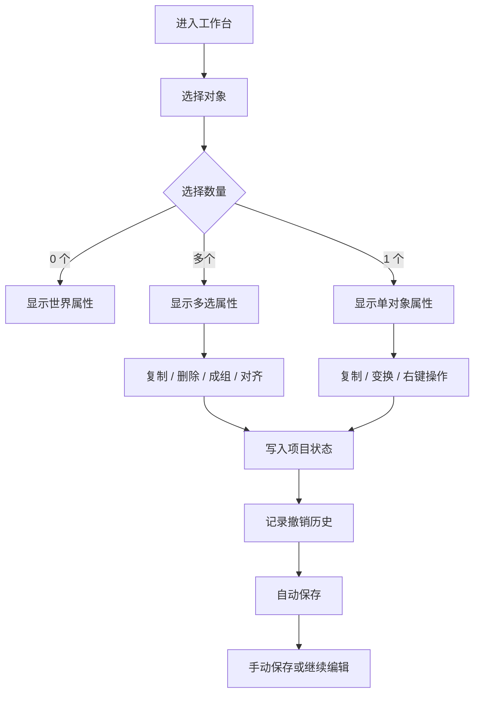

# P0 基础编辑闭环产品需求文档

## 1. 文档信息

| 文档版本 | 修订日期（YYYY/MM/DD） | 变更内容 | 变更原因 | 备注 |
| --- | --- | --- | --- | --- |
| 1.0 | 2026/07/09 | 创建 P0 基础编辑闭环正式 PRD，覆盖选择体系、搜索、复制粘贴、撤销重做、分组、右键菜单、吸附对齐和项目保存 | P0 进入正式需求阶段，需要将已确认方案整理为可开发、可测试的需求事实源 | 本版不包含截图 |

## 2. 一页摘要

### 一句话结论

P0 将 3D 导演台从“单对象编辑和临时预演工具”升级为“可多选、可复制、可成组、可撤销、可保存恢复”的基础搭景工作台。

### 本次解决的问题

- 用户无法复制模型，重复布置角色、道具和场景元素成本高。
- 用户只能单选对象，无法批量移动、隐藏、锁定、删除或组织复杂场景。
- 用户不能打组，场景对象数量变多后难以整理和整体调整。
- 用户缺少撤销 / 重做，误删、误拖、误改后恢复成本高。
- 左侧搜索已有视觉入口但不能过滤对象和机位。
- 用户缺少右键菜单，常用操作入口分散。
- 用户难以快速让对象落地、对齐和等距排布。
- 项目状态缺少保存和恢复机制，刷新或关闭页面后容易丢失工作。

### 预期结果或成功判断

- 用户可以在左侧资产树和 3D 视口中完成对象多选。
- 用户可以复制粘贴对象，导入 GLB 的副本可正常复用资产并独立编辑。
- 用户可以把多个对象打组，并对组进行整体选择、移动、隐藏、锁定和删除。
- 用户可以撤销和重做 P0 覆盖的高频编辑操作。
- 用户可以通过搜索、右键菜单、吸附对齐和保存恢复完成稳定搭景。
- P0 完成后，现有 GLB 导入、对象属性、材质、相机、世界属性、骨骼、时间线、快照和导出能力不回退。

### 功能优先级

| 优先级 | 功能/能力 | 用户价值 | 本版结论 |
| --- | --- | --- | --- |
| P0 | 选择体系升级 | 支持多选和后续批量编辑基础 | 本版交付 |
| P0 | 左侧搜索 | 快速定位对象、组和机位 | 本版交付 |
| P0 | 复制粘贴 | 降低重复搭景成本 | 本版交付 |
| P0 | 撤销 / 重做 | 降低误操作风险 | 本版交付 |
| P0 | 多选批量操作 | 提升显隐、锁定、删除等操作效率 | 本版交付 |
| P0 | 打组 / 解组 | 支持复杂场景组织和整体移动 | 本版交付 |
| P0 | 右键菜单 | 让高频操作贴近对象和视口上下文 | 本版交付 |
| P0 | 吸附到地面与对齐分布 | 帮助小白快速摆齐场景 | 本版交付 |
| P0 | 项目保存 / 打开 / 自动保存 | 保证搭景成果可恢复和可迁移 | 本版交付 |
| P1 | 组内组、多层级资产树 | 支持更复杂场景层级 | 后续版本 |
| P1 | 相机多选和相机入组 | 批量管理机位资产 | 后续版本 |
| P1 | 完整项目打包格式 | 离线完整恢复 GLB、贴图和全景图 | 后续版本 |

### 本次交付内容

- 对象选择体系升级，支持单选、多选、追加选择、切换选择和清空选择。
- 左侧资产树搜索，覆盖对象、组和机位。
- 对象复制、粘贴、重复粘贴偏移和快捷键入口。
- 对象删除恢复能力，批量删除使用轻确认或撤销兜底。
- 撤销 / 重做，覆盖 P0 高频编辑操作。
- 多选属性面板，支持批量隐藏、显示、锁定、解锁、删除、复制和成组。
- 一层对象分组，支持组整体选择、移动、旋转、缩放、隐藏、锁定、删除、重命名和解组。
- 视口与左侧列表右键菜单。
- 吸附到地面、按轴对齐、按包围盒边界对齐和等距分布。
- 手动保存 `.3dwb.json`、打开项目文件、自动保存与恢复提示。
- 资产引用保护，复制对象复用同一导入资产时，删除单个对象不得释放仍被引用的资产。

### 本次不交付内容

- 不做场景模板、镜头模板、姿势库和起手式生成。
- 不做 Shot Board、镜头备注和运镜预设。
- 不做 AI 视频提示词生成和 AI 参考包导出。
- 不做相机多选、相机入组和相机批量编辑。
- 不做组内组的完整编辑体验。
- 不做物理碰撞、复杂表面吸附和路径避障。
- 不做云端同步、多人协作和权限管理。
- 不做完整二进制项目包格式；本版手动导出优先使用 `.3dwb.json`。

### 关键风险

- 多选、骨骼控制点和相机选择容易产生交互冲突，本版多选仅覆盖对象。
- 分组和解组涉及世界矩阵保持，若规则不清会导致对象跳位。
- 撤销历史若包含大资源会造成内存膨胀，本版历史仅记录可序列化项目状态。
- 手动 JSON 保存无法天然完整携带本地导入文件，本版需明确缺失资产处理和自动保存恢复边界。

## 3. 背景、问题与依据

### 背景

当前 3D 导演台已经具备 GLB 导入、对象编辑、材质编辑、相机编辑、世界属性、骨骼 Pose、快照、关键帧时间线、机位序列和导出能力。用户已经可以搭出单个镜头画面，但在真实搭景过程中，重复摆放、批量调整、整理层级、撤销误操作和保存恢复仍是高频基础动作。

P0 的目标不是扩展专业 DCC 能力，而是补齐轻量导演台最基本的编辑安全感和组织能力，为后续 P1 快速构图、P2 导演预演和 P3 AI 视频交付打底。

### 用户问题

- 小白用户常通过重复复制相似对象搭场景，但当前每次都需要重新导入或重新插入。
- 场景对象变多后，用户需要批量移动、隐藏、锁定或删除，但当前只能单个处理。
- 用户需要把桌椅、道具、群众、布景等作为整体移动或整理，但当前没有组。
- 用户害怕误删、误拖、误改，因为缺少撤销和重做。
- 用户需要通过对象名称快速定位资产，但当前搜索框没有实际过滤能力。
- 用户在视口中操作对象时，希望直接右键获得上下文操作。
- 用户需要快速让对象落地、对齐、等距排布，避免靠手动数值一点点调。
- 用户需要保存当前搭景状态并在刷新或关闭后恢复。

### 现有方案不足

- `activeObjectId` 与 `selectedCameraId` 支撑单选，但不能表达多选集合。
- 左侧对象列表是平铺结构，无法展示组层级。
- 视口 TransformControls 只绑定单对象、骨骼控制点或相机控制，不支持多选临时中心点。
- 删除对象时存在按单对象释放资产资源的倾向，复制复用资产后需要避免误释放。
- 动画、快照和导出已有独立模块，但项目级保存恢复尚未形成独立序列化模块。

### 证据与依据

| 类型 | 内容 | 来源 | 可信度 |
| --- | --- | --- | --- |
| 用户反馈 | 3D 世界中的模型不能复制、不能打组，希望小白快速搭建理想镜头画面 | 项目沟通 | 高 |
| 当前实现 | 左侧搜索框存在，但对象列表未根据搜索词过滤 | 当前代码 | 高 |
| 当前实现 | `ProjectState` 使用 `activeObjectId` 和 `selectedCameraId` 表达选择状态 | 当前代码 | 高 |
| 当前实现 | `removeObject` 会处理对象关联资产释放，复制复用资产后需要增加引用保护 | 当前代码 | 高 |
| 产品规划 | P0-P4 路线图中 P0 定位为基础编辑闭环 | 已确认路线图 | 高 |

## 4. 用户、场景与用户旅程

### 用户角色

| 用户类型 | 目标 | 痛点 | 使用频率 |
| --- | --- | --- | --- |
| 导演 / 分镜创作者 | 快速摆出镜头画面和空间关系 | 重复摆放和误操作恢复成本高 | 高频 |
| AI 视频创作者 | 生成前锁定主体、道具、场景和机位 | 纯文本难表达空间关系，3D 操作门槛高 | 高频 |
| 预演执行 / 3D 协作人员 | 快速整理场景并交付可沟通预演 | 复杂场景缺少层级组织和批量操作 | 中高频 |

### 使用场景

- 用户导入一个桌子模型后复制多个桌子，快速搭建餐厅或会议室。
- 用户选中多个椅子，一次性移动、旋转、隐藏、锁定或删除。
- 用户把桌椅和装饰物打成“餐厅布景”组，整体移动到镜头画面中。
- 用户误删一组对象后通过撤销恢复。
- 用户搜索“角色”或“相机”，快速定位对应对象或机位。
- 用户在视口右键对象，直接复制、成组、吸附到地面或对齐。
- 用户刷新页面后从自动保存恢复最近搭景状态。
- 用户手动导出项目 JSON，在后续继续打开并恢复项目结构。

### 触发条件

- 用户已经进入 3D 工作台。
- 用户已存在一个或多个对象，或准备导入 / 插入对象。
- 用户需要批量编辑、组织场景、恢复误操作或保存工作结果。

### 用户旅程

| 步骤 | 用户行为 | 用户目标 | 系统响应 |
| --- | --- | --- | --- |
| 1 | 搜索或点选对象 | 找到要编辑的对象 | 左侧资产树和视口同步选择状态 |
| 2 | 使用 Shift 或 Cmd/Ctrl 追加选择 | 形成多选集合 | 视口显示多选高亮，右侧显示多选属性 |
| 3 | 复制并粘贴对象 | 快速重复布置 | 系统生成独立对象副本并轻微偏移 |
| 4 | 批量拖动或右键操作 | 快速调整多个对象 | 系统批量写入对象状态并记录撤销历史 |
| 5 | 对多选对象成组 | 整理复杂场景 | 左侧资产树生成组层级，视口支持组整体编辑 |
| 6 | 使用吸附和对齐 | 快速摆齐画面 | 系统按地面、轴或包围盒规则更新对象位置 |
| 7 | 误操作后撤销 / 重做 | 恢复或重放操作 | 系统按历史栈恢复项目状态 |
| 8 | 保存或刷新页面 | 保留搭景结果 | 系统导出项目文件或提示恢复自动保存 |

## 5. 产品方案与用户流程

### 产品方案

P0 采用“选择集合 + 上下文操作 + 历史恢复 + 项目持久化”的基础编辑方案：

- 左侧资产树负责搜索、层级组织、显隐锁定和选择。
- 中间 3D 视口负责直接点选、多选、右键和 TransformControls 编辑。
- 右侧属性面板根据上下文展示世界属性、单对象属性、多选属性或组属性。
- 顶部栏提供撤销、重做、保存、打开和自动保存状态。
- 底部工具条保留现有移动、旋转、缩放、对象插入、画幅和截图能力，并补充吸附 / 对齐入口。

### 页面/区域结构

- 顶部栏：项目名、撤销、重做、保存、打开、自动保存状态、帮助、退出。
- 左侧资产树：导入 GLB、搜索、对象 / 组树、机位列表、行级显隐 / 锁定 / 删除。
- 中间 3D 视口：对象点选、多选、TransformControls、右键菜单、选中高亮。
- 右侧属性面板：世界属性、单对象属性、多选属性、组属性、机位属性、快照工作区。
- 底部工具条：变换模式、对象插入、全景图、添加机位、画幅、截图、吸附和对齐。

### 主流程

1. 用户在左侧资产树或 3D 视口中选中对象。
2. 用户通过 Shift 或 Cmd/Ctrl 追加或切换对象选择，形成多选集合。
3. 用户在右侧多选属性面板、右键菜单或快捷键中执行复制、删除、隐藏、锁定、成组、吸附或对齐。
4. 系统更新项目状态、视口显示、左侧资产树和右侧属性面板。
5. 系统把可撤销操作写入历史栈。
6. 用户可撤销或重做最近操作。
7. 用户可手动保存项目，或在刷新后恢复自动保存状态。

### 分支流程

- 单选对象：右侧展示单对象属性，沿用当前对象属性编辑能力。
- 多选对象：右侧展示多选属性，只展示批量操作和公共状态，不展示材质、骨骼和单对象尺寸。
- 选中组：右侧展示组属性，支持组名称、显隐、锁定、变换和解组。
- 选中机位：右侧展示机位属性；本版机位不进入多选对象集合。
- 点击空白区域：清空对象选择和机位选择，右侧回到世界属性。
- 搜索有结果：资产树仅展示匹配对象、组、机位和包含匹配对象的父组。
- 搜索无结果：展示无结果空状态，不改变当前项目数据。
- 粘贴对象：如果剪贴板有对象，则创建新对象并选中新副本；如果剪贴板为空，则粘贴入口禁用。
- 删除多选对象：批量删除后选中状态清空；用户可撤销恢复。

### 异常流程

- 对象被锁定：不可通过视口 TransformControls 移动、旋转或缩放；可在属性或菜单中解锁。
- 对象不可见：不可在视口拾取，但可在左侧资产树中选中并显示。
- 复制对象引用的资产已缺失：粘贴后生成对象占位并提示资产需重新绑定。
- 项目文件格式不支持：打开时阻止导入并展示明确失败原因。
- 自动保存内容与当前 schema 不兼容：提示无法恢复或按可迁移字段恢复。
- 浏览器 IndexedDB 不可用：自动保存降级为仅当前会话提示，不阻断手动保存。

### 状态说明

- 空状态：没有对象时，资产树对象区域展示空提示；多选属性面板不出现。
- 加载状态：打开项目文件或恢复自动保存时展示导入中反馈。
- 错误状态：项目文件解析失败、资产缺失或自动保存恢复失败时展示明确原因。
- 禁用状态：没有选中对象时复制、成组、删除、对齐禁用；剪贴板为空时粘贴禁用。
- 成功状态：复制、粘贴、成组、解组、保存、恢复完成后展示短反馈。

### 流程图

## 6. 功能需求与规则

### 6.0 功能需求索引

| 需求编号 | 功能名称 | 优先级 | 用户任务 | 关联测试 |
| --- | --- | --- | --- | --- |
| FR-001 | 选择体系升级 | P0 | 单选、多选、清空选择 | AC-001 至 AC-005 |
| FR-002 | 左侧资产树搜索 | P0 | 搜索对象、组和机位 | AC-006 至 AC-009 |
| FR-003 | 对象复制与粘贴 | P0 | 复制对象并生成副本 | AC-010 至 AC-015 |
| FR-004 | 撤销与重做 | P0 | 恢复或重放编辑操作 | AC-016 至 AC-021 |
| FR-005 | 多选批量操作 | P0 | 批量隐藏、锁定、删除、复制、成组 | AC-022 至 AC-027 |
| FR-006 | 打组与解组 | P0 | 组织对象层级并整体编辑 | AC-028 至 AC-034 |
| FR-007 | 右键菜单 | P0 | 在上下文中执行高频操作 | AC-035 至 AC-039 |
| FR-008 | 吸附到地面与对齐分布 | P0 | 快速落地、对齐和等距排布 | AC-040 至 AC-045 |
| FR-009 | 项目保存、打开与自动保存 | P0 | 保存、恢复和迁移项目 | AC-046 至 AC-053 |
| FR-010 | 资产引用与资源释放保护 | P0 | 防止复制资产被误释放 | AC-054 至 AC-057 |

### 6.1 FR-001 选择体系升级

用户问题：

- 用户需要一次选择多个对象并批量操作，但当前只能单选。

用户故事：

- 作为分镜创作者，我希望通过列表和视口选择多个对象，以便一次性移动、复制、隐藏、锁定、删除或成组。

入口：

- 左侧资产树对象行。
- 中间 3D 视口对象。
- 视口空白区域。
- 键盘辅助键 Shift、Cmd/Ctrl。

命中对象/组件/交互类型：

- 业务对象：`SceneObject`、`SceneGroup`。
- 组件类型：资产树、3D 视口、属性面板。
- 状态类型：未选中、单选、多选、组选择、锁定、隐藏。
- 联动对象：TransformControls、右侧属性面板、时间线插帧目标、右键菜单。

主流程：

1. 用户点击对象，系统选中该对象并清空其他对象选择。
2. 用户按 Shift 或 Cmd/Ctrl 点击其他对象，系统追加或切换选择。
3. 系统根据选择数量切换右侧属性面板。
4. 用户点击空白区域，系统清空选择。

规则：

- 单选对象时必须兼容现有 `activeObjectId` 行为。
- 多选集合只包含对象，不包含相机、骨骼、IK 控制点和编辑辅助器。
- 多选状态下，最近一次被点击的对象作为主对象，用于命名、焦点和必要的兼容逻辑。
- 选中骨骼或 IK 控制点时，应退出对象多选并进入原有骨骼控制态。
- 选中相机时，应清空对象多选并进入原有机位属性。
- 锁定对象可以被选中，但不可通过视口变换。
- 隐藏对象不能在视口中被拾取，但可在资产树中选中。

状态机：

| 状态 | 进入条件 | 可见内容 | 可用操作 | 退出条件 | 异常处理 |
| --- | --- | --- | --- | --- | --- |
| 未选中 | 点击空白或清空选择 | 世界属性 | 选择对象、选择机位 | 点击对象或机位 | 无 |
| 单选对象 | 点击对象且无多选辅助键 | 单对象属性、对象高亮 | 变换、复制、删除、成组入口 | 追加选择、选相机、清空 | 对象锁定时禁用变换 |
| 多选对象 | 使用辅助键追加或切换选择 | 多选属性、多选高亮 | 批量操作、成组、对齐 | 清空、缩减到单选、选相机 | 仅可批量编辑公共能力 |
| 组选择 | 点击组或组代理对象 | 组属性、组高亮 | 组整体编辑、解组 | 选对象、清空 | 子对象锁定时按组锁定规则处理 |

规格明细：

| 维度 | 说明 |
| --- | --- |
| 展示内容 | 选中对象在资产树中高亮；视口显示选中高亮；多选显示临时中心点 |
| 数据来源 | 项目状态中的对象、组和当前选择集合 |
| 数据规则 | 选择集合去重；不存在的对象 id 自动移除；组选择不自动展开为子对象选择 |
| 交互规则 | 普通点击单选；Shift 追加区间或追加对象；Cmd/Ctrl 切换对象选择 |
| 状态规则 | 单选、多选和机位选择互斥；骨骼控制态优先于对象多选 |
| 权限规则 | 锁定对象可选中不可变换；隐藏对象仅列表可选 |
| 联动规则 | 右侧属性、TransformControls、右键菜单、时间线插帧目标同步变化 |
| 持久化规则 | 当前选择不写入手动项目文件；自动保存可保留最近选择但恢复失败不阻断项目打开 |
| 性能约束 | 多选高亮和选择切换应在百级对象下保持即时反馈 |

边界与异常：

- 快速切换对象时，右侧面板不得出现旧对象属性残留。
- 删除选中对象后，选择集合必须移除已删除对象。
- 打开项目后，若原选择对象不存在，应清空选择。

### 6.2 FR-002 左侧资产树搜索

用户问题：

- 用户对象和机位变多后，需要快速定位资产。

用户故事：

- 作为预演执行人员，我希望在左侧搜索对象、组和机位，以便快速找到需要编辑的资产。

入口：

- 左侧资产列表顶部搜索框。

命中对象/组件/交互类型：

- 业务对象：对象、组、机位。
- 组件类型：搜索输入框、资产树、空状态。
- 字段型控件：文本输入。
- 状态类型：默认、输入中、有结果、无结果。
- 联动对象：资产树展示和当前选择状态。

主流程：

1. 用户在搜索框输入关键词。
2. 系统实时过滤对象、组和机位。
3. 用户点击搜索结果完成选择。
4. 用户清空搜索框，系统恢复完整列表。

规则：

- 搜索范围包含对象名称、组名称、机位名称和类型标签。
- 搜索不区分大小写。
- 匹配子对象时，父组必须展示，且只展示匹配子对象或当前选中子对象。
- 当前选中项即使不匹配搜索词，也应保留可见或提供清晰提示，避免用户丢失上下文。
- 搜索只影响展示，不改变项目数据。

状态机：

| 状态 | 进入条件 | 可见内容 | 可用操作 | 退出条件 | 异常处理 |
| --- | --- | --- | --- | --- | --- |
| 默认 | 搜索词为空 | 完整资产树 | 输入、选择、行操作 | 输入关键词 | 无 |
| 有结果 | 搜索词命中资产 | 匹配资产和必要父级 | 选择、清空、行操作 | 清空或修改关键词 | 无 |
| 无结果 | 搜索词无命中 | 无结果提示 | 清空搜索 | 清空或修改关键词 | 无 |

规格明细：

| 维度 | 说明 |
| --- | --- |
| 展示内容 | 搜索框、匹配对象、匹配组、匹配机位、无结果提示 |
| 数据来源 | 本地项目状态 |
| 数据规则 | 前端本地过滤，不改变排序和层级 |
| 交互规则 | 输入实时过滤；清空恢复完整列表 |
| 状态规则 | 无结果不清空当前选择 |
| 联动规则 | 点击结果后视口和右侧属性同步 |
| 持久化规则 | 搜索词不写入项目文件 |
| 性能约束 | 百级资产过滤应即时响应 |

边界与异常：

- 搜索词包含空格时，应 trim 后匹配。
- 搜索词只包含空白字符时视为清空。

### 6.3 FR-003 对象复制与粘贴

用户问题：

- 用户需要重复摆放相似对象，但当前无法复制已有对象。

用户故事：

- 作为 AI 视频创作者，我希望复制已有角色、道具或几何体，以便快速搭出更复杂的场景关系。

入口：

- 右键菜单。
- 顶部或快捷键 `Cmd/Ctrl+C`、`Cmd/Ctrl+V`。
- 多选属性面板。

命中对象/组件/交互类型：

- 业务对象：`SceneObject`、对象选择集合、剪贴板。
- 组件类型：右键菜单、快捷键、资产树、视口。
- 状态类型：可复制、剪贴板为空、可粘贴、粘贴成功。
- 联动对象：资产树、视口、右侧属性面板、撤销历史、资产引用。

主流程：

1. 用户选中一个或多个对象。
2. 用户执行复制。
3. 系统把对象数据写入项目内剪贴板。
4. 用户执行粘贴。
5. 系统创建新对象，生成新 id 和可区分名称，并轻微偏移位置。
6. 系统选中新副本并记录撤销历史。

规则：

- 复制对象必须复制变换、显隐、锁定、包围盒状态、材质覆盖、骨骼 Pose 和 IK 链目标。
- 粘贴对象必须生成新的 `id`。
- 新名称默认使用“原名称 副本”或连续编号，避免重名难辨。
- 每次重复粘贴应继续轻微偏移，避免完全重叠。
- 导入 GLB 对象复制时复用同一 `assetId`，不重复创建资产记录。
- 内置素体、群众对象和几何体复制后外观保持一致。
- 本版不复制时间线关键帧和快照记录。
- 复制锁定对象时，新对象继承锁定状态；用户可解锁后编辑。

状态机：

| 状态 | 进入条件 | 可见内容 | 可用操作 | 退出条件 | 异常处理 |
| --- | --- | --- | --- | --- | --- |
| 剪贴板为空 | 未执行复制 | 粘贴入口禁用 | 复制对象 | 复制成功 | 无 |
| 已复制 | 剪贴板存在对象 | 粘贴入口可用 | 粘贴、覆盖复制 | 清空项目或复制失败 | 资产缺失时粘贴占位并提示 |
| 粘贴成功 | 粘贴完成 | 新对象选中 | 编辑、撤销、继续粘贴 | 用户下一步操作 | 无 |

规格明细：

| 维度 | 说明 |
| --- | --- |
| 展示内容 | 右键复制 / 粘贴、快捷键反馈、新对象出现在资产树和视口 |
| 数据来源 | 当前选择集合和项目内剪贴板 |
| 数据规则 | 深拷贝对象状态，重写 id 和名称；复用 assetId |
| 交互规则 | Cmd/Ctrl+C 复制；Cmd/Ctrl+V 粘贴；粘贴后选中新对象 |
| 状态规则 | 无选择时复制禁用；剪贴板为空时粘贴禁用 |
| 联动规则 | 粘贴写入对象列表、选择集合、撤销历史和自动保存 |
| 持久化规则 | 剪贴板不写入手动项目文件；粘贴后的对象写入项目 |
| 性能约束 | 复制多对象时避免复制运行时 Three.js 实例 |

边界与异常：

- 被复制对象引用的资产缺失时，粘贴后应明确提示需要重新绑定资产。
- 粘贴对象若超出视口可见范围，仍应能在资产树中选中定位。

### 6.4 FR-004 撤销与重做

用户问题：

- 用户误删、误拖或误改后缺少恢复路径。

用户故事：

- 作为小白用户，我希望能撤销和重做最近编辑，以便放心试错搭建场景。

入口：

- 顶部栏撤销 / 重做按钮。
- 快捷键 `Cmd/Ctrl+Z`、`Cmd/Ctrl+Shift+Z`、`Cmd/Ctrl+Y`。

命中对象/组件/交互类型：

- 业务对象：项目状态快照、历史栈。
- 组件类型：顶部按钮、快捷键。
- 状态类型：可撤销、不可撤销、可重做、不可重做。
- 联动对象：资产树、视口、右侧属性面板、自动保存。

主流程：

1. 用户执行可撤销编辑操作。
2. 系统在操作前或操作后写入历史栈。
3. 用户点击撤销或按快捷键。
4. 系统恢复上一状态，并把当前状态放入重做栈。
5. 用户点击重做，系统恢复下一状态。

规则：

- 覆盖对象新增、复制、粘贴、删除、变换、显隐、锁定、重命名、分组、解组、批量操作、吸附、对齐、项目打开。
- 覆盖世界属性和相机属性的基础编辑，但不撤销文件下载、截图下载、视频导出等外部副作用。
- 历史栈不得包含 Three.js 实例、object URL 对象本身或不可序列化运行时对象。
- 历史栈应限制长度，超出后丢弃最旧记录。
- 撤销后执行新编辑，应清空重做栈。
- 输入框、文本域或可编辑区域内的快捷键优先保留文本编辑语义。

状态机：

| 状态 | 进入条件 | 可见内容 | 可用操作 | 退出条件 | 异常处理 |
| --- | --- | --- | --- | --- | --- |
| 无历史 | 初始或历史为空 | 撤销禁用、重做禁用 | 编辑 | 新操作写入历史 | 无 |
| 可撤销 | past 非空 | 撤销可用 | 撤销、继续编辑 | 撤销到空历史 | 快照无效时跳过并提示 |
| 可重做 | 撤销后 future 非空 | 重做可用 | 重做、继续编辑 | 重做完成或新编辑 | 新编辑清空重做 |

规格明细：

| 维度 | 说明 |
| --- | --- |
| 展示内容 | 顶部撤销 / 重做按钮及禁用态 |
| 数据来源 | 可序列化项目快照历史 |
| 数据规则 | 历史快照排除 history 自身、运行时对象和下载副作用 |
| 交互规则 | 快捷键触发；输入态不拦截文本编辑快捷键 |
| 状态规则 | past 为空撤销禁用；future 为空重做禁用 |
| 联动规则 | 恢复状态后资产树、视口、属性面板和时间线同步 |
| 持久化规则 | 历史栈不写入手动项目文件；自动保存可保存当前恢复后的项目状态 |
| 性能约束 | 历史栈长度限制，避免大项目内存持续增长 |

边界与异常：

- 撤销到引用资产缺失的状态时，应保留对象占位并提示资产缺失。
- 撤销项目打开操作时，应恢复打开前项目状态。

### 6.5 FR-005 多选批量操作

用户问题：

- 多个对象需要一起隐藏、锁定、删除、复制或成组时，逐个操作效率低。

用户故事：

- 作为预演执行人员，我希望对多个选中对象执行批量操作，以便快速整理复杂场景。

入口：

- 右侧多选属性面板。
- 左侧资产树批量操作。
- 右键菜单。
- 快捷键。

命中对象/组件/交互类型：

- 业务对象：对象选择集合。
- 组件类型：多选属性面板、右键菜单、资产树。
- 状态类型：多选、部分锁定、部分隐藏、批量删除确认。
- 联动对象：视口、资产树、撤销历史、自动保存。

主流程：

1. 用户选择多个对象。
2. 右侧展示多选属性面板。
3. 用户执行批量隐藏、显示、锁定、解锁、复制、删除或成组。
4. 系统批量更新对象状态并记录历史。

规则：

- 多选属性面板展示已选数量。
- 批量显隐和锁定支持混合状态，混合状态下再次点击应明确变为目标状态。
- 批量删除应可通过撤销恢复；删除数量较大时需要轻确认。
- 成组入口仅在选中对象数量大于等于 2 时可用。
- 批量操作跳过不存在对象。

状态机：

| 状态 | 进入条件 | 可见内容 | 可用操作 | 退出条件 | 异常处理 |
| --- | --- | --- | --- | --- | --- |
| 多选可操作 | 选择 2 个及以上对象 | 多选属性面板 | 批量操作 | 缩减到单选或清空 | 不存在对象自动移除 |
| 混合状态 | 已选对象显隐或锁定不一致 | 混合状态提示 | 统一显示、隐藏、锁定、解锁 | 批量状态统一 | 无 |
| 批量删除确认 | 删除数量达到确认条件 | 轻确认浮层或确认提示 | 确认、取消 | 确认删除或取消 | 可撤销恢复 |

规格明细：

| 维度 | 说明 |
| --- | --- |
| 展示内容 | 已选数量、批量按钮、混合状态提示 |
| 数据来源 | 当前选择集合和对象列表 |
| 数据规则 | 批量更新仅作用于选中对象 |
| 交互规则 | 批量操作写入一条撤销历史 |
| 状态规则 | 少于 2 个对象时不显示多选属性面板 |
| 权限规则 | 锁定对象可被批量解锁；锁定对象不参与批量变换 |
| 联动规则 | 对象列表、视口和自动保存同步 |
| 持久化规则 | 批量操作后的对象状态写入项目 |
| 性能约束 | 批量百级对象时保持界面响应 |

边界与异常：

- 部分对象资产缺失不影响对其他对象执行批量状态操作。
- 删除后如选择集合为空，右侧回到世界属性。

### 6.6 FR-006 打组与解组

用户问题：

- 复杂场景缺少层级组织，用户无法把多个对象作为整体管理。

用户故事：

- 作为导演，我希望把多个对象打成组，以便整体移动和整理布景。

入口：

- 多选属性面板。
- 右键菜单。
- 左侧资产树。

命中对象/组件/交互类型：

- 业务对象：`SceneGroup`、`SceneObject`。
- 组件类型：资产树、组属性面板、TransformControls。
- 状态类型：未分组、组选择、组锁定、解组。
- 联动对象：视口、对象选择集合、撤销历史、项目保存。

主流程：

1. 用户多选两个或更多对象。
2. 用户点击成组。
3. 系统创建组，并在资产树中展示组层级。
4. 用户选中组，视口以组整体进行变换。
5. 用户点击解组，系统移除组并保留子对象当前世界位置。

规则：

- 本版只保证一层组稳定可用。
- 组可重命名、隐藏、显示、锁定、解锁和删除。
- 组整体移动、旋转、缩放时，子对象相对位置保持一致。
- 解组后，子对象世界位置不得跳变。
- 删除组默认删除组和组内对象；若用户只想移除组关系，应使用解组。
- 相机不支持入组。
- 骨骼控制点和 IK 目标点不支持入组。

状态机：

| 状态 | 进入条件 | 可见内容 | 可用操作 | 退出条件 | 异常处理 |
| --- | --- | --- | --- | --- | --- |
| 未分组对象 | 对象不属于组 | 平铺对象行 | 选择、成组 | 成组 | 无 |
| 组 | 成组成功 | 组行、子对象层级 | 选组、重命名、显隐、锁定、解组、删除 | 解组或删除 | 子对象缺失时从组中移除 |
| 组锁定 | 组被锁定 | 锁定态 | 解锁、选择 | 解锁 | 变换禁用 |

规格明细：

| 维度 | 说明 |
| --- | --- |
| 展示内容 | 资产树组行、展开 / 收起、子对象缩进、组属性面板 |
| 数据来源 | 项目组数据和对象归属 |
| 数据规则 | 对象同一时间最多属于一个一层组 |
| 交互规则 | 组选中后操作整体；子对象仍可从资产树选中 |
| 状态规则 | 组隐藏时子对象视口不可见；组锁定时整体变换禁用 |
| 联动规则 | 组变换同步影响子对象运行时显示和保存状态 |
| 持久化规则 | 组数据写入项目文件和自动保存 |
| 性能约束 | 组内对象数量增加时，变换计算应避免逐帧重建大量对象 |

边界与异常：

- 成组时包含已分组对象，本版应阻止或先提示用户解组。
- 解组后必须保持子对象世界位置、旋转和缩放。

### 6.7 FR-007 右键菜单

用户问题：

- 常用编辑操作入口分散，用户需要贴近对象上下文的操作菜单。

用户故事：

- 作为小白用户，我希望在视口或资产树右键对象，以便直接复制、成组、隐藏、锁定、吸附或删除。

入口：

- 3D 视口对象右键。
- 3D 视口空白区域右键。
- 左侧资产树对象或组行右键。

命中对象/组件/交互类型：

- 业务对象：对象、组、选择集合、剪贴板。
- 组件类型：浮层菜单。
- 状态类型：对象菜单、多选菜单、组菜单、空白菜单、禁用项。
- 联动对象：资产树、视口、属性面板。

主流程：

1. 用户右键对象或资产树行。
2. 系统根据当前上下文打开菜单。
3. 用户点击菜单项。
4. 系统执行对应操作并关闭菜单。

规则：

- 右键未选中对象时，应先选中该对象再打开对象菜单。
- 右键已在多选集合中的对象时，应保留多选集合并打开多选菜单。
- 空白区域菜单提供粘贴、清空选择、视角重置等入口。
- 菜单项根据上下文禁用，例如无剪贴板时粘贴禁用、少于两个对象时成组禁用。
- 点击菜单外、按 Esc 或执行操作后关闭菜单。

状态机：

| 状态 | 进入条件 | 可见内容 | 可用操作 | 退出条件 | 异常处理 |
| --- | --- | --- | --- | --- | --- |
| 对象菜单 | 右键单对象 | 复制、重命名、隐藏、锁定、删除、吸附 | 点击菜单项 | 点击外部或 Esc | 对象不存在时关闭 |
| 多选菜单 | 右键多选对象 | 复制、删除、成组、隐藏、锁定、对齐 | 点击菜单项 | 点击外部或 Esc | 选择为空时关闭 |
| 组菜单 | 右键组 | 重命名、解组、隐藏、锁定、删除 | 点击菜单项 | 点击外部或 Esc | 组不存在时关闭 |
| 空白菜单 | 右键空白区域 | 粘贴、清空选择、视角重置 | 点击菜单项 | 点击外部或 Esc | 剪贴板为空时粘贴禁用 |

规格明细：

| 维度 | 说明 |
| --- | --- |
| 展示内容 | 菜单项、分隔线、禁用态 |
| 数据来源 | 当前右键目标、选择集合和剪贴板 |
| 数据规则 | 菜单不保存项目数据，仅触发操作 |
| 交互规则 | 右键打开；点击外部和 Esc 关闭 |
| 状态规则 | 根据上下文启用或禁用菜单项 |
| 联动规则 | 菜单操作同步到项目状态和撤销历史 |
| 持久化规则 | 菜单展开状态不持久化 |
| 性能约束 | 打开菜单不得触发重型场景重建 |

边界与异常：

- 摄影机预览或播放接管时，视口右键菜单应禁用或只提供安全操作。
- 右键 TransformControls 辅助器不应误选对象。

### 6.8 FR-008 吸附到地面与对齐分布

用户问题：

- 用户难以手动把对象摆到地面、摆齐或等距分布。

用户故事：

- 作为分镜创作者，我希望一键把对象落地、对齐和等距分布，以便快速得到干净的镜头画面。

入口：

- 右键菜单。
- 底部工具条吸附 / 对齐入口。
- 多选属性面板。

命中对象/组件/交互类型：

- 业务对象：对象选择集合、对象包围盒、地面设置。
- 组件类型：菜单、工具条、属性面板。
- 状态类型：单对象、多个对象、锁定对象、缺少尺寸。
- 联动对象：视口、对象属性、撤销历史。

主流程：

1. 用户选择一个或多个对象。
2. 用户选择吸附到地面、轴对齐、边界对齐或等距分布。
3. 系统根据对象包围盒和世界地面高度计算新位置。
4. 系统写入对象位置并记录撤销历史。

规则：

- 吸附到地面按对象包围盒底部对齐到 `worldSettings.ground.y`。
- 轴对齐支持 X / Y / Z 中心对齐。
- 边界对齐支持底部、顶部、左侧、右侧、前侧、后侧。
- 等距分布支持 X / Z 方向，按对象中心或包围盒边界间距分布。
- 锁定对象不参与位置更新，但可作为对齐参考。
- 对象缺少 `actualDimensions` 时，应使用运行时包围盒计算。
- 对齐和分布不改变对象旋转、缩放和材质。

状态机：

| 状态 | 进入条件 | 可见内容 | 可用操作 | 退出条件 | 异常处理 |
| --- | --- | --- | --- | --- | --- |
| 单对象 | 选择 1 个对象 | 吸附到地面可用 | 吸附 | 操作完成 | 无包围盒时提示无法计算 |
| 多对象 | 选择 2 个及以上对象 | 吸附、对齐、分布可用 | 对齐、分布 | 操作完成 | 锁定对象跳过 |
| 不可操作 | 无对象选择 | 入口禁用 | 无 | 选择对象 | 无 |

规格明细：

| 维度 | 说明 |
| --- | --- |
| 展示内容 | 吸附、对齐、分布入口和禁用态 |
| 数据来源 | 对象变换、对象包围盒、地面高度 |
| 数据规则 | 只更新位置；不更新旋转、缩放和材质 |
| 交互规则 | 操作一次生成一条撤销历史 |
| 状态规则 | 无选择禁用；多选才启用等距分布 |
| 权限规则 | 锁定对象不被修改 |
| 联动规则 | 视口和右侧位置字段同步 |
| 持久化规则 | 更新后对象位置写入项目 |
| 性能约束 | 多对象包围盒计算应避免长时间阻塞 |

边界与异常：

- 如果所有对象都锁定，操作不执行并提示。
- 如果对象运行时包围盒不可用，跳过该对象并提示。

### 6.9 FR-009 项目保存、打开与自动保存

用户问题：

- 用户搭好的场景容易因刷新或关闭页面丢失，也无法迁移给后续继续编辑。

用户故事：

- 作为 AI 视频创作者，我希望保存并重新打开项目，以便持续迭代同一个镜头场景。

入口：

- 顶部栏保存按钮。
- 顶部栏打开按钮。
- 页面加载时自动保存恢复提示。

命中对象/组件/交互类型：

- 业务对象：项目状态、资产记录、自动保存记录。
- 组件类型：文件导入、文件下载、恢复提示、错误提示。
- 状态类型：未保存、保存成功、打开中、打开失败、可恢复、恢复失败。
- 联动对象：整个工作台、资产树、视口、时间线。

主流程：

1. 用户点击保存。
2. 系统导出 `.3dwb.json` 项目文件。
3. 用户点击打开并选择项目文件。
4. 系统解析、校验并恢复项目状态。
5. 页面加载时如存在自动保存，系统提示用户恢复。

规则：

- 手动保存文件扩展名使用 `.3dwb.json`。
- 手动保存包含项目名称、schema、世界设置、对象、组、相机、快照元数据、时间线和机位序列。
- 手动保存可记录资产元数据，但不保证完整携带本地导入的 GLB、贴图和全景图 Blob。
- 自动保存优先使用 IndexedDB 保存项目状态和可恢复的导入资产 Blob。
- 打开项目时应进行 schema 校验和默认值补齐。
- 打开项目应记录撤销历史，用户可撤销回到打开前状态。
- 资产缺失时不得导致页面崩溃，应保留占位或提示重新绑定。

状态机：

| 状态 | 进入条件 | 可见内容 | 可用操作 | 退出条件 | 异常处理 |
| --- | --- | --- | --- | --- | --- |
| 未保存 | 项目有编辑 | 自动保存状态或未保存提示 | 保存、继续编辑 | 保存成功 | 自动保存失败时提示 |
| 保存成功 | 手动保存完成 | 成功反馈 | 继续编辑 | 新编辑 | 下载失败时提示 |
| 可恢复 | 页面加载检测到自动保存 | 恢复提示 | 恢复、忽略 | 用户选择 | 恢复失败提示 |
| 打开中 | 选择项目文件 | 加载反馈 | 等待 | 打开完成 | 解析失败提示 |
| 打开失败 | 文件不合法或 schema 不支持 | 错误提示 | 重新选择 | 重新打开成功 | 无 |

规格明细：

| 维度 | 说明 |
| --- | --- |
| 展示内容 | 保存、打开、自动保存状态、恢复提示、错误提示 |
| 数据来源 | 当前项目状态、文件输入、IndexedDB 自动保存记录 |
| 数据规则 | 只序列化项目数据，不序列化 Three.js 实例 |
| 交互规则 | 保存触发下载；打开触发文件选择；恢复由用户确认 |
| 状态规则 | 打开中禁用重复打开；保存失败保留当前项目 |
| 联动规则 | 恢复或打开项目后刷新资产树、视口、右侧面板和时间线 |
| 持久化规则 | 手动保存为本地 JSON；自动保存写入浏览器本地存储 |
| 性能约束 | 大项目保存和恢复需要避免阻塞交互过久 |

边界与异常：

- 文件不是 JSON 或 schema 不支持时，应阻止打开并提示。
- 自动保存数据损坏时，应允许用户忽略并继续当前默认项目。
- 手动打开项目中资产缺失时，应显示缺失资产提示并保留可编辑项目结构。

### 6.10 FR-010 资产引用与资源释放保护

用户问题：

- 复制 GLB 对象会复用同一资产，如果删除其中一个对象就释放资产，其他副本会失效。

用户故事：

- 作为创作者，我希望复制出来的模型副本稳定可用，以便放心删除或调整任意副本。

入口：

- 对象删除。
- 批量删除。
- 解组 / 删除组。
- 项目打开和资源清理。

命中对象/组件/交互类型：

- 业务对象：资产记录、对象引用、材质贴图引用、全景图引用。
- 组件类型：资源管理、删除操作。
- 状态类型：资产被引用、资产未引用、资源释放。
- 联动对象：GLB 渲染、材质贴图、全景球、自动保存。

主流程：

1. 用户删除对象或批量删除对象。
2. 系统计算被删对象引用的资产。
3. 系统检查项目中是否仍有其他对象、材质或世界设置引用这些资产。
4. 仅当资产不再被引用时，系统释放 object URL 和运行时资源。

规则：

- 删除对象不得释放仍被其他对象引用的 `assetId`。
- 删除材质贴图覆盖时，不得释放仍被其他材质覆盖引用的贴图资产。
- 移除全景图时，只释放不再被世界设置或其他记录引用的全景资产。
- 页面卸载或项目整体关闭时，应释放所有运行时 object URL 和 Three.js 资源。
- 自动保存恢复后的 Blob URL 需要纳入同一引用释放规则。

状态机：

| 状态 | 进入条件 | 可见内容 | 可用操作 | 退出条件 | 异常处理 |
| --- | --- | --- | --- | --- | --- |
| 资产被引用 | 至少一个对象或设置引用资产 | 对象正常渲染 | 删除部分引用 | 引用数归零 | 无 |
| 资产未引用 | 引用数为 0 | 不展示 | 释放资源 | 释放完成 | 释放失败记录但不阻断 UI |
| 资源释放 | 页面卸载或资产无引用 | 无 | 无 | 完成 | 无 |

规格明细：

| 维度 | 说明 |
| --- | --- |
| 展示内容 | 资源释放一般不直接展示，仅在资产缺失时提示 |
| 数据来源 | 项目资产列表、对象 assetId、材质 textureAssetId、世界全景 assetId |
| 数据规则 | 以当前项目引用为准判断释放 |
| 交互规则 | 删除对象后自动判断，无需用户手动处理 |
| 状态规则 | 资产缺失时保留项目结构并提示 |
| 联动规则 | 资源释放影响视口渲染和保存恢复 |
| 持久化规则 | 资产引用关系写入项目；运行时 URL 不作为稳定持久化依据 |
| 性能约束 | 引用检查应在删除批量对象时保持可接受耗时 |

边界与异常：

- 批量删除多个对象时，引用检查应基于删除后的完整项目状态。
- 资产释放失败不得导致 UI 崩溃。

### 6.11 组件类型专项清单

#### 数据列表 / 资产树

- 列表目的：展示对象、组和机位，支持搜索、选择、显隐、锁定、删除和右键操作。
- 数据来源：项目状态中的对象、组和机位。
- 字段与展示规则：对象显示名称、类型图标、显隐状态、锁定状态；组显示展开态和子对象缩进；机位显示相机图标。
- 搜索与筛选：按本地关键词过滤。
- 空状态：无对象、无机位、无搜索结果分别展示。
- 行操作：选择、显隐、锁定、删除、右键菜单。
- 批量操作：通过多选属性面板和右键菜单执行。

#### 表单 / 属性编辑器

- 单对象属性沿用当前对象属性面板。
- 多选属性仅展示批量操作、选中数量和公共状态。
- 组属性展示组名称、显隐、锁定、变换和解组入口。
- 字段修改实时写入项目状态并记录可撤销历史。

#### 画布 / 3D 视口 / 拖拽交互

- 可交互对象：可见对象、组代理、相机、骨骼控制点和 IK 目标点。
- 多选仅对对象生效；骨骼控制点和 IK 目标点维持原有单点编辑。
- TransformControls 单选绑定对象，组选择绑定组代理，多选绑定临时 pivot。
- 播放或相机预览状态下禁用对象右键菜单和多选变换。

#### 选择 / 批量操作

- 单选、多选和组选择互斥。
- 多选上限不设置硬限制，但需要在百级对象下保持可用。
- 批量删除、成组、对齐等操作写入单条撤销历史。

#### 导出 / 下载 / 文件解析

- 保存项目导出 `.3dwb.json`。
- 打开项目只接受兼容 schema 的项目文件。
- 解析失败应展示错误原因，不改变当前项目。

## 7. 非功能性需求

### 性能要求

- 百级对象的搜索、多选、显隐和锁定操作应保持即时反馈。
- 多选变换和组变换不得在拖拽过程中频繁重建全部场景对象。
- 撤销历史需要限制长度，避免内存持续增长。
- 自动保存应防抖执行，避免每次拖拽更新都立即写入本地存储。

### 兼容性要求

- 保持现有 Vite、React、TypeScript、Three.js、Zustand 技术栈。
- 保持现有 GLB 导入、对象属性、材质编辑、相机、世界、骨骼、时间线和导出入口不回退。
- 浏览器不支持 IndexedDB 或本地 Blob 恢复时，手动保存和当前会话编辑仍可用。

### 可用性要求

- P0 高频入口应出现在用户操作上下文附近：右键菜单、资产树、右侧属性和顶部安全操作。
- 禁用项必须有明确原因或 title。
- 复制、粘贴、成组、解组、保存、恢复等操作应有短反馈。
- 删除尽量依赖撤销降低打断；批量高风险删除可使用轻确认。

### 可维护性要求

- 选择、分组、历史、项目序列化和资源释放应拆为清晰模块或 store action。
- 3D 渲染层只负责显示和交互，不直接承担项目文件序列化。
- 历史快照和项目保存共享可序列化状态清理逻辑。
- 资源释放逻辑统一处理，不在多个组件中重复判断。

### 安全与隐私要求

- 项目保存和自动保存均只在用户本地处理，不上传外部服务。
- 打开项目文件时只解析预期 JSON 结构，不执行文件内脚本。
- 错误提示不得暴露本地敏感路径。

### 可观测性要求

- 用户可见失败需要有明确提示，例如项目打开失败、自动保存失败、资产缺失、对齐计算失败。
- 开发调试时应能定位项目 schema、自动保存状态和资产引用缺失原因。

## 8. 测试验收

### 验收矩阵

| 验收编号 | 对应需求 | 给定 | 当 | 则 | 优先级 |
| --- | --- | --- | --- | --- | --- |
| AC-001 | FR-001 | 场景中有多个对象 | 点击一个对象 | 系统应单选该对象并显示单对象属性 | P0 |
| AC-002 | FR-001 | 已选中一个对象 | Shift 或 Cmd/Ctrl 点击第二个对象 | 系统应形成多选集合并显示多选属性 | P0 |
| AC-003 | FR-001 | 当前处于多选对象状态 | 点击相机 | 系统应清空对象多选并显示机位属性 | P0 |
| AC-004 | FR-001 | 当前处于多选对象状态 | 点击视口空白区域 | 系统应清空选择并显示世界属性 | P0 |
| AC-005 | FR-001 | 带骨骼对象可见 | 点击骨骼控制点 | 系统应进入骨骼控制态而不是对象多选态 | P0 |
| AC-006 | FR-002 | 左侧存在对象、组和机位 | 输入对象名称关键词 | 系统应仅展示匹配对象和必要父级 | P0 |
| AC-007 | FR-002 | 左侧存在机位 | 输入机位名称关键词 | 系统应展示匹配机位 | P0 |
| AC-008 | FR-002 | 搜索词无命中 | 输入关键词 | 系统应展示无结果空状态且不清空当前项目 | P0 |
| AC-009 | FR-002 | 搜索框有内容 | 清空搜索框 | 系统应恢复完整资产树 | P0 |
| AC-010 | FR-003 | 已选中单个对象 | 执行复制并粘贴 | 系统应创建新对象、新 id、新名称并轻微偏移 | P0 |
| AC-011 | FR-003 | 已选中导入 GLB 对象 | 复制并粘贴 | 新对象应正常渲染并复用原资产 | P0 |
| AC-012 | FR-003 | 已选中有材质覆盖的对象 | 复制并粘贴 | 新对象应保留材质覆盖 | P0 |
| AC-013 | FR-003 | 剪贴板为空 | 打开右键菜单 | 粘贴入口应禁用 | P0 |
| AC-014 | FR-003 | 已粘贴一次对象 | 再次粘贴 | 系统应继续创建副本并再次偏移 | P0 |
| AC-015 | FR-003 | 已粘贴对象 | 查看右侧属性 | 系统应选中新副本 | P0 |
| AC-016 | FR-004 | 用户移动对象 | 点击撤销 | 对象应回到移动前位置 | P0 |
| AC-017 | FR-004 | 已撤销对象移动 | 点击重做 | 对象应回到移动后位置 | P0 |
| AC-018 | FR-004 | 用户复制粘贴对象 | 点击撤销 | 新副本应被移除 | P0 |
| AC-019 | FR-004 | 用户删除对象 | 点击撤销 | 被删除对象应恢复 | P0 |
| AC-020 | FR-004 | 用户撤销后又执行新编辑 | 查看重做按钮 | 重做应不可用 | P0 |
| AC-021 | FR-004 | 焦点在输入框内 | 按 Cmd/Ctrl+Z | 应优先执行文本输入撤销，不触发项目撤销 | P0 |
| AC-022 | FR-005 | 已多选多个对象 | 点击批量隐藏 | 所选对象应全部隐藏 | P0 |
| AC-023 | FR-005 | 已多选多个对象 | 点击批量锁定 | 所选对象应全部锁定 | P0 |
| AC-024 | FR-005 | 已多选多个对象 | 执行批量复制粘贴 | 系统应创建对应数量副本并选中新副本集合 | P0 |
| AC-025 | FR-005 | 已多选多个对象 | 执行批量删除 | 所选对象应删除且可撤销 | P0 |
| AC-026 | FR-005 | 已多选 1 个对象 | 查看成组入口 | 成组入口应禁用 | P0 |
| AC-027 | FR-005 | 已多选 2 个及以上对象 | 查看成组入口 | 成组入口应可用 | P0 |
| AC-028 | FR-006 | 已多选多个对象 | 点击成组 | 左侧资产树应生成组并展示子对象 | P0 |
| AC-029 | FR-006 | 已选中组 | 移动组 | 组内子对象应整体移动且相对位置不变 | P0 |
| AC-030 | FR-006 | 已选中组 | 锁定组后拖拽 | 系统应禁止组变换 | P0 |
| AC-031 | FR-006 | 已选中组 | 隐藏组 | 组内对象应从视口隐藏 | P0 |
| AC-032 | FR-006 | 已选中组 | 解组 | 子对象应回到平铺层级且世界位置不变化 | P0 |
| AC-033 | FR-006 | 已选中组 | 删除组 | 组和组内对象应删除且可撤销 | P0 |
| AC-034 | FR-006 | 已选中包含相机的多选集合 | 尝试成组 | 相机不应进入对象组 | P0 |
| AC-035 | FR-007 | 右键未选中对象 | 打开菜单 | 系统应先选中该对象并展示对象菜单 | P0 |
| AC-036 | FR-007 | 已多选对象 | 右键其中一个对象 | 系统应保留多选并展示多选菜单 | P0 |
| AC-037 | FR-007 | 右键视口空白区域且剪贴板有对象 | 点击粘贴 | 系统应创建副本 | P0 |
| AC-038 | FR-007 | 右键菜单打开 | 按 Esc | 菜单应关闭且不执行操作 | P0 |
| AC-039 | FR-007 | 剪贴板为空 | 打开空白菜单 | 粘贴入口应禁用 | P0 |
| AC-040 | FR-008 | 已选中单个对象 | 点击吸附到地面 | 对象包围盒底部应对齐地面高度 | P0 |
| AC-041 | FR-008 | 已多选对象 | 点击 X 轴中心对齐 | 所选未锁定对象 X 中心应一致 | P0 |
| AC-042 | FR-008 | 已多选对象 | 点击底部对齐 | 所选未锁定对象底部应一致 | P0 |
| AC-043 | FR-008 | 已多选 3 个及以上对象 | 点击 X 方向等距分布 | 对象应按 X 方向等距排列 | P0 |
| AC-044 | FR-008 | 已选对象全部锁定 | 点击吸附或对齐 | 系统应不修改对象并展示提示 | P0 |
| AC-045 | FR-008 | 对象缺少尺寸缓存但视口可计算包围盒 | 点击吸附 | 系统应基于运行时包围盒完成吸附 | P0 |
| AC-046 | FR-009 | 当前项目有对象、组、相机和时间线 | 点击保存 | 系统应下载 `.3dwb.json` 文件 | P0 |
| AC-047 | FR-009 | 已保存项目文件 | 打开该文件 | 系统应恢复对象、组、相机、世界设置和时间线基础状态 | P0 |
| AC-048 | FR-009 | 打开非法 JSON 文件 | 选择文件 | 系统应阻止打开并展示错误原因 | P0 |
| AC-049 | FR-009 | 浏览器存在自动保存记录 | 打开页面 | 系统应提示用户恢复或忽略 | P0 |
| AC-050 | FR-009 | 用户选择恢复自动保存 | 确认恢复 | 系统应恢复最近项目状态 | P0 |
| AC-051 | FR-009 | 自动保存数据损坏 | 尝试恢复 | 系统应提示失败且保留当前项目 | P0 |
| AC-052 | FR-009 | 打开项目中导入资产缺失 | 打开项目 | 系统应保留项目结构并提示资产缺失 | P0 |
| AC-053 | FR-009 | 用户打开项目后不满意 | 点击撤销 | 系统应回到打开前状态 | P0 |
| AC-054 | FR-010 | 两个对象引用同一 GLB assetId | 删除其中一个对象 | 另一个对象应继续正常渲染 | P0 |
| AC-055 | FR-010 | 多个材质覆盖引用同一贴图资产 | 删除其中一个覆盖 | 其他覆盖应继续正常显示 | P0 |
| AC-056 | FR-010 | 删除最后一个引用某资产的对象 | 完成删除 | 系统应释放不再被引用的运行时资源 | P0 |
| AC-057 | FR-010 | 页面卸载 | 关闭页面 | 系统应释放当前会话运行时资源 | P0 |

### 回归检查

- GLB 导入仍可用，导入后对象出现在资产树和视口。
- 内置素体、群众和几何体插入仍可用。
- 单对象移动、旋转、缩放和右侧数值编辑仍可用。
- 材质颜色、粗糙度、金属度、透明度和贴图替换仍可用。
- 相机创建、选择、预览、目标绑定、FOV 编辑和截图仍可用。
- 世界属性、全景球、地面、标签和网格吸附仍可用。
- FK / IK 骨骼编辑仍可用，且对象多选不抢占骨骼控制点。
- 时间线关键帧、机位序列、播放预览和导出入口仍可用。
- 快照工作区仍可查看和下载快照。

### 测试注意事项

- 需要用至少一个导入 GLB、一个内置几何体、一个带材质覆盖对象和一个带骨骼对象做混合场景测试。
- 需要重点验证复制对象后的资产引用释放，避免删除一个副本导致其他副本失效。
- 需要验证多选 TransformControls 与骨骼控制、相机选择、播放预览之间的互斥关系。
- 需要验证打开项目、自动保存恢复和撤销历史之间的关系。
- 需要验证大批量对象下搜索、多选、成组、对齐和撤销的响应表现。

