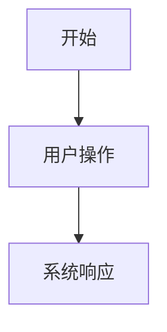

# 阶段/功能 PRD 模板

> 使用方式：每次新增较大功能或开发阶段时，复制本模板，按实际内容填写。小变更优先更新主 PRD 或产品变更记录，不必强行套完整模板。
>
> 写作原则：文档用于拿去讨论和确认需求，不在文档内记录讨论流程。正文只保留产品背景、功能方案、详细规则、非功能性需求和测试验收。

## 1. 文档信息

| 文档版本 | 修订日期（YYYY/MM/DD） | 变更内容 | 变更原因 | 备注 |
| --- | --- | --- | --- | --- |
|  |  |  |  |  |

## 2. 一页摘要

### 一句话结论

### 本次解决的问题

### 功能优先级

| 优先级 | 功能/能力 | 用户价值 | 本版结论 |
| --- | --- | --- | --- |
| P0 |  |  | 本版交付 |
| P1 |  |  | 本版交付 / 后续 |
| P2 |  |  | 后续版本 |

### 本次交付内容

### 本次不交付内容

### 关键风险或待确认问题

## 3. 背景、问题与依据

### 背景

### 用户问题

### 现有方案不足

### 证据与依据

| 类型 | 内容 | 来源 | 可信度 |
| --- | --- | --- | --- |
| 用户反馈 / 竞品 / 数据 / 截图 / 内部判断 |  |  | 高 / 中 / 低 |

## 4. 用户、场景与用户旅程

### 用户角色

| 用户类型 | 目标 | 痛点 | 使用频率 |
| --- | --- | --- | --- |
|  |  |  |  |

### 使用场景

### 触发条件

### 用户旅程

| 步骤 | 用户行为 | 用户目标 | 系统响应 |
| --- | --- | --- | --- |
| 1 |  |  |  |

## 5. 产品方案与用户流程

### 产品方案

### 页面/区域结构

### 主流程

1. 
2. 
3. 

### 分支流程

### 异常流程

### 状态说明

- 空状态：
- 加载状态：
- 错误状态：
- 禁用状态：
- 成功状态：

### 流程图

## 6. 功能需求与规则

### 6.0 功能需求索引

| 需求编号 | 功能名称 | 优先级 | 用户任务 | 关联测试 |
| --- | --- | --- | --- | --- |
| FR-001 |  | P0 / P1 / P2 |  | AC-001 |

### 6.1 FR-001 功能名称

用户问题：

用户故事：

- 作为【用户】，我希望【动作】，以便【价值】。

入口：

主流程：

1. 
2. 
3. 

规则：

- 业务规则：
- 状态规则：
- 数据规则：
- 权限规则：
- 联动规则：

状态机：

| 状态 | 进入条件 | 可见内容 | 可用操作 | 退出条件 | 异常处理 |
| --- | --- | --- | --- | --- | --- |
| 默认 |  |  |  |  |  |

规格明细：

| 维度 | 说明 |
| --- | --- |
| 展示内容 | 页面、区域、字段、控件、默认值、占位文案、格式化方式 |
| 数据来源 | 接口、本地状态、文件、运行时对象、用户输入、派生计算、缓存 |
| 数据规则 | 字段口径、默认值、缺失值、去重、排序、过滤、冲突处理、精度 |
| 交互规则 | 点击、拖拽、输入、选择、快捷操作、撤销、确认、取消、禁用条件 |
| 状态规则 | 默认、选中、悬停、聚焦、禁用、加载、成功、失败、空状态 |
| 权限规则 | 可见、可操作、只读、锁定、无权限提示、高风险操作保护 |
| 联动规则 | 与其他模块、列表、详情、视口、时间线、导出结果的同步关系 |
| 持久化规则 | 是否保存、保存位置、保存时机、刷新后是否保留、导入导出是否包含 |
| 性能约束 | 数据量、文件大小、刷新频率、响应时间、渲染成本、降级策略 |

边界与异常：

- 空状态：
- 加载失败：
- 数据缺失：
- 重复操作：
- 快速切换：
- 撤销或回退：
- 资源清理：

### 6.2 组件类型专项清单

> 按功能实际形态选择填写。一个功能可能命中多个类型，例如“素材列表”同时命中“数据列表”“搜索筛选”“批量操作”。

#### 数据列表 / 表格 / 卡片流

- 列表目的：
- 数据来源：
- 首次加载时机：
- 数据刷新时机：
- 字段与展示规则：
- 默认排序：
- 可切换排序：
- 排序执行位置：前端 / 后端 / 本地状态
- 分页方式：无分页 / 页码分页 / 游标分页 / 无限滚动
- 每页数量：
- 搜索与筛选：
- 空状态：无数据 / 无搜索结果 / 无权限 / 加载失败
- 行操作：
- 批量操作：
- 刷新策略：
- 新增、编辑、删除后的回写策略：
- 选择、滚动、分页后的状态保留：
- 大数据量性能边界：

#### 详情页 / 详情面板

- 入口：
- 数据来源：
- 字段分组：
- 字段展示规则：
- 编辑入口：
- 只读与锁定状态：
- 缺失数据展示：
- 与列表或视口的联动：
- 关闭、返回或切换对象后的状态保留：

#### 表单 / 属性编辑器

- 表单目的：
- 字段列表：
- 字段类型：
- 默认值：
- 必填规则：
- 校验规则：
- 输入限制：
- 提交时机：实时保存 / 点击保存 / 失焦保存 / 分步保存
- 保存成功反馈：
- 保存失败处理：
- 重置、取消与撤销：
- 脏数据提醒：

#### 搜索 / 筛选 / 排序

- 搜索范围：
- 触发方式：实时 / 回车 / 点击按钮
- 防抖时间：
- 筛选项来源：
- 多筛选条件关系：且 / 或
- 默认筛选：
- 清空规则：
- 与分页的联动：
- 与 URL、本地状态或项目状态的同步：

#### 上传 / 导入 / 文件解析

- 支持格式：
- 文件大小限制：
- 数量限制：
- 选择入口：
- 拖拽上传：
- 解析流程：
- 进度展示：
- 成功后的数据写入：
- 失败原因与提示：
- 重试、取消与清理策略：
- 临时资源释放策略：

#### 导出 / 下载 / 生成结果

- 导出入口：
- 导出对象：
- 文件格式：
- 文件命名：
- 字段内容：
- 数据来源：
- 导出前校验：
- 生成中状态：
- 成功反馈：
- 失败处理：
- 导出内容与当前视图、选中项或筛选条件的关系：

#### 弹窗 / 抽屉 / 浮层

- 打开入口：
- 打开条件：
- 内容结构：
- 默认聚焦：
- 确认、取消与关闭规则：
- 点击遮罩或按 Esc 的行为：
- 未保存内容处理：
- 多层弹窗限制：
- 移动端或小屏适配：

#### 导航 / 标签页 / 步骤流

- 入口与层级：
- 默认选中项：
- 切换规则：
- 是否允许跳步：
- 未完成步骤限制：
- 返回规则：
- 状态保留：
- URL 或项目状态同步：

#### 选择 / 批量操作

- 可选择对象：
- 单选或多选：
- 默认选中：
- 选择上限：
- 全选范围：当前页 / 当前筛选结果 / 全部数据
- 批量操作项：
- 执行前确认：
- 部分成功与部分失败处理：
- 操作后选中状态：

#### 状态机 / 工作流

- 状态列表：
- 初始状态：
- 状态流转条件：
- 可逆与不可逆操作：
- 每个状态下的可见内容：
- 每个状态下的可用操作：
- 异常状态：
- 状态变更记录：

#### 画布 / 3D 视口 / 拖拽交互

- 可交互对象：
- 选择规则：
- 拖拽、旋转、缩放规则：
- 坐标系与单位：
- 吸附、约束与边界：
- 辅助器显示：
- 选中、高亮、锁定、隐藏状态：
- 与属性面板、对象列表、时间线的同步：
- 性能边界：

#### 时间线 / 播放 / 关键帧

- 时间单位：
- 默认时长：
- FPS：
- 播放头规则：
- 可关键帧对象：
- 可关键帧属性：
- 添加、更新、删除、拖动关键帧规则：
- 插值方式：
- 轨道层级：
- 片段、标记或剪辑规则：
- 播放、暂停、跳转：
- 与视口和属性面板的同步：
- 播放结束、循环、恢复编辑视角规则：

#### 权限 / 可见性 / 锁定

- 权限来源：
- 角色或状态差异：
- 可见规则：
- 可操作规则：
- 只读规则：
- 锁定规则：
- 无权限提示：
- 导出、保存、删除等高风险操作限制：

#### 通知 / 提示 / 反馈

- 触发场景：
- 提示类型：toast / inline / modal / banner
- 成功文案：
- 失败文案：
- 是否自动消失：
- 是否提供操作入口：
- 多条提示合并策略：

#### 设置 / 配置 / 偏好

- 配置项：
- 默认值：
- 可选值：
- 生效时机：
- 作用范围：当前对象 / 当前项目 / 全局
- 是否持久化：
- 重置规则：
- 与已有数据的兼容策略：

#### AI / 自动生成 / 智能辅助

- 输入信号：
- 用户可控参数：
- 生成策略：
- 输出结果：
- 失败兜底：
- 结果可编辑性：
- 可解释信息：
- 成本或耗时提示：

## 7. 非功能性需求

- 性能要求：
- 兼容性要求：
- 可用性要求：
- 可维护性要求：
- 安全与隐私要求：
- 可观测性要求：

## 8. 测试验收

### 8.1 验收矩阵

| 编号 | 关联需求 | 验收项 | 前置条件 | 操作 | 预期结果 | 验证方式 | 优先级 |
| --- | --- | --- | --- | --- | --- | --- | --- |
| AC-001 | FR-001 |  |  |  |  | 手动 / 自动 | P0 |

### 8.2 回归检查

- 需要回归的旧功能：
- 需要验证的数据兼容：
- 需要验证的浏览器或设备：
- 需要验证的真实素材：

### 8.3 测试注意事项

- 主路径：
- 异常路径：
- 边界值：
- 回归范围：
